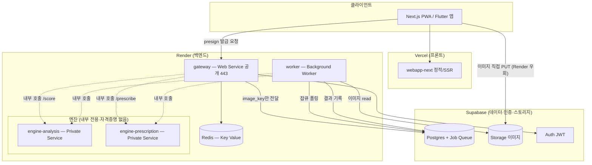
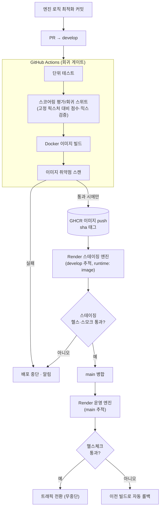

# SkinLens 3-Tier 마이그레이션 계획서

> 로컬 서버호스팅(월 8만원) → **Vercel + Render + Supabase** 관리형 3-Tier 이전
> 1순위 목표: **운영 자동화 · 확장성** / 핵심 요건: **피부분석·처방 엔진의 지속적 최적화를 위한 배포 자동화**

---

## 1. 개요

SkinLens의 백엔드에서 **피부분석 엔진**과 **처방 엔진**은 스코어링·믹스 로직을 지속적으로 최적화해야 하는 영역이다. 따라서 이 두 엔진을 **자주, 안전하게, 독립적으로** 배포할 수 있는 자동화가 이번 이전의 성패를 가른다. 나머지 인프라(웹, DB, 인증, 스토리지)는 그 잦은 배포를 방해하지 않도록 뒤에서 안정적으로 받쳐주는 역할이다.

기존에 이미 구현된 자산을 대부분 재활용한다.

- presigned 업로드 (gateway `/uploads/presign` → 브라우저 직접 PUT → `/analyze`는 `image_key`만 수신)
- Case A 신뢰 경계 (엔진에는 Supabase 자격증명을 주입하지 않음)
- 4개 서비스 분리 (gateway / worker / engine-analysis / engine-prescription)
- RLS/Storage 폴더 소유권 정책, JWT strict(HS256), psycopg_pool
- 공용 계약 `skinlens_contract` (`/score`, `/prescribe` + 단계 이벤트)

변경의 핵심: 기존 자체 배포 장치(GHCR + self-hosted 러너 + `deploy.sh`의 원자 교체·헬스 게이트·롤백)를 **Render 네이티브 CD로 대체**한다. Render는 새 인스턴스가 헬스체크를 통과하기 전까지 트래픽을 전환하지 않고, 실패 시 이전 빌드로 롤백한다 — `deploy.sh`가 하던 일과 동일하다.

---

## 2. 최종 구성 결정

| 판단 항목 | 결론 |
|---|---|
| CV 모델 | 16MB · CPU 추론 → 경량. 무거운 GPU 티어 불필요 |
| 1순위 목표 | 비용 절감 아님 → **운영 자동화·확장성** |
| 결론 | 제안한 3-Tier 관리형 구성이 목표에 부합 |

관리형 스택이 사주는 가치가 정확히 자동화·확장성이다. Git push → 자동 빌드·배포, Blueprint(render.yaml)로 인프라를 코드로 관리, Supabase Pro의 자동 백업·인증·스토리지가 로컬 서버에서 손으로 하던 일을 없앤다.

---

## 3. 아키텍처



핵심 원칙 두 가지가 이 그림에 담겨 있다.

1. **이미지 바이트는 Render를 통과하지 않는다.** 브라우저가 Supabase Storage에 직접 PUT하고, Render는 `image_key`(참조)만 다룬다. Render는 JSON API 트래픽만 처리 → 대역폭·비용·확장 모두 안전.
2. **엔진은 내부 전용 + 무자격증명(Case A).** gateway/worker만 DB·Storage·Auth 쓰기 주체이고, 엔진은 계약(`/score`·`/prescribe`)만 노출한 폐쇄 컴포넌트다.

---

## 4. 서비스 매핑

| 기존 컴포넌트 | Render 타입 | 공개 여부 | 비고 |
|---|---|---|---|
| apps/webapp-next | (Vercel) | 공개 | 상업 서비스 → Vercel Pro |
| services/gateway | `type: web` | 공개(443) | 얇은 BFF, TLS·라우팅은 Render |
| services/worker | `type: worker` | 비공개 | 포트 없음, 잡큐 폴링 |
| services/engine-analysis | `type: pserv` | 내부 전용 | **최적화 대상 ①** |
| services/engine-prescription | `type: pserv` | 내부 전용 | **최적화 대상 ②** |
| Redis 캐시 | `type: keyvalue` | 내부 전용 | Render Key Value |
| Postgres + Storage + Auth | (Supabase) | 외부 | 전 환경 통일 |

reverse proxy(nginx/Caddy)는 Render에서 불필요 → 제거. 정적 파일은 Vercel이 서빙.

---

## 배포 자동화 개요 — 프론트(Vercel) vs 백엔드(Render)

세 배포 대상 모두 **GitHub push가 배포 트리거**라는 점은 같지만, 자동화의 성격이 다르다. 프론트와 즉시성 서비스는 "push = 즉시 배포", 최적화가 잦은 엔진만 "push = 검증 통과 시 배포"다. 이 차이는 실수가 아니라 의도된 설계로, 계속 최적화하는 엔진 로직의 회귀를 막기 위한 것이다.

```
GitHub push
 ├─ 프론트(webapp-next)      → Vercel 자동 배포 (즉시)
 └─ 백엔드
     ├─ gateway / worker     → Render 자동 배포 (즉시)
     └─ engine-analysis /    → GitHub Actions 게이트 통과 →
        engine-prescription     GHCR → Render 자동 배포 (검증 후)
```

| 대상 | 플랫폼 | 트리거 | 자동화 성격 | 근거 |
|---|---|---|---|---|
| webapp-next (Next.js PWA) | **Vercel** | GitHub push | 즉시 배포 + PR 프리뷰 | 프론트는 회귀가 눈에 보임 → 즉시성 우선 |
| gateway / worker | **Render** | GitHub push (`autoDeployTrigger: commit`) | 즉시 배포 (네이티브) | 계약이 고정된 얇은 계층 → 즉시성 무난 |
| engine-analysis / engine-prescription | **Render** (GHCR 경유) | GitHub push → CI 게이트 | 검증 통과 시 배포 | 스코어링이 조용히 틀어지는 것 차단 → 안전성 우선 |

**프론트엔드(Vercel)**: `apps/webapp-next`를 Vercel에 연결하면 push마다 자동 빌드·배포되고 PR별 프리뷰 URL이 생성된다. 설정 파일도 거의 필요 없다.

**백엔드(Render)**: gateway·worker는 Render 네이티브 자동 배포로 push 즉시 반영된다(Vercel과 유사한 감각). 엔진 2종만 GitHub Actions 회귀 게이트를 사이에 세워, 통과한 이미지만 GHCR→Render로 자동 배포된다. 자동인 것은 동일하되 나쁜 배포만 자동으로 걸러진다. (엔진 CD 세부는 §5.6, 구현은 `engine-cd.yml`.)

---

## 5. ⭐ 엔진 배포 자동화 (이 문서의 핵심)

피부분석·처방 로직은 계속 바뀐다. 그래서 엔진 CD는 다음 4가지를 동시에 만족해야 한다.

### 5.1 요구사항

1. **독립 배포** — 엔진 로직만 고쳤을 때 gateway/worker는 재배포되지 않아야 한다.
2. **회귀 방지 게이트** — 스코어링 로직 변경은 회귀 위험이 크다. 배포 전에 **평가/회귀 테스트가 반드시 통과**해야 한다.
3. **무중단 + 자동 롤백** — 잦은 배포가 안전하려면 실패가 자동 복구돼야 한다.
4. **계약 안정성** — `/score`·`/prescribe`·단계 이벤트는 고정. 내부만 자유롭게 최적화.

### 5.2 계약 안정성 = 잦은 배포의 전제

엔진을 마음껏 최적화하면서도 시스템이 깨지지 않는 이유는 **경계 계약이 고정**돼 있기 때문이다.

```
[ 고정 (바뀌면 안 됨) ]              [ 자유 (계속 최적화) ]
POST /score      요청/응답 스키마     스코어링 알고리즘, 지표 계산
POST /prescribe  요청/응답 스키마     믹스 배합 로직, 등급→비율 매핑
단계 이벤트 형식                       내부 파이프라인, 모델 교체
```

계약을 건드리는 변경(스키마 변경)만 gateway/worker와 조율하고, 그 외 로직 최적화는 엔진 단독 배포로 끝난다. 이 분리가 "자주 배포"를 가능하게 하는 근본 장치다.

### 5.3 엔진 CD 파이프라인

엔진은 회귀 게이트가 중요하므로 **GitHub Actions에서 평가 테스트 후 이미지를 GHCR에 올리고, Render가 pull**하는 방식(B안)을 권장한다. gateway/worker는 Render 직접 빌드(A안)로 두어 혼용한다.



이 파이프라인이 주는 것:

- **회귀 게이트**: 스코어링/믹스 결과를 고정 픽스처와 비교하는 평가 스위트가 통과해야만 이미지가 GHCR로 나간다. 점수가 의도치 않게 흔들리면 배포 자체가 막힌다.
- **재현성·감사성**: 엔진 이미지는 `sha` 태그로 GHCR에 남아, 어떤 버전이 언제 배포됐는지 추적 가능하고 즉시 특정 버전으로 되돌릴 수 있다.
- **안전한 잦은 배포**: 스테이징 검증 → 운영 무중단 전환 → 실패 시 자동 롤백. 하루에 여러 번 최적화 배포해도 사고 반경이 통제된다.

### 5.4 독립 배포 (빌드 필터)

Render 모노레포 빌드 필터가 `rootDir` 밖 변경을 무시하므로, `services/engine-analysis/`만 바뀌면 그 엔진만 배포된다. gateway/worker/처방엔진은 그대로 유지된다.

```
services/engine-analysis/   변경 → engine-analysis 만 재배포
services/engine-prescription/ 변경 → engine-prescription 만 재배포
services/gateway/           변경 → gateway 만 재배포
```

### 5.5 (선택) 병렬 버전 비교

스코어링 변경의 영향을 실측하고 싶다면, 엔진을 두 서비스(`engine-analysis`, `engine-analysis-next`)로 띄우고 gateway에서 트래픽 일부를 새 버전으로 보내 결과를 비교하는 카나리/A-B도 가능하다. 초기에는 과설계이므로 "자동 롤백"만으로 시작하고, 최적화 빈도가 높아지면 도입을 검토한다.

### 5.6 엔진 CD 워크플로 구현 요약 (GitHub Actions)

§5.3의 파이프라인을 실제 파일로 구현한 것이 `.github/workflows/engine-cd.yml`이다. **"push하면 검증 통과한 것만 자동 배포"**가 이 한 파일로 굴러간다.

**동작 흐름**

```
push (develop/main)
  └─ 변경 엔진 감지 (paths-filter)         ← 바뀐 엔진만 진행 = 독립 배포
       └─ 게이트 A: 단위 테스트
            └─ 게이트 B: 스코어링/믹스 회귀 스위트  ← 점수가 조용히 틀어지면 여기서 차단
                 └─ 이미지 빌드
                      └─ 게이트 C: 취약점 스캔(HIGH/CRITICAL 차단)
                           └─ GHCR push (sha 태그 = 감사·롤백용)
                                └─ Render 자동 배포 (정확한 sha 이미지 지정)
                                     └─ live 대기 (무중단 헬스게이트 통과까지 폴링)
                                          실패 시 → 이전 라이브 유지 (자동 롤백 효과)
```

**핵심 설계 포인트**

| 요소 | 구현 |
|---|---|
| 자동 배포 | push → 게이트 전부 통과 시 Render 배포까지 자동 이어짐 |
| 회귀 방지 | 게이트 B(스코어링 회귀 스위트)를 통과 못 하면 배포 자체가 막힘 |
| 독립 배포 | `paths-filter`로 바뀐 엔진만 빌드·배포 (gateway/worker 무영향) |
| 환경 분리 | `develop`→스테이징 서비스 / `main`→운영 서비스 |
| 감사·롤백 | 이미지를 `sha-<커밋>` 불변 태그로 GHCR 보관, 특정 sha로 즉시 되돌림 |
| 무중단 | Render 헬스게이트 통과 전 트래픽 미전환, 실패 시 이전 라이브 유지 |

**Vercel과의 차이(의도된 것)**: Vercel식 "묻지도 따지지도 않고 즉시 배포"와 달리, 엔진은 게이트 B를 사이에 세워 **회귀한 배포만 자동으로 걸러낸다.** 스코어링 결과가 소리 없이 바뀌는 것을 막기 위한 의도적 문지기다. 통과하면 배포까지 자동이라 "자동 배포"인 것은 동일하다.

**필요 시크릿/변수 (GitHub → Settings)**

```
secret  RENDER_API_KEY
var     RENDER_SVC_ANALYSIS_STAGING / _PROD
var     RENDER_SVC_PRESCRIPTION_STAGING / _PROD
# GHCR push는 기본 GITHUB_TOKEN(packages: write)로 동작 — 별도 PAT 불필요
```

**사전 설정**: Render 각 엔진 서비스의 Auto-Deploy를 끄고(배포는 이 워크플로가 담당), 엔진은 image-backed(`runtime: image`, GHCR)로 둔다.

동봉 파일: `engine-cd.yml`(워크플로), `test_scoring_regression.py`(게이트 B의 회귀 테스트 예시 — 점수 허용오차·처방 비율 정확일치·계약 스키마 고정).

---

## 6. 마이그레이션 순서

### Step 1 — DB 스키마 이관 (Supabase)

`deploy/`의 마이그레이션 SQL·RLS SQL을 Supabase에 적용한다.

```bash
supabase link --project-ref <ref>
supabase db push
psql "$SUPABASE_DB_URL" -f deploy/rls.sql
psql "$SUPABASE_DB_URL" -f deploy/storage_policies.sql
```

적용 순서: 스키마(테이블 + Postgres 잡큐) → RLS → Storage 정책 → 참조 데이터 시드.

**커넥션은 Supabase 풀러(Supavisor) 경유로 통일.** worker는 트랜잭션 모드, gateway는 세션 모드. 앱 내부 `psycopg_pool`은 작게 유지. 수평 확장 시 커넥션 폭증을 막는 핵심.

스테이징 로컬 postgres는 제거하고 전 환경을 Supabase로 통일한다.

### Step 2 — Storage 이관 (Supabase Storage)

presign 업로드는 구현돼 있으므로 이 단계는 **기존 이미지 이전 + 정책 검증**이다.

- 기존 이미지 → Supabase Storage 버킷 복사 (폴더 구조 = 소유권 정책 일치)
- 검증: presign→직접 PUT→`image_key` 경로 / RLS 폴더 소유권 차단 / worker magic-byte 재검증

이미지 egress는 전부 Supabase로 집중 → Render 대역폭을 아낀다.

### Step 3 — API 컨테이너화 (Render 규약 조정)

기존 Dockerfile 재사용, docker-compose 전제만 조정한다.

- reverse proxy 제거 (TLS·라우팅은 Render)
- gateway는 `$PORT` 바인딩, worker는 포트 없음
- 헬스 엔드포인트: gateway `/healthz`, 엔진 `/healthz`(추론 호출 없이 준비 상태만)
- **엔진 컨테이너에 Supabase 키/DB URL 절대 주입 금지** (Case A)

### Step 4 — Blueprint 작성 (render.yaml)

repo 루트에 하나의 `render.yaml`로 4서비스 + Redis를 선언한다. (엔진은 §5.3의 GHCR pull 방식으로 `runtime: image` 사용, gateway/worker는 Render 직접 빌드)

```yaml
services:
  # 공개 API (얇은 BFF) — Render 직접 빌드
  - type: web
    name: skinlens-gateway
    runtime: docker
    rootDir: services/gateway
    dockerfilePath: ./Dockerfile
    healthCheckPath: /healthz
    autoDeployTrigger: commit
    envVars:
      - key: PORT
        value: 8000
      - key: DATABASE_URL          # Supabase 풀러(세션 모드)
        sync: false
      - key: SUPABASE_URL
        sync: false
      - key: SUPABASE_SERVICE_ROLE_KEY
        sync: false
      - key: JWT_SECRET
        sync: false
      - key: REDIS_URL
        fromService: { name: skinlens-redis, type: keyvalue, property: connectionString }
      - key: ENGINE_ANALYSIS_URL
        fromService: { name: engine-analysis, type: pserv, property: hostport }
      - key: ENGINE_PRESCRIPTION_URL
        fromService: { name: engine-prescription, type: pserv, property: hostport }

  # 리포트 워커 — Render 직접 빌드
  - type: worker
    name: skinlens-worker
    runtime: docker
    rootDir: services/worker
    autoDeployTrigger: commit
    envVars:
      - key: DATABASE_URL          # Supabase 풀러(트랜잭션 모드)
        sync: false
      - key: SUPABASE_URL
        sync: false
      - key: SUPABASE_SERVICE_ROLE_KEY
        sync: false
      - key: REDIS_URL
        fromService: { name: skinlens-redis, type: keyvalue, property: connectionString }
      - key: ENGINE_ANALYSIS_URL
        fromService: { name: engine-analysis, type: pserv, property: hostport }
      - key: ENGINE_PRESCRIPTION_URL
        fromService: { name: engine-prescription, type: pserv, property: hostport }

  # 피부분석 엔진 — GHCR 이미지 pull (회귀 게이트 통과본만)
  - type: pserv
    name: engine-analysis
    runtime: image
    image:
      url: ghcr.io/<org>/engine-analysis:<sha>
      creds:
        fromRegistryCreds: { name: ghcr-creds }
    healthCheckPath: /healthz
    # Supabase/DB 환경변수 없음 — Case A 유지

  # 처방 엔진 — GHCR 이미지 pull
  - type: pserv
    name: engine-prescription
    runtime: image
    image:
      url: ghcr.io/<org>/engine-prescription:<sha>
      creds:
        fromRegistryCreds: { name: ghcr-creds }
    healthCheckPath: /healthz

  # 캐시
  - type: keyvalue
    name: skinlens-redis
    plan: starter
    ipAllowList: []
```

시크릿(`sync: false`)은 대시보드에서 1회 입력. 컴퓨트는 gateway/worker=Standard(2GB), 엔진=Starter~Standard로 시작 후 조정.

> 참고: `runtime: image`를 쓰면 이미지 태그 갱신은 GitHub Actions가 GHCR에 새 `sha`를 올리고 Render를 트리거하는 흐름으로 굴린다. Render 직접 빌드(A안)만으로 단순화하려면 엔진도 `runtime: docker` + `rootDir`로 두면 되지만, 그 경우 회귀 게이트를 Render 밖(별도 CI)에서 강제하는 장치가 약해진다. 엔진은 회귀 위험이 크므로 GHCR + CI 게이트 방식을 권장.

### Step 5 — 배포 자동화(CD) 확정

- **트리거**: `autoDeployTrigger: commit` — 매 push 자동 배포 (구 `autoDeploy` 대체)
- **선택적 빌드**: `rootDir` 빌드 필터 — 변경된 서비스만 배포
- **무중단 + 롤백**: 헬스체크 통과 전 트래픽 미전환, 실패 시 이전 아티팩트로 롤백
- **환경 분리**: 서비스당 1브랜치 매핑. 스테이징=`develop`, 운영=`main`

### Step 6 — 컷오버 & 검증

Supabase 안정화(Step 1~2) → Render 백엔드 스테이징 검증 → Vercel API 베이스 URL을 Render gateway로 전환 → **로컬 호스팅과 병렬 운영** → 관찰 후 트래픽 이전 → 안정 확인 → 로컬 서버 해지.

검증 체크리스트

- [ ] presign → 직접 PUT → `image_key` 경로 정상
- [ ] 처방 3원 입력(분석/설문/PCR) 각각 단독 동작
- [ ] RLS로 타 사용자 이미지·리포트 차단
- [ ] worker 잡큐 정상 소비
- [ ] 엔진 공개 URL 없음(Private Service 확인)
- [ ] 엔진 회귀 게이트가 실제로 배포를 막는지 1회 검증

---

## 7. 예상 비용 (초기 안정화 기준)

| 레이어 | 티어 | 월 비용(USD) |
|---|---|---|
| Vercel | Pro (상업적 사용) | $20 |
| Render | Hobby 워크스페이스 $0 + Standard 컴퓨트 $25 | $25 |
| Supabase | Pro (일시정지 없음·스토리지·인증·백업) | $25 |
| **합계** | | **$70 (약 94,000원)** |

현재 8만원과 사실상 비슷한 선. 목표가 비용 절감이 아니라 운영 자동화이므로, 이 차이는 관리 부담 제거와 엔진 CD 자동화로 정당화된다. 오토스케일링 도입 시 Render 워크스페이스 Pro +$25. 엔진을 별도 컴퓨트로 각각 띄우면 엔진 티어만큼 추가된다.

> 주의: 이미지·API 트래픽이 커지면 대역폭 초과 과금(Render GB당 $0.15, Supabase egress 초과 GB당 $0.09)이 붙는다. presign 우회 구조로 이미지 egress를 Supabase에 몰아 Render 초과를 억제하는 게 중요.

---

## 8. 로컬 서버호스팅 해지 판단

**해지 가능하다.** 프로덕션 필수 요소가 세 곳(Render/Supabase/Vercel)으로 완전히 분산되어, 로컬 유료 호스팅에 남겨야 할 프로덕션 요소가 없다. 단,

- **순서**: 새 스택 검증 → 트래픽 이전 → 관찰 → 그다음 해지. 관찰 기간에만 8만원이 잠깐 중복.
- **스테이징 WSL2**는 본인 개발 머신이지 유료 호스팅이 아니므로 해지 판단과 무관.
- **유일한 예외**: "엔진 완전 폐쇄망(egress 차단)"을 양보 불가 요건으로 걸 때만 엔진을 자체 서버에 남긴다. 그 경우도 지금의 유료 업체일 필요는 없고 저가 VPS/자체 하드웨어로 충분. 대개 하드 요건까지는 불필요.

### 8.1 배포 자동화 경로에도 로컬 호스팅이 끼는 지점이 없다

이번에 정리한 배포 자동화는 전적으로 **GitHub → 클라우드 플랫폼** 흐름이며, 이 경로 어디에도 로컬 호스팅 업체가 개입하는 지점이 없다.

- 프론트: GitHub push → **Vercel**이 빌드·배포
- gateway/worker: GitHub push → **Render**가 빌드·배포
- 엔진: GitHub push → **GitHub Actions 게이트** → GHCR → **Render**가 배포

코드가 서버에 반영되는 전 과정이 Vercel·Render·GitHub 안에서 끝나므로, 프로덕션에서 로컬 유료 호스팅이 하던 역할이 완전히 사라진다.

**CI 러너도 로컬 서버가 아니다.** GitHub Actions는 GitHub가 제공하는 클라우드 러너(`ubuntu-latest`)에서 돌아간다. 예전 계획의 self-hosted 러너(WSL2)처럼 본인이 상시 서버를 띄워둘 필요가 없다 — 이 지점에서도 로컬 상시 가동 서버의 필요성이 없어진다.

**결론**: egress 완전 차단을 하드 요건으로 걸지 않는 한, 이 구성만으로 로컬 서버호스팅은 필요 없다. 원칙은 하나 — **검증 먼저, 해지는 나중에.**

---

## 9. 트레이드오프 / 주의

- **엔진 egress 차단 불가**: Render Private Service는 공개 인바운드는 막지만, 서비스 단위 아웃바운드 egress 차단은 네이티브로 제공하지 않는다. 단 Case A로 엔진에 자격증명이 없어 유출 대상 자체가 없으므로 실질 피해 반경은 제한적. 완전 폐쇄망이 하드 요건이면 엔진만 하이브리드(자체 서버)로.
- **콜드 스타트**: 무료 티어는 15분 스핀다운 + 30~60초 콜드스타트로 프로덕션 부적합. 반드시 유료(Starter 이상) 상시 가동 사용.
- **Supabase 무료 일시정지**: 무료 프로젝트는 7일 무활동 시 자동 일시정지. 운영은 Pro 필수.
- **Vercel Hobby 상업 제한**: 사업체 서비스는 Pro 사용.
- **커넥션 폭증**: 수평 확장 시 Supavisor 풀러 경유 필수.

---

## 부록 — 엔진 최적화 배포 체크리스트 (반복 사용)

스코어링/믹스 로직을 최적화할 때마다:

1. [ ] `services/engine-*/` 내부만 수정 (계약 스키마는 불변)
2. [ ] 로컬에서 평가/회귀 스위트 통과 확인
3. [ ] PR → `develop` → CI 회귀 게이트 통과
4. [ ] GHCR에 `sha` 이미지 push → 스테이징 자동 배포
5. [ ] 스테이징 스모크·점수 확인
6. [ ] `main` 병합 → 운영 무중단 배포 (실패 시 자동 롤백)
7. [ ] 배포 후 실측 지표 모니터링 (이상 시 이전 `sha`로 즉시 롤백)
