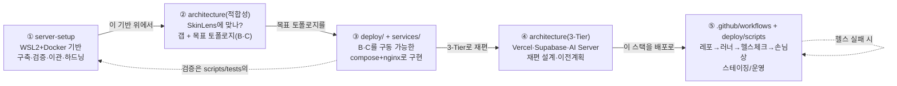

# SkinLens 문서세트 — 통합 인덱스 · 읽는 순서 (docs/)

> 🗂 이 저장소는 **monorepo**입니다. 코드·인프라는 `docs/` 바깥에 있고, 이 문서는 **`docs/` 안의 설계·운영 문서**를 읽는 순서로 안내합니다.
> 저장소 전체 구조는 루트 [`../README.md`](../README.md), 옛 문서세트(`SkinServer`) → 현재 경로의 **정본 대응표**는 [`../MIGRATION.md`](../MIGRATION.md) 에 있습니다.
> 🌐 **웹으로 볼 때:** [`../site/index.html`](../site/index.html) 을 열면 구성·아키텍처·감사(P0/P1/P2)를 한 화면에서 훑고 각 파트로 이동할 수 있습니다.

세 개의 산출물을 **구축 → 검토 → 구현** 순서로 정리한 세트입니다. 현재는 **3-Tier(Vercel·Supabase·AI Server)** 로의 이전이 진행 중이며, 그 설계·계획·런북이 별도 축으로 추가되었습니다.

## 현재 `docs/` 구조

```
docs/
├── README.md                 ← 지금 이 문서 (읽는 순서 · 라우터)
├── MANIFEST.md               ← 모든 파일 한 줄 설명 (전체 목록)
├── outsourcing/              ← 외주개발: 요구사양 명세서(SRS) + 인도 문서 패키지(HANDOFF)
├── deploy_components_guide.md ← 통합 배포 스택(deploy/) 구성 요소 역할 가이드
├── stories/                  ← 개념 요약(이야기체): 전체 여정 + 구축 + 배포 + 3-Tier 이전. 먼저 읽기
├── server-setup/             ← 기반: WSL2 Ubuntu 서버 구축·검증·이관·운영 (v3 보완 반영)
├── architecture/             ← 다리+감사: 적합성 검토 + 운영아키텍처 최종리뷰(P0/P1/P2) + 3-Tier 설계/이전계획
├── operations/               ← 운영: 체크리스트 · 학습 로드맵 · 실행/운영 · 트러블슈팅 · 3-Tier 런북
├── roadmap/                  ← 후속: Phase 로드맵(매핑) · 우선순위·리스크 정리 · 후속보완 로드맵
└── integration/              ← 연동: Flutter 앱 ↔ 서버 계약(사진+설문)
```

> 구현물(구동 가능한 스택)과 배선은 `docs/` 밖에 실물로 있습니다 — `../deploy/`(compose·caddy·scripts·supabase·ops-jobs) · `../services/`(gateway·worker·engine-*) · `../apps/`(webapp-next(PWA)·webapp(레거시)·homepage·devpage) · `../.github/workflows/`(CD) · `../tests/`(검증·스모크) · `../packages/`(공용 계약).

## 3-Tier 이전 (현재 진행 축)

현재 monorepo는 **Vercel(웹/PWA) + Supabase(데이터/인증/스토리지) + AI Server(엔진/워커/게이트웨이)** 구조로 재편 중입니다.

| 문서 | 역할 |
|---|---|
| [`architecture/04_3Tier_Vercel_Supabase_AIServer_설계.md`](./architecture/04_3Tier_Vercel_Supabase_AIServer_설계.md) | **설계 정본** — 왜/무엇을 3분할하는가 |
| [`architecture/05_3Tier_이전_작업계획.md`](./architecture/05_3Tier_이전_작업계획.md) | **작업계획** — Phase 1~6별 무엇을·어느 파일을·어떤 순서로 |
| [`server-setup/Vercel_Render_기반_웹서비스_도메인_IP_구성_가이드_수정본.md`](./server-setup/Vercel_Render_기반_웹서비스_도메인_IP_구성_가이드_수정본.md) | **도메인 & IP 구성 가이드** — Vercel + Render 기반 도메인/IP 설정 |
| [`operations/09_Phase1_Supabase_실행런북.md`](./operations/09_Phase1_Supabase_실행런북.md) | Phase 1 실행 런북 — Supabase 프로젝트 생성·스키마·RLS 적용 |
| [`operations/10_Phase5_배포순서_런북.md`](./operations/10_Phase5_배포순서_런북.md) | Phase 5 실행 런북 — Vercel/AI Server 배포 순서(계약 버전 게이트) |
| [`stories/09_SkinLens_3Tier_이전_이야기.md`](./stories/09_SkinLens_3Tier_이전_이야기.md) | **이야기체 요약** — 3-Tier 이전의 큰 그림과 진행 상황 |
| [`roadmap/00_PHASE_ROADMAP.md`](./roadmap/00_PHASE_ROADMAP.md) | Phase 로드맵 — 역량 Phase + 3-Tier 이전 트랙 상태 스냅샷 |

**핵심 변화**: nginx 정적 서빙·로컬 postgres·`frontnet` 제거 → Vercel(웹) + Supabase(전 환경) + AI Server(슬림화) + presigned 업로드.

## 옛 번호 → 현재 위치 (빠른 대응)

옛 문서세트의 번호 폴더를 기억하는 경우를 위한 축약표입니다(정본은 [`../MIGRATION.md`](../MIGRATION.md)).

| 옛 표기 | 현재 위치 |
|---|---|
| `00_INDEX.md` / `00_파일안내_MANIFEST.md` | `./README.md`(이 문서) / `./MANIFEST.md` |
| `04_이야기/` | `./stories/` |
| `01_서버구축_패치본_v3/`(가이드·노트) | `./server-setup/` |
| `01_…`(스크립트 `verify_*`·`pg_backup`·`migrate_*`·`deploy.sh`·`wsl-backup-task`) | `../deploy/scripts/` |
| `01_…/test_environment.py` | `../tests/test_environment.py` |
| `02_적합성검토/` | `./architecture/SkinLens_서버구성_적합성_검토.md` |
| `03_webstack_스캐폴드/` | `../deploy/compose/` + `../services/`·`../apps/` (실물 전개) |
| `05_CD_배포/` | `../deploy/scripts/deploy.sh`·`../deploy/compose/`·`../deploy/env/`·`../.github/workflows/` |
| `05_…/followup-P1/` | `../deploy/ops-jobs/` |
| `06_…체크리스트.md` / `07_학습_로드맵.md` | `./operations/06_운영·배포_체크리스트.md` / `./operations/07_학습_로드맵.md` |
| `08_최종리뷰/00~03` | `./architecture/00_README.md`·`01_…최종리뷰`·`02_PATCH_NOTES_P0_P1`·`03_DB_MIGRATION_ROLLBACK` |
| `08_…/04_후속보완_로드맵.md` | `./roadmap/04_후속보완_로드맵.md` |
| `09_구현우선순위_배포구조_리스크정리.md` | `./roadmap/09_구현우선순위_배포구조_리스크정리.md` |

---

## 순서와 관계 (한눈에)



- **server-setup은 범용 기반**(어떤 서비스든 올릴 수 있는 서버 만들기), **architecture(적합성)는 SkinLens 관점의 판단**,
  **deploy/+services/는 그 판단을 실물로 구현**한 것입니다.
- **architecture(3-Tier)** 는 그 실물을 Vercel·Supabase·AI Server로 재편하는 설계·계획입니다.
- 구현의 스모크/검증 개념은 `../deploy/scripts/`의 `verify_server.sh`·`verify_client.ps1`·`../tests/test_environment.py`와 이어집니다.

> **처음이라면 여기부터.** 세부 문서로 들어가기 전에 아래 **이야기(개념 요약)** 두 편으로 큰 그림을 먼저 잡으면 훨씬 수월합니다.

---

## ⓪ `stories/` — 개념 요약 (이야기체, 먼저 읽기)

부품 대신 "작은 식당" 비유로 전체를 풀어 쓴 문서입니다. 구간마다 Mermaid 그림이 있어 큰 그림을 빠르게 잡을 수 있습니다.

| 파일 | 무엇 | 대응 |
|---|---|---|
| `stories/README.md` | **허브:** 읽는 순서 · 공용 비유 사전 · 심화편 로드맵 (먼저) | — |
| `stories/01_SkinLens_서버_이야기.md` | 전체 여정: 구축→하드닝→운영→백업→이관→배포 (6막 + 막 0-B 주문 흐름, overview) | server-setup·architecture 전반 |
| `stories/02_SkinLens_구축_이야기.md` | 구축 심화: 빈 땅→검증된 주방 (골조·SSH·Docker·네트워킹·검증) | server-setup |
| `stories/03_SkinLens_하드닝_이야기.md` | 하드닝 심화: 열린 주방→잠긴 주방 (문지기·SSH·뒷문·표면·컨테이너·골방) | server-setup·architecture |
| `stories/04_SkinLens_운영_이야기.md` | 운영 심화: 자동 개점·벽시계·쓰레기통·설비 점검·경비실 | server-setup·operations |
| `stories/05_SkinLens_백업_이야기.md` | 백업 심화: 장부 사본·금고 잠금·오프사이트·데드맨·스냅샷·리허설 | deploy/scripts |
| `stories/06_SkinLens_이관_이야기.md` | 이관 심화: 집 주방→영업점 (예고·멈춤·델타덤프·점검·전환·롤백) | server-setup |
| `stories/07_SkinLens_배포_이야기.md` | 배포 심화: 코드 한 줄이 손님상까지 (세 여정·스테이징/운영) | deploy·workflows |
| `stories/08_SkinLens_기동_이야기.md` | 기동 심화: 환경별 빌드·기동 절차를 "같은 배치도, 다른 메모"로 (dev 조리 / staging 완제품 / prod 창고+자물쇠) | deploy/scripts/sl |
| `stories/09_SkinLens_3Tier_이전_이야기.md` | 3-Tier 이전: 집 주방 간판 떼고 전문점 셋으로 (Vercel·Supabase·AI Server) | architecture 04·05·operations 09·10 |
| `stories/10_SkinLens_프로젝트_분석_이야기.md` | 3-Tier 이후 투어: 프로젝트 전체 구조·환경변수·계약 | ANALYSIS_REPORT |

> 읽는 순서: **`stories/README.md`(허브)** 로 지도·용어를 잡고 → **서버 이야기(overview)** 로 큰 그림 → 관심 단계의 심화(**구축** / **배포** / **3-Tier 이전**)로.
> 이야기는 **개념 지도**입니다. 실제 명령·설정·근거는 아래 세부 문서와 `../deploy/`·`../services/` 실물에 있습니다.

---

## ① `server-setup/` — 기반 (범용)

Windows 11 데스크톱을 WSL2 기반 Ubuntu 서버로 만들고, 검증·이관·운영까지 다루는 문서 묶음.
**3차 보완(v3)까지 반영**된 버전입니다(v2 위에 구축 절차 안전성·컨테이너 하드닝·컷오버 정합성 추가).
가이드가 참조하는 **스크립트는 `../deploy/scripts/`**, **통합 검증(pytest)은 `../tests/`** 에 있습니다.

| 파일 | 무엇 |
|---|---|
| `server-setup/windows11_ubuntu_server_setup.md` | 메인 가이드(구축 0~27장 + 운영 + 부록). v3 하드닝 반영 |
| `server-setup/Vercel_Render_기반_웹서비스_도메인_IP_구성_가이드_수정본.md` | Vercel + Render 웹서비스 도메인 및 IP 구성 가이드 (현행 권장) |
| `server-setup/server_migration_runbook.md` | 외부 서버(VPS/클라우드) 이관 런북 (레거시 자체 서버 VPS 이관 시 참고용) |
| `changelog/server-setup_검증보강_노트.md` | 검증 보강(하드닝 모듈·게이트 연장·verify_ops) 요약 |
| `changelog/server-setup_보완개선_v2_노트.md` / `_v3_노트.md` | v2 6가지 + v3 11가지 보완 리뷰 |
| `server-setup/changes/CHANGES{,_v2,_v3}.diff` | 1·2·3차 패치 변경 이력 |
| (스크립트) `../deploy/scripts/verify_server.sh`·`verify_client.ps1`·`verify_ops.sh` | 서버·클라이언트·운영 점검 |
| (스크립트) `../deploy/scripts/pg_backup.sh`·`wsl-backup-task.ps1`·`migrate_export.sh`·`migrate_import.sh` | 백업·이관 |
| (검증) `../tests/test_environment.py` | 로컬/서버 공통 통합 검증(pytest) |

**핵심 포인트(v2):** ufw는 Docker 발행 포트를 못 막음 → 루프백 바인딩/보안그룹, 불필요 포트 비노출,
WSL idle로 cron 백업 누락 → Windows 스케줄러, 백업 스크립트 `.env` 기반화, PIPA 관점 하드닝.

**핵심 포인트(v3):** SSH 변경 락아웃 방지(`sshd -t`→검증→세션유지), `wsl --export` 롤백 스냅샷,
백업 견고성(오프사이트+암호화+보존 하한+데드맨 스위치), 컨테이너 비루트·`no-new-privileges`·`cap_drop`·
리소스 상한, native `daemon.json`, Nginx 표면 하드닝(헤더·레이트리밋), 이관 컷오버 쓰기 중지(정합성).

## ② `architecture/` — 다리 (SkinLens 관점) + 감사 + 3-Tier 설계

범용 스택으로 **피부분석엔진 + 홈페이지 + 개발자페이지**를 함께 운영할 수 있는지 판단하고, 맞는 목표
구조를 제시(적합성 검토). 여기엔 실제 배선을 감사한 **운영아키텍처 최종리뷰(P0/P1/P2)** 와
**3-Tier 재편 설계·이전계획**도 함께 있습니다.

| 파일 | 무엇 |
|---|---|
| `architecture/SkinLens_서버구성_적합성_검토.md` | §0~9 갭 판단 + 부록 A(기준 스택)·**부록 B(목표 토폴로지)**·**부록 C(비동기 Job 생애주기)** |
| `architecture/00_README.md` | 감사 계층 안내 + 배선 반영 요약 |
| `architecture/01_SkinLens_운영아키텍처_최종리뷰.md` | ①구조 ②보안 ③장애 ④개선 ⑤P0/P1/P2 |
| `architecture/02_PATCH_NOTES_P0_P1.md` | 무엇을·어디에 반영 + 적용 순서·검증 |
| `architecture/03_DB_MIGRATION_ROLLBACK.md` | "코드 롤백 ≠ 스키마 롤백" 런북(expand-contract) |
| `architecture/04_3Tier_Vercel_Supabase_AIServer_설계.md` | **3-Tier 재편 설계 정본** — Vercel·Supabase·AI Server 3분할 |
| `architecture/05_3Tier_이전_작업계획.md` | **3-Tier 이전 작업계획** — Phase 1~6별 작업 분해·상태 스냅샷 |
| `architecture/엔진_baseline_교체_가이드.md` | 엔진 baseline(OpenCV/규칙) → ML/GAN 교체 지점 가이드 |

**적합성 한 줄 결론:** 개발/스테이징·이관 리허설엔 server-setup 기반으로 충분. 실운영 4표면은
(1) 엔진 격리 (2) www/dev/app/api 라우팅 (3) 업로드·타임아웃+비동기 (4) Supabase 정렬을 얹어야 함 →
그 구현이 `../deploy/`·`../services/`이며, 현재는 3-Tier로 재편 중.

## ③ 구현 — `../deploy/` + `../services/` + `../apps/` (구동 가능)

적합성 검토의 부록 B·C가 **실제로 뜨는** 통합 compose 스택으로 전개돼 있습니다(옛 `03_webstack_스캐폴드`와
`05/skinlens-ops`의 두 compose를 `compose.base.yml` + 환경 오버레이로 단일화).
현재는 3-Tier 재편으로 **AI Server 전용**으로 슬림화되었습니다.

- **네트워크**: `appnet` ↔ `enginenet(internal: true)` 2분할(기존 `frontnet`은 Vercel 이관으로 제거).
  엔진 2개는 enginenet 전용 + 포트 미발행 + 자격증명 없음(Case A를 런타임 강제).
- **서비스**(`../services/`): gateway · worker · engine-analysis · engine-prescription. 정적 표면은 `../apps/`.
- **앱 표면(PWA)**: `../apps/webapp-next`(Next.js PWA) — Vercel이 서빙. 서비스워커는 앱 셸만 캐시하고 `/api/*`·`*.supabase.co` 는 `NetworkOnly`(PIPA). 로컬 개발·보안 메모: `../apps/webapp-next/README.md`.
- **presigned 업로드**: 브라우저가 Supabase Storage에 직접 PUT → gateway는 `image_key`만 수신 → worker가 서명 URL로 fetch + magic-byte 재검증.
- **흐름(부록 C)**: gateway가 Job 등록→`job_id` 즉시 반환, worker가 분석(사진)→처방(분석지표+설문 병합) 호출 후 결과 기록.
  처방 엔진은 분석/설문/PCR 중 ≥1이면 동작하고, 점수→등급→비율(76+/60–76/40–60/<40 → 0/0.5/1.0/3.0%)을 인코딩.
- **실행**: `../deploy/scripts/sl init dev`(최초 1회) → `sl up dev` → `make smoke`(루트 `../Makefile` — sl의 얇은 래퍼). 환경별 긴 compose 조합은 `./operations/환경별_빌드_기동_절차.md`.
- **앱 연동 계약**(사진+설문 업로드): `./integration/flutter_app_contract.md` · 공용 규격 `../packages/common/skinlens_contract`.

---

## 상황별 빠른 라우터

| 지금 하려는 일 | 볼 곳 |
|---|---|
| 어떤 파일이 무엇인지 전체 목록 | `./MANIFEST.md` |
| 외주개발 범위 및 상세 요구사항 확인 | `./outsourcing/skinlens_outsourcing_srs.md` |
| 배포 스택 (deploy/) 구성 요소 상세 | `./deploy_components_guide.md` |
| 큰 그림부터 이야기로 잡기 | `./stories/01_SkinLens_서버_이야기.md`(전체) · `02_구축` · `03_하드닝` · `04_운영` · `05_백업` · `06_이관` · `07_배포` · `08_기동` · `09_3Tier_이전` · `10_프로젝트_분석` |
| 3-Tier 이전 설계·계획·상태 | `./architecture/04_3Tier_Vercel_Supabase_AIServer_설계.md` · `./architecture/05_3Tier_이전_작업계획.md` |
| Supabase 프로젝트 생성·RLS 적용 | `./operations/09_Phase1_Supabase_실행런북.md` |
| Vercel/AI Server 배포 순서 | `./operations/10_Phase5_배포순서_런북.md` |
| 데스크톱에 서버부터 세우기 | `./server-setup/windows11_ubuntu_server_setup.md` |
| 각 단계·이관 검증 | `../deploy/scripts/verify_*` · `../tests/test_environment.py` |
| 외부 서버로 이관 | `./server-setup/server_migration_runbook.md` · `../deploy/scripts/migrate_*.sh` |
| "이 구성이 SkinLens에 맞나?" 판단·근거 | `./architecture/SkinLens_서버구성_적합성_검토.md`(§0~9) |
| 목표 토폴로지·데이터 흐름 그림 | 위 문서 부록 B·C |
| 실제로 띄워 보기 | `../deploy/scripts/sl up <dev|staging|prod>`(통합 CLI) — 절차 `./operations/환경별_빌드_기동_절차.md` · 이야기 `./stories/08_SkinLens_기동_이야기.md` |
| 앱↔서버 업로드 계약(사진+설문) | `./integration/flutter_app_contract.md` |
| 웹앱(Next.js PWA) 로컬 개발·SW 캐시/PIPA 정책 | `../apps/webapp-next/README.md` |
| 코드 변경을 서버에 자동 반영(CD) | `../.github/workflows/` + `../deploy/scripts/deploy.sh` |
| 구축 이후 배포·운영에서 챙길 것 | `./operations/06_운영·배포_체크리스트.md` · `./operations/서버_실행_운영_가이드.md` |
| 파이프라인 장애·체크포인트 진단 | `./operations/파이프라인_체크포인트_트러블슈팅.md` |
| 무엇을 어떤 순서로 학습할지 | `./operations/07_학습_로드맵.md` |
| Phase별 구현계획·현재 위치 | `./roadmap/00_PHASE_ROADMAP.md` |
| 우선순위·리스크·후속·엔진 고도화 로드맵 | `./roadmap/09_구현우선순위_배포구조_리스크정리.md` · `./roadmap/04_후속보완_로드맵.md` · `./roadmap/engine_advancement_roadmap.md` |

## 감사 계층 · 배선 위치

감사 문서(왜/무엇)는 `./architecture/`, 실제 배선된 설정(어떻게)은 `../deploy/`·`../.github/workflows/`에 있습니다.

- 배선된 설정: `../deploy/compose/compose.{gpu,tls}.yml` · `../deploy/caddy/Caddyfile` · `../deploy/scripts/deploy.sh`,
  `../deploy/supabase/policies/0001_rls_and_storage.sql`, `../.github/workflows/deploy-built-service.yml`
- 오버레이는 **그 환경에서 선택될 때만** 적용(스테이징은 base + staging 오버레이).
- 후속 P1 실제 파일: `../deploy/ops-jobs/`(보존 잡·로그 스크러빙·구조적 로깅·알림·복구 리허설).
- ⚠️ `../deploy/nginx/` 는 3-Tier 이전으로 제거 예정 — 책임은 Caddy/gateway로 이주 중.
