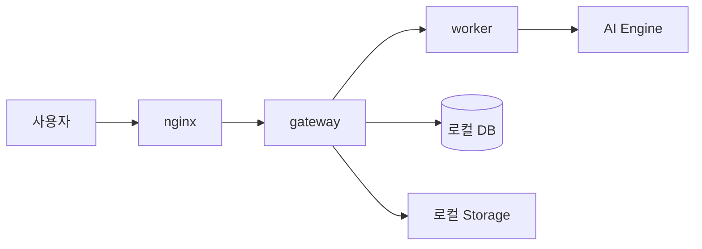
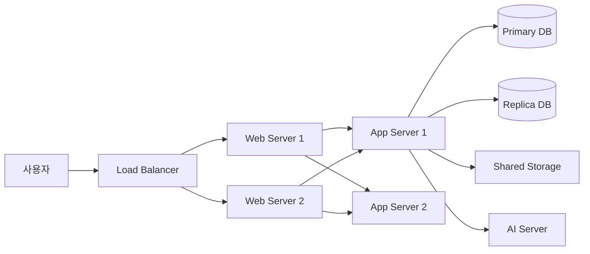
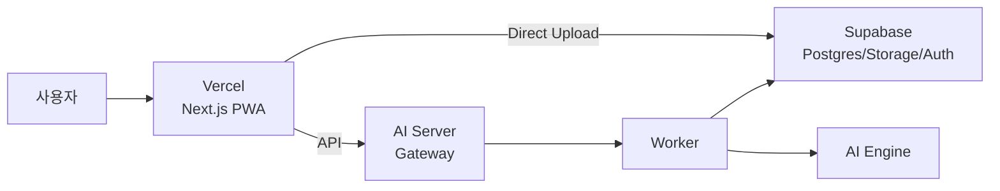
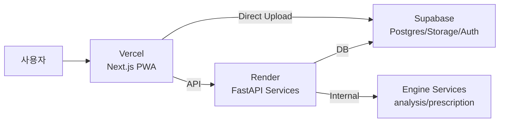
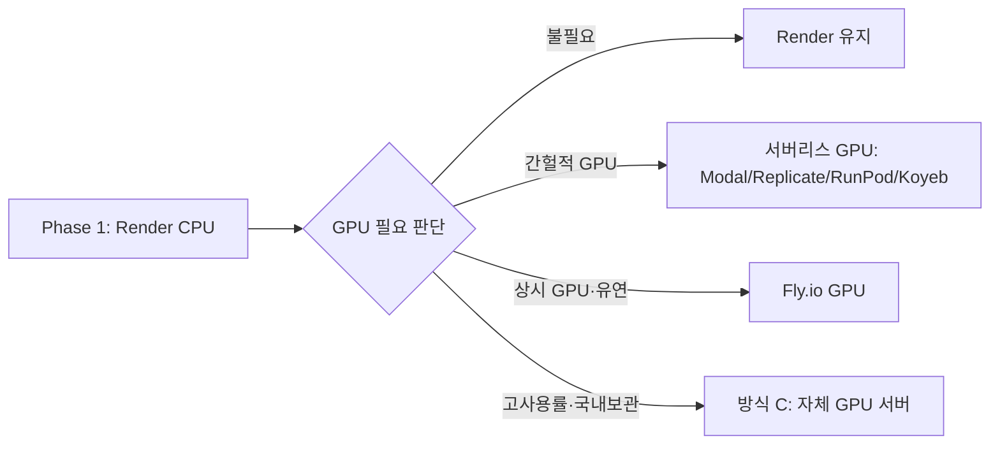
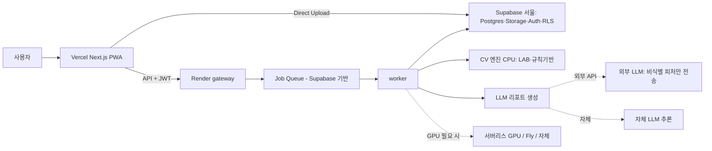
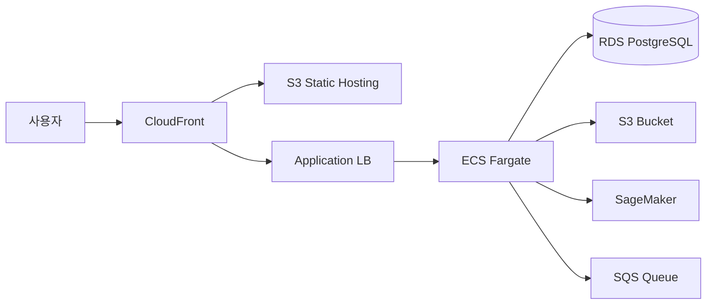
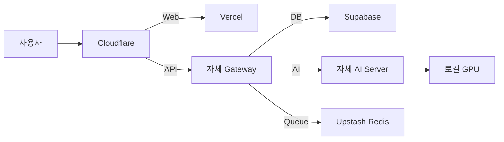
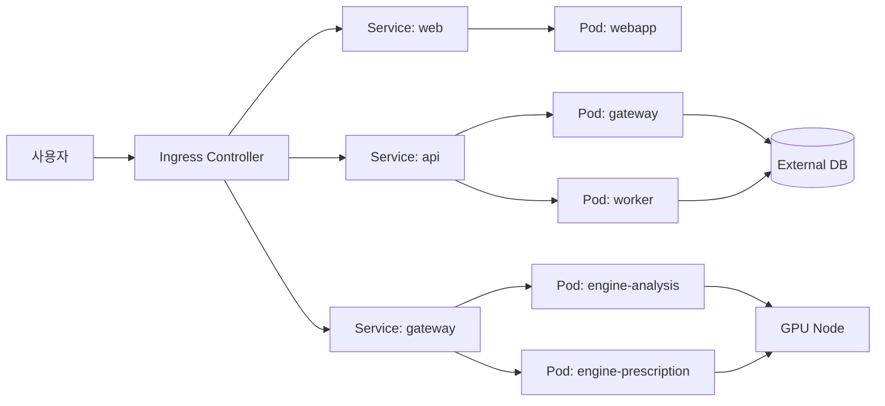
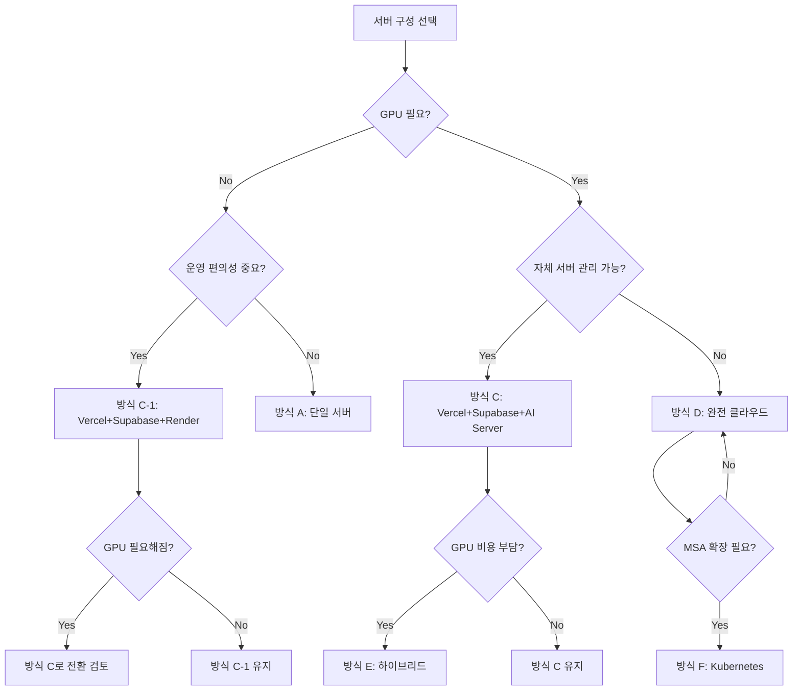

# SkinLens 서버 구성 방식별 장단점 종합 분석

> 작성일: 2026-08-23 · 개정: 2026-08-23 (리뷰 반영 통합본 v1.1)
> 목적: SkinLens 프로젝트에 적용 가능한 다양한 서버 구성 방식을 체계적으로 비교 분석하여 최적의 아키텍처 선택을 지원
>
> 개정 요약: (1) 종합 점수 산정 정정 및 가중치 명시(§10.3), (2) 데이터 레지던시·민감정보(PIPA) 보강(§6.10), (3) LLM 리포트 계층 + GPU 3분기 경로(§6.11), (4) MVP 큐 처리(§6.12).

---

## 목차

1. [개요](#1-개요)
2. [비교 대상 구성 방식](#2-비교-대상-구성-방식)
3. [방식 A: 단일 서버 (All-in-One)](#3-방식-a-단일-서버-all-in-one)
4. [방식 B: 전통적 3-Tier 자체 구축](#4-방식-b-전통적-3-tier-자체-구축)
5. [방식 C: Vercel + Supabase + AI Server (권장)](#5-방식-c-vercel--supabase--ai-server-권장)
6. [방식 C-1: Vercel + Supabase + Render (GPU 불필요 시)](#6-방식-c-1-vercel--supabase--render-gpu-불필요-시)
7. [방식 D: 완전 클라우드 네이티브](#7-방식-d-완전-클라우드-네이티브)
8. [방식 E: 하이브리드 구성](#8-방식-e-하이브리드-구성)
9. [방식 F: Kubernetes 오케스트레이션](#9-방식-f-kubernetes-오케스트레이션)
10. [종합 비교표](#10-종합-비교표)
11. [선택 가이드](#11-선택-가이드)
12. [결론](#12-결론)

---

## 1. 개요

SkinLens는 피부 분석 AI 서비스로서 다음과 같은 특수한 요구사항을 가진다:

- **이미지 처리**: 고해상도 피부 사진 업로드 및 분석
- **AI 연산**: CV 파이프라인 (LAB 색공간, 규칙 기반 분석) - **현재는 CPU로 충분, GPU는 향후 확장**
- **개인정보 보호**: PIPA(개인정보보호법) 준수 필요
- **비동기 처리**: 장시간 분석 작업을 위한 Job Queue
- **다중 표면**: 홈페이지, 개발자 페이지, PWA 앱, API
- **LLM 리포트**: CV 분석 결과를 LLM으로 자연어 리포트 생성 (외부 API 또는 자체 호스팅 — §6.11 참조)

> **정량 가정(MVP)**: 동시 사용자 100명 미만 · 분석 지연 p95 5초 이내 · 업로드 이미지 ≤5MB. 아래 평가 별점은 이 가정을 기준으로 한다.

본 문서는 이러한 요구사항을 충족하는 서버 구성 방식들을 비교 분석한다.

---

## 2. 비교 대상 구성 방식

| 구분 | 명칭 | 핵심 특징 | 적합 규모 |
|:---|:---|:---|:---|
| A | 단일 서버 | 모든 기능을 1대 서버에 집중 | PoC, 소규모 테스트 |
| B | 전통적 3-Tier | Web/App/DB를 물리적 분리 | 중규모, 온프레미스 |
| C | Vercel+Supabase+AI | 관리형 Front/DB + 전용 AI 서버 | 스타트업~중견 |
| C-1 | Vercel+Supabase+Render | 관리형 Front/DB + Render AI 서버 | 스타트업 (GPU 불필요 시) |
| D | 완전 클라우드 | AWS/GCP/Azure 완전 위임 | 대규모, 글로벌 |
| E | 하이브리드 | 관리형 + 자체 서버 혼합 | 특수 요구사항 |
| F | Kubernetes | 컨테이너 오케스트레이션 | 대규모, MSA |

---

## 3. 방식 A: 단일 서버 (All-in-One)

### 3.1 아키텍처



### 3.2 구성 요소

- **하드웨어**: 단일 서버 (CPU 8코어+, RAM 16~32GB) — 현재 baseline은 GPU 불필요(개요의 "GPU는 향후 확장"과 정합). GPU는 향후 도입 시에만 추가
- **OS**: Ubuntu 22.04 LTS
- **컨테이너**: Docker Compose
- **구성**: nginx + FastAPI gateway + worker + engine-analysis + engine-prescription + PostgreSQL + Redis

### 3.3 장점

| 항목 | 설명 |
|:---|:---|
| **구축 단순성** | 서버 1대만 관리하면 되므로 초기 구축이 매우 쉬움 |
| **저비용** | 하드웨어 1대 비용만 발생 (초기 투자 최소화) |
| **네트워크 지연 없음** | 모든 통신이 localhost에서 발생 |
| **디버깅 용이** | 모든 로그와 상태를 한 곳에서 확인 가능 |
| **외부 의존성 없음** | 인터넷 연결 없이도 동작 가능 (온프레미스) |

### 3.4 단점

| 항목 | 설명 |
|:---|:---|
| **SPOF** | 서버 장애 시 전체 서비스 중단 |
| **자원 경합** | AI 연산과 웹 서비스가 CPU/GPU/메모리 경쟁 |
| **확장성 제한** | 수직 확장만 가능 (스케일업) |
| **백업 복잡** | DB, 파일, 설정을 모두 직접 백업해야 함 |
| **보안 취약** | 단일 진입점이 뚫리면 전체 시스템 위험 |
| **무중단 배포 불가** | 배포 시 서비스 중단 시간 발생 |

### 3.5 적합한 경우

- PoC 및 프로토타입 개발
- 날짜/시간 제한이 있는 해커톤
- 사용자 100명 미만의 낮은 트래픽
- 예산이 매우 제한적인 초기 스타트업

### 3.6 SkinLens 적합성 평가

| 기준 | 평가 | 비고 |
|:---|:---|:---|
| 초기 개발 | ⭐⭐⭐⭐⭐ | 매우 적합 |
| 운영 안정성 | ⭐⭐ | 부적합 |
| 확장성 | ⭐ | 매우 부적합 |
| 보안/컴플라이언스 | ⭐⭐ | 부적합 |
| 비용 효율 | ⭐⭐⭐⭐ | 초기만 해당 |
| **종합** | **2.8/5** | **개발용으로만 권장** |

---

## 4. 방식 B: 전통적 3-Tier 자체 구축

### 4.1 아키텍처



### 4.2 구성 요소

- **Web Tier**: nginx 2대 (Active-Standby)
- **Application Tier**: FastAPI 2대 이상
- **Database Tier**: PostgreSQL Primary-Replica
- **Storage**: NFS 또는 GlusterFS 공유 스토리지
- **AI Tier**: GPU 서버 별도 운영
- **네트워크**: 남/북/동/서 분리된 VLAN

### 4.3 장점

| 항목 | 설명 |
|:---|:---|
| **고가용성** | 계층별 이중화로 단일 장애점 제거 |
| **독립 확장** | 각 계층을 필요에 따라 개별 스케일링 |
| **보안 강화** | 계층 간 방화벽으로 남북/동서 트래픽 제어 |
| **성능 최적화** | 계층별 하드웨어 특화 가능 |
| **완전한 통제** | 모든 인프라를 직접 관리 가능 |

### 4.4 단점

| 항목 | 설명 |
|:---|:---|
| **높은 초기 비용** | 서버 6대+ 네트워크 장비 필요 |
| **운영 복잡성** | 각 계층별 전문 지식 필요 |
| **긴 구축 기간** | 설계부터 구축까지 수개월 소요 |
| **유지보수 부담** | 패치, 백업, 모니터링을 모두 직접 |
| **전력/공간 비용** | IDC 랙 공간 및 전력 비용 지속 발생 |

### 4.5 적합한 경우

- 대기업 온프레미스 환경
- 데이터 주권이 중요한 금융/의료 기관
- 예산이 충분하고 전문 운영팀 보유
- 규제 준수가 엄격한 환경

### 4.6 SkinLens 적합성 평가

| 기준 | 평가 | 비고 |
|:---|:---|:---|
| 초기 개발 | ⭐⭐ | 과도한 투자 |
| 운영 안정성 | ⭐⭐⭐⭐⭐ | 매우 우수 |
| 확장성 | ⭐⭐⭐⭐ | 우수 |
| 보안/컴플라이언스 | ⭐⭐⭐⭐⭐ | 최고 수준 |
| 비용 효율 | ⭐⭐ | 높은 고정비 |
| **종합** | **3.6/5** | **대기업용, 스타트업엔 과도** |

---

## 5. 방식 C: Vercel + Supabase + AI Server (권장)

### 5.1 아키텍처



### 5.2 구성 요소

- **Frontend**: Vercel (Next.js PWA, 엣지 캐시, 자동 TLS)
- **Backend/DB**: Supabase (PostgreSQL, Auth, Storage, RLS)
- **AI Server**: 전용 GPU 호스트 (FastAPI gateway + worker + engine-*)
- **네트워크**: AI Server만 443 포트 노출, 엔진은 폐쇄망

### 5.3 장점

| 항목 | 설명 |
|:---|:---|
| **빠른 배포** | Vercel 자동 배포 (git push → 즉시 반영) |
| **글로벌 CDN** | Vercel 엣지 네트워크로 전 세계 빠른 응답 |
| **관리형 DB** | Supabase가 백업, 복제, 모니터링 자동 처리 |
| **보안 강화** | RLS로 DB 수준 접근 제어, presigned URL로 직접 업로드 |
| **비용 효율** | 사용량 기반 과금, 초기 투자 최소 |
| **개발자 경험** | Supabase SDK, Vercel CLI 등 우수한 DX |
| **자동 확장** | Vercel/Supabase 모두 자동 스케일링 |
| **PIPA 준수** | 사진을 AI 서버 경유 없이 Storage 직접 업로드 |

### 5.4 단점

| 항목 | 설명 |
|:---|:---|
| **벤더 종속** | Vercel/Supabase 장애 시 영향 |
| **비용 예측 어려움** | 트래픽 급증 시 비용 급증 가능 |
| **커스터마이징 제한** | 관리형 서비스의 한계 |
| **네트워크 지연** | 3개 서비스 간 통신 지연 발생 가능 |
| **복잡한 인증** | 브라우저 → Supabase → AI Server 간 JWT 검증 필요 |

### 5.5 적합한 경우

- 스타트업 및 중소기업
- 빠른 시장 출시가 중요한 경우
- 글로벌 사용자 대상 서비스
- AI/ML 워크로드가 있는 경우
- 개인정보 보호가 중요한 서비스

### 5.6 SkinLens 적합성 평가

| 기준 | 평가 | 비고 |
|:---|:---|:---|
| 초기 개발 | ⭐⭐⭐⭐⭐ | 빠른 MVP 개발 |
| 운영 안정성 | ⭐⭐⭐⭐ | 관리형으로 안정적 |
| 확장성 | ⭐⭐⭐⭐⭐ | 자동 스케일링 |
| 보안/컴플라이언스 | ⭐⭐⭐⭐⭐ | RLS + presigned URL |
| 비용 효율 | ⭐⭐⭐⭐ | 사용량 기반 |
| **종합** | **4.6/5** | **GPU 필요 시 최적** |

---

## 6. 방식 C-1: Vercel + Supabase + Render (GPU 불필요 시)

### 6.1 아키텍처



### 6.2 구성 요소

- **Frontend**: Vercel (Next.js PWA, 엣지 캐시, 자동 TLS)
- **Backend/DB**: Supabase (PostgreSQL, Auth, Storage, RLS)
- **AI Server**: Render (FastAPI gateway + worker + engine-analysis + engine-prescription)
- **배포**: Render Git 연동 자동 배포
- **네트워크**: Render는 외부 유입(North-South) 트래픽만 처리하며, AI 엔진은 사설 네트워크(Private Network) 내에 격리됨

### 6.3 Render 서비스 구성

| 서비스 | Render 플랜 | 용도 |
|:---|:---|:---|
| `gateway` | Web Service (Starter) | API 엔드포인트, 인증 검증 |
| `worker` | Background Worker | 비동기 분석 작업 처리 |
| `engine-analysis` | Private Service | 피부 분석 엔진 (CPU) |
| `engine-prescription` | Private Service | 처방 엔진 (CPU) |
| `redis` | Key Value (또는 Upstash) | 캐시/큐 (Phase 3) |

### 6.4 장점

| 항목 | 설명 |
|:---|:---|
| **완전 관리형** | 서버 프로비저닝/패치/모니터링 불필요 |
| **Git 기반 배포** | `git push`로 자동 빌드/배포 (GitHub 연동) |
| **Docker 지원** | 기존 Dockerfile 그대로 사용 가능 |
| **Private Network** | 내부 사설 통신(East-West)을 통해 엔진 서비스를 외부로부터 완전히 격리 |
| **자동 TLS** | 모든 서비스에 자동 HTTPS 적용 |
| **비용 예측** | 고정 월 요금으로 예산 관리 용이 |
| **쉬운 롤백** | 대시보드에서 이전 버전으로 즉시 롤백 |
| **환경 변수 관리** | 대시보드에서 환경 변수 및 보안 키(Secrets) 중앙 관리 |
| **Health Checks** | 자동 헬스 체크 및 재시작 |

### 6.5 단점

| 항목 | 설명 |
|:---|:---|
| **GPU 미지원** | GPU 인스턴스 없음 (CPU만 사용 가능) |
| **콜드 스타트** | 무료 티어에 한함(유휴 시 슬립). 권장하는 유료 Starter는 상시 가동이라 콜드 스타트 없음 |
| **리전 제한** | Oregon, Frankfurt, Singapore 등 제한적 |
| **장기 실행 제한** | Background Worker는 24시간 제한 (주기적 재시작 필요) |
| **디스크 영속성** | 기본적으로 임시 파일 시스템 (영구 디스크는 별도 비용) |
| **네트워크 대역폭** | 플랜별 대역폭 제한 |
| **비용/사양 현실성** | gateway+worker+엔진2+redis 등 상시 서비스 4~5개 → 월 $20-50 상회 가능. Starter RAM으로 이미지 처리 가능 여부 사전 검증 필요 |

### 6.6 Render vs 자체 AI Server 비교

| 항목 | Render | 자체 GPU 서버 |
|:---|:---|:---|
| **초기 설정** | 30분 | 1-2일 |
| **GPU 사용** | 불가능 | 가능 |
| **월 비용 (소규모)** | $20-50 | $100-300 (전기/인터넷 제외) |
| **배포 속도** | 2-3분 | 10-30분 |
| **롤백** | 1분 (대시보드 클릭) | 10-30분 (수동) |
| **확장성** | 자동 (유료) | 수동 |
| **모니터링** | 기본 제공 | 직접 구축 |
| **보안 패치** | 자동 | 수동 |

### 6.7 적합한 경우

- **GPU가 필요 없는 CPU 기반 AI 분석** (현재 SkinLens baseline 엔진)
- 빠른 배포 및 운영 편의성이 중요한 경우
- 인프라 관리 인력이 없는 소규모 팀
- 비용 예측 가능성이 중요한 경우
- **GPU 도입 전 전환 단계**로 사용

### 6.8 GPU 필요 시 마이그레이션 경로



**GPU 경로 3분기 (기존 2분기 확장):**

| 경로 | 언제 | 특징 |
|:---|:---|:---|
| 서버리스 GPU | GPU 작업이 간헐적일 때 | 서버 미보유·사용량 과금·유휴비용 최소 (소규모 팀 1차 후보) |
| Fly.io GPU | 상시 GPU + 유연 컴퓨트 | 컨테이너 기반 GPU 제공 |
| 자체 GPU 서버(방식 C) | 고사용률·데이터 국내보관 필수 | 통제 최대·운영부담 최대 |

**(자체 서버 전환 시) 마이그레이션 시 변경 사항:**
- Render 서비스 → Docker Compose 서비스로 변환
- 환경 변수 → `.env` 파일로 이동
- Private Network → Docker `internal: true` 네트워크
- Render Health Check → Docker Health Check

### 6.9 SkinLens 적합성 평가

| 기준 | 평가 | 비고 |
|:---|:---|:---|
| 초기 개발 | ⭐⭐⭐⭐⭐ | 매우 빠른 설정 |
| 운영 안정성 | ⭐⭐⭐⭐ | 관리형으로 안정적 |
| 확장성 | ⭐⭐⭐ | 자동 스케일링 (유료) |
| 보안/컴플라이언스 | ⭐⭐⭐⭐ | Private Network 격리 |
| 비용 효율 | ⭐⭐⭐⭐⭐ | 소규모에 최적 |
| **종합** | **4.2/5** | **GPU 불필요 시 최적** |

### 6.10 데이터 레지던시 및 PIPA 준수 (권장안 필수 보강)

presigned URL 직접 업로드만으로 PIPA가 충족되지는 않으며, **국외 이전·민감정보·보유파기·처리위탁**을 함께 다뤄야 한다. 특히 C-1에는 리전 정합성 이슈가 있다.

| 계층 | 서비스 | 한국 리전 | 결과 |
|:---|:---|:---|:---|
| DB/Storage/Auth | Supabase | ✅ 서울(ap-northeast-2) | 국내 보관 가능 |
| Front/Edge | Vercel | ✅ 서울 리전/PoP | 국내 근접 |
| **AI 처리** | **Render** | ❌ **한국 리전 없음(최근접 싱가포르)** | **국외 이전 발생** |

→ 사진이 서울 Storage에 저장되어도 분석을 위해 Render(싱가포르)로 전달되는 순간 **개인정보 국외 이전**에 해당한다.

**선택지**: (1) AI 계층을 한국 리전 가능한 곳(국내 IDC 자체 서버 / 한국 리전 PaaS)에 두어 국외 이전 회피, (2) 국외 이전 수용 시 목적·항목·보유기간·수탁자 고지 및 동의(민감정보면 별도 동의), (3) 원본 대신 파생 피처만 전송(원본은 국내 Storage 유지).

**민감정보 판단**: 피부 사진은 건강/생체 관련 정보로 해석될 여지가 있어, 민감정보로 분류되면 별도 동의·강화된 안전조치가 필요하다. 법무 검토로 확정할 것.

**PIPA 체크리스트**: 수집·이용 동의(민감정보 별도 동의) / 국외이전 고지·동의(수탁자별) / 처리위탁 계약·공개 / 보유·파기(분석 후 원본 자동 삭제, Storage TTL) / 목적 제한 / 접근통제(RLS·짧은 presigned TTL·최소권한 키) / 처리방침 공개·접근 로그 / 유출 대응 리허설.

### 6.11 LLM 리포트 계층 + GPU 3분기 경로 (아키텍처 보강)

원문 아키텍처에 SkinLens 핵심인 **LLM 리포트 생성**을 명시한다.



**LLM 배치와 PIPA**: 외부 LLM API 사용 시 **이미지 원본 전송 금지**(CV 결과 수치/라벨 등 비식별 피처만 전송) — "사진은 Storage 밖으로 안 나간다"는 전제 유지. 자체 호스팅은 데이터 국내·통제가 강하나 운영/GPU 부담이 있다.

**GPU 경로**: §6.8의 3분기(서버리스 GPU → Fly → 자체) 규칙을 따른다.

**인증 흐름**: 브라우저는 Supabase Auth 로그인 → JWT를 gateway에 전달 → gateway가 **Supabase JWKS로 서명·만료·aud 검증**. Storage는 RLS + 짧은 TTL presigned URL로 제어한다.

### 6.12 MVP 큐 처리 (Redis 없이)

"비동기 Job Queue" 요구사항을 MVP에서 Redis 없이 충족한다.

- **Supabase 기반 큐**: `jobs(id, user_id, status, payload, result, created_at)` 테이블 또는 Postgres 네이티브 큐(pgmq)에 작업 등록, worker가 `SELECT ... FOR UPDATE SKIP LOCKED`로 폴링/처리 — 별도 Redis 불필요.
- **동기/비동기 하이브리드**: 분석이 짧으면(수 초) 동기 처리 + 진행 표시로 시작하고, 장시간 작업만 큐로 오프로드한다("MVP는 동기, 장시간만 큐"를 명시).
- **Render Worker 24h 재시작 대응**: worker를 무상태로 설계하고 작업은 DB/pgmq에 영속화(재시작돼도 미완 작업 재수행). 처리는 멱등, 실패 시 지수 백오프 재시도. 진행 상태는 Supabase Realtime으로 노출해 재시작이 UX에 드러나지 않게 한다.
- **Redis 도입 시점**: 동시 작업량↑ 또는 지연 문제 시 Upstash/Render Key Value로 이관(Phase 3).


---

## 7. 방식 D: 완전 클라우드 네이티브

### 7.1 아키텍처 (AWS 예시)



### 7.2 구성 요소

- **CDN**: CloudFront / Cloudflare
- **Compute**: ECS Fargate / EKS / Lambda
- **Database**: RDS / Aurora Serverless
- **Storage**: S3 + CloudFront
- **AI/ML**: SageMaker / Bedrock / Rekognition
- **Queue**: SQS / SNS / EventBridge

### 7.3 장점

| 항목 | 설명 |
|:---|:---|
| **완전 관리형** | 인프라 관리 불필요 |
| **무한 확장** | 클라우드 한계 내 자동 확장 |
| **고가용성** | Multi-AZ 기본 제공 |
| **보안 인증** | SOC, ISO, HIPAA 등 인증 완료 |
| **생태계** | 200+ 서비스 연동 가능 |

### 7.4 단점

| 항목 | 설명 |
|:---|:---|
| **매우 높은 비용** | 소규모에도 고정비 발생, 트래픽 증가 시 폭증 |
| **복잡성** | 수많은 서비스 학습 필요 |
| **벤더 락인** | AWS 종속적 아키텍처 |
| **예측 불가 비용** | 데이터 전송비, 요청비 등 숨은 비용 |
| **오버엔지니어링** | 소규모 서비스에 과도한 구성 |

### 7.5 적합한 경우

- 대규모 엔터프라이즈
- 글로벌 대규모 트래픽
- 예산이 충분한 경우
- 전문 클라우드 아키텍트 보유

### 7.6 SkinLens 적합성 평가

| 기준 | 평가 | 비고 |
|:---|:---|:---|
| 초기 개발 | ⭐⭐⭐ | 학습 곡선 있음 |
| 운영 안정성 | ⭐⭐⭐⭐⭐ | 최고 수준 |
| 확장성 | ⭐⭐⭐⭐⭐ | 무한 확장 |
| 보안/컴플라이언스 | ⭐⭐⭐⭐⭐ | 인증 완료 |
| 비용 효율 | ⭐⭐ | 소규모에 부적합 |
| **종합** | **4.0/5** | **대규모 확장 시 고려** |

---

## 8. 방식 E: 하이브리드 구성

### 8.1 아키텍처



### 8.2 구성 요소

- **Frontend**: Vercel (웹)
- **API Gateway**: 자체 서버 또는 Cloudflare Workers
- **Database**: Supabase (관리형)
- **AI Processing**: 자체 GPU 서버 (온프레미스 또는 코로케이션)
- **Queue/Cache**: Upstash Redis / Cloudflare KV

### 8.3 장점

| 항목 | 설명 |
|:---|:---|
| **비용 최적화** | 필요한 부분만 관리형 사용 |
| **GPU 비용 절감** | AI는 자체 서버로 클라우드 GPU 비용 절감 |
| **유연성** | 각 영역별 최적 솔루션 선택 |
| **데이터 주권** | 민감 데이터는 자체 서버에 보관 가능 |

### 8.4 단점

| 항목 | 설명 |
|:---|:---|
| **복잡한 운영** | 여러 환경을 동시에 관리 |
| **네트워크 복잡** | VPN, Direct Connect 등 필요 |
| **일관성 유지** | 환경별 설정 동기화 어려움 |
| **장애 추적** | 분산된 시스템의 장애 원인 파악 어려움 |

### 8.5 적합한 경우

- GPU 비용이 큰 AI 서비스
- 특정 데이터는 온프레미스에 보관해야 하는 경우
- 점진적 클라우드 마이그레이션 중

### 8.6 SkinLens 적합성 평가

| 기준 | 평가 | 비고 |
|:---|:---|:---|
| 초기 개발 | ⭐⭐⭐ | 복잡도 높음 |
| 운영 안정성 | ⭐⭐⭐ | 관리 포인트 증가 |
| 확장성 | ⭐⭐⭐⭐ | 유연한 확장 |
| 보안/컴플라이언스 | ⭐⭐⭐⭐ | 선택적 적용 가능 |
| 비용 효율 | ⭐⭐⭐⭐ | GPU 비용 절감 |
| **종합** | **3.6/5** | **성장 후 고려** |

---

## 9. 방식 F: Kubernetes 오케스트레이션

### 9.1 아키텍처



### 9.2 구성 요소

- **Orchestration**: Kubernetes (EKS/GKE/AKS 또는 자체)
- **Service Mesh**: Istio / Linkerd
- **Ingress**: NGINX Ingress / Traefik
- **Storage**: Persistent Volumes + CSI
- **GPU**: NVIDIA Device Plugin
- **Autoscaling**: HPA + VPA + Cluster Autoscaler

### 9.3 장점

| 항목 | 설명 |
|:---|:---|
| **자동화** | 선언적 배포, 자동 복구, 롤링 업데이트 |
| **확장성** | Pod 수준에서 세밀한 스케일링 |
| **리소스 효율** | 컨테이너 밀집도 높음 |
| **이식성** | 멀티클라우드/온프레미스 동일하게 동작 |
| **생태계** | Helm, ArgoCD, Prometheus 등 풍부 |

### 9.4 단점

| 항목 | 설명 |
|:---|:---|
| **매우 높은 복잡도** | 학습 곡선 가파름 |
| **운영 오버헤드** | 클러스터 자체 관리 필요 |
| **비용** | 관리형 K8s도 비용 발생 |
| **과도함** | 소규모 서비스에 불필요 |

### 9.5 적합한 경우

- MSA 기반 대규모 시스템
- 수십 개 이상의 마이크로서비스
- DevOps 전문팀 보유
- 멀티클라우드 전략 필요

### 9.6 SkinLens 적합성 평가

| 기준 | 평가 | 비고 |
|:---|:---|:---|
| 초기 개발 | ⭐⭐ | 과도한 복잡성 |
| 운영 안정성 | ⭐⭐⭐⭐⭐ | 자동 복구 |
| 확장성 | ⭐⭐⭐⭐⭐ | 세밀한 제어 |
| 보안/컴플라이언스 | ⭐⭐⭐⭐ | NetworkPolicy 등 |
| 비용 효율 | ⭐⭐⭐ | 리소스 효율 vs 관리 비용 |
| **종합** | **3.8/5** | **대규모 확장 후 고려** |

---

## 10. 종합 비교표

### 10.1 정량적 비교

| 항목 | A: 단일 | B: 3-Tier | C: Vercel+Supabase+AI | C-1: Vercel+Supabase+Render | D: 클라우드 | E: 하이브리드 | F: K8s |
|:---|:---:|:---:|:---:|:---:|:---:|:---:|:---:|
| 초기 구축 비용 | $ | $$$$ | $$ | $$ | $$$ | $$$ | $$$$ |
| 월 운영 비용 (소규모) | $ | $$$ | $$ | $$ | $$$$ | $$$ | $$$$ |
| 월 운영 비용 (대규모) | $$$$ | $$$ | $$$ | $$$$ | $$$ | $$$ | $$$ |
| 구축 기간 | 1주 | 2-3개월 | 1-2주 | 1주 | 1-2개월 | 1개월 | 2-3개월 |
| 필요 인력 | 1명 | 3-5명 | 1-2명 | 1명 | 3-5명 | 2-3명 | 3-5명 |
| GPU 지원 | ✅ | ✅ | ✅ | ❌ (CPU만) | ✅ | ✅ | ✅ |
| 확장성 | ⭐ | ⭐⭐⭐⭐ | ⭐⭐⭐⭐⭐ | ⭐⭐⭐ | ⭐⭐⭐⭐⭐ | ⭐⭐⭐⭐ | ⭐⭐⭐⭐⭐ |
| 안정성 | ⭐⭐ | ⭐⭐⭐⭐⭐ | ⭐⭐⭐⭐ | ⭐⭐⭐⭐ | ⭐⭐⭐⭐⭐ | ⭐⭐⭐ | ⭐⭐⭐⭐⭐ |
| 보안 | ⭐⭐ | ⭐⭐⭐⭐⭐ | ⭐⭐⭐⭐⭐ | ⭐⭐⭐⭐ | ⭐⭐⭐⭐⭐ | ⭐⭐⭐⭐ | ⭐⭐⭐⭐ |
| 복잡도 | ⭐ | ⭐⭐⭐⭐ | ⭐⭐ | ⭐ | ⭐⭐⭐⭐ | ⭐⭐⭐ | ⭐⭐⭐⭐⭐ |

> **표 읽는 법**: 확장성·안정성·보안은 ⭐가 많을수록 우수하지만, **복잡도는 ⭐가 많을수록 나쁨(낮을수록 좋음)** 입니다.

### 10.2 정성적 비교

| 항목 | A | B | C | C-1 | D | E | F |
|:---|:---|:---|:---|:---|:---|:---|:---|
| **개발 속도** | 빠름 | 느림 | 매우 빠름 | 매우 빠름 | 보통 | 보통 | 느림 |
| **배포 자동화** | 수동 | 반자동 | 완전 자동 | 완전 자동 | 완전 자동 | 반자동 | 완전 자동 |
| **장애 복구** | 수동 | 수동/반자동 | 자동 | 자동 | 자동 | 반자동 | 자동 |
| **모니터링** | 직접 구축 | 직접 구축 | 관리형 포함 | 관리형 포함 | 관리형 포함 | 혼합 | 직접 구축 |
| **벤더 종속** | 없음 | 없음 | 중간 | 중간 | 높음 | 중간 | 낮음 |
| **GPU 필요 시** | 적합 | 적합 | 적합 | **전환 필요** | 적합 | 적합 | 적합 |

### 10.3 가중치 기반 종합 (권장 결정 도구)

각 절의 5개 별점 단순 평균이 §10.1 별점과 재현되도록 종합 점수를 정정하는 한편(§3~9), 최종 결정에는 PIPA를 최우선으로 둔 가중 평균을 함께 사용한다.

| 기준 | 가중치 | 근거 |
|:---|:---:|:---|
| 보안/컴플라이언스 | 0.30 | PIPA 위반 리스크가 사업 리스크 중 최대 |
| 운영 안정성 | 0.20 | 소규모 팀, 무중단 운영 부담 최소화 |
| 비용 효율 | 0.20 | 스타트업 예산 제약 |
| 초기 개발/속도 | 0.15 | 빠른 출시 필요하나 일회성 |
| 확장성 | 0.15 | MVP 단계에선 후순위(향후 재평가) |

| 방식 | 가중 종합 | 순위 |
|:---|:---:|:---:|
| C Vercel+Supabase+AI | **4.60** | 1 |
| C-1 Vercel+Supabase+Render | **4.20** | 2 |
| D 완전 클라우드 | 4.10 | 3 |
| F Kubernetes | 3.85 | 4 |
| B 3-Tier | 3.80 | 5 |
| E 하이브리드 | 3.65 | 6 |
| A 단일 | 2.70 | 7 |

> 두 모델 모두 C > C-1이나, 격차(4.6 vs 4.2)는 확장성(5 vs 3)·보안(5 vs 4)에서 나오며 이는 C-1의 유료 오토스케일링·Private Network로 상당 부분 좁혀진다. 무엇보다 C의 우위는 **현재 불필요한 GPU 서버 운영**을 전제로 하므로, GPU 불필요 동안엔 C-1이 합리적이다(§12.1 결정 규칙).

---

## 11. 선택 가이드

### 11.1 단계별 권장 사항

```
┌─────────────────────────────────────────────────────────────────┐
│  SkinLens 성장 단계별 서버 구성 권장안                           │
├─────────────────────────────────────────────────────────────────┤
│                                                                 │
│  [Phase 1: PoC/개발]                                            │
│  └── 방식 A: 단일 서버 (로컬 Docker Compose)                    │
│      • 목적: 빠른 프로토타이핑                                   │
│      • 기간: 1-3개월                                            │
│                                                                 │
│  [Phase 2: MVP/초기 출시]        ← 현재 SkinLens 위치           │
│  ├── 방식 C-1: Vercel + Supabase + Render (GPU 불필요 시) ★권장 │
│  │   • 현재 baseline 엔진은 CPU로 충분                           │
│  │   • 배포/운영 용이성 최고                                     │
│  │                                                              │
│  └── 방식 C: Vercel + Supabase + AI Server (GPU 필요 시)        │
│      • GPU 가속 필요 시 선택                                    │
│      • 자체 서버 관리 필요                                       │
│                                                                 │
│  [Phase 3: 성장기]                                              │
│  ├── GPU 도입 시: 방식 C (자체 GPU 서버)로 전환                 │
│  │   • Render → Docker Compose 마이그레이션                      │
│  │                                                              │
│  └── GPU 불필요 시: 방식 C-1 유지 또는 방식 E 검토              │
│      • GPU 비용 최적화 필요 시 하이브리드                        │
│                                                                 │
│  [Phase 4: 확장기]                                              │
│  └── 방식 D (클라우드) 또는 방식 F (K8s) 검토                   │
│      • 대규모 트래픽 대응 필요 시                                 │
│      • 글로벌 확장 필요 시                                       │
│                                                                 │
│  [Phase 5: 엔터프라이즈]                                        │
│  └── 방식 B (전통적 3-Tier) 또는 방식 F (K8s)                   │
│      • 규제 준수 엄격 시                                         │
│      • 완전한 통제 필요 시                                       │
│                                                                 │
└─────────────────────────────────────────────────────────────────┘
```

### 11.2 의사결정 플로우차트



---

## 12. 결론

### 12.1 SkinLens 현재 권장 사항

**방식 C-1: Vercel + Supabase + Render**를 권장한다.

**선정 근거:**

1. **GPU 불필요**: 현재 baseline 엔진은 CPU로 충분히 동작 (CodeFormer 등은 향후 도입)
2. **배포 용이성**: `git push`로 자동 배포, 롤백 1분 이내
3. **운영 편의성**: 서버 패치/모니터링/보안 업데이트 불필요
4. **비용 효율**: 월 $20-50로 예측 가능한 비용
5. **빠른 시장 출시**: 1주 내 MVP 배포 가능

> **결정 규칙**: GPU가 불필요한 동안 C-1을 유지하고, GPU 도입이 확정되면 서버리스 GPU → Fly → 자체 서버(방식 C) 순으로 검토한다. §10.3 가중 평가에서도 C > C-1 순이나, C의 우위는 지금 불필요한 GPU 서버 운영을 전제로 하므로 MVP에선 C-1이 합리적이다.

**향후 GPU 필요 시:**
- 방식 C (자체 GPU 서버)로 전환
- Render → Docker Compose 마이그레이션 (기존 Dockerfile 재사용)

### 12.2 향후 고려 사항

| 시점 | 고려 사항 |
|:---|:---|
| GPU 엔진 도입 결정 | 방식 C (자체 GPU 서버)로 전환 |
| 월 Render 비용 > $100 | 자체 서버 비용과 비교 검토 |
| 동시 사용자 > 10,000 | 완전 클라우드(방식 D) 검토 |
| MSA 서비스 > 20개 | Kubernetes(방식 F) 검토 |
| 규제 요구 엄격 | 전통적 3-Tier(방식 B) 검토 |
| 한국 데이터 레지던시 필요 | Supabase 서울 리전 사용 + AI 계층 국외이전 여부 점검(Render는 한국 리전 없음) |
| 외부 LLM 사용 | 이미지 원본 대신 비식별 피처만 전송, 국외이전·제3자 제공 검토 |

### 12.3 핵심 성공 요소

- **모니터링**: 어떤 방식이든 관측 가능성(Observability) 확보 필수
- **백업**: 방식과 무관하게 정기적인 백업 및 복구 리허설
- **보안**: 최소 권한 원칙, 정기적인 보안 점검
- **문서화**: 아키텍처 결정 기록(ADR) 유지

---

## 참고 문서

- [`01_SkinLens_운영아키텍처_최종리뷰.md`](./01_SkinLens_운영아키텍처_최종리뷰.md)
- [`04_3Tier_Vercel_Supabase_AIServer_설계.md`](./04_3Tier_Vercel_Supabase_AIServer_설계.md)
- [`SkinLens_서버구축_아키텍처_장단점_비교.md`](./SkinLens_서버구축_아키텍처_장단점_비교.md)
- [`SkinLens_서버구성_적합성_검토.md`](./SkinLens_서버구성_적합성_검토.md)

---

*본 문서는 2026-08-23 기준으로 작성되었으며, 기술 환경 변화에 따라 주기적인 검토가 필요합니다.*
