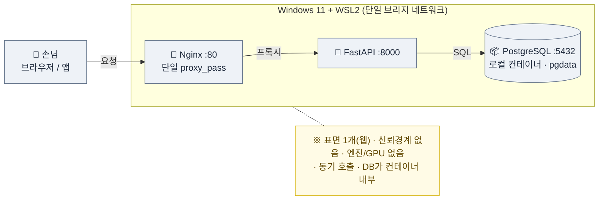
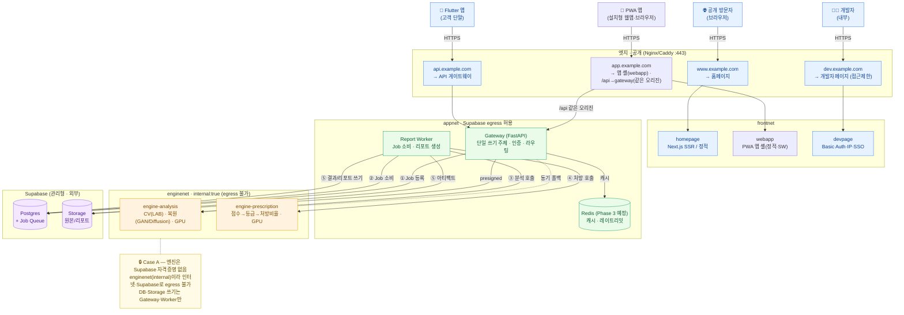
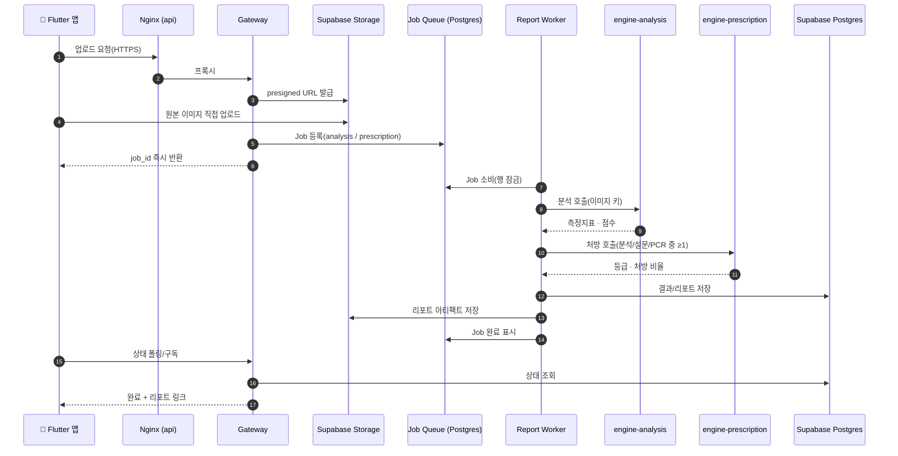

# SkinLens 서버 구성 적합성 검토 — 피부분석엔진 + 홈페이지 + 개발자페이지 동시 운영

> 대상: `windows11_ubuntu_server_setup.md`의 WSL2 + Docker(Nginx / FastAPI / PostgreSQL) 구성을
> **SkinLens 실제 아키텍처**(Gateway + 분석/처방 엔진 2개 + Worker + Redis〔Phase 3 예정〕 + Supabase)로
> 홈페이지·개발자페이지와 함께 운영할 수 있는지에 대한 검토.
>
> 결론 먼저: **개발/스테이징 스캐폴드이자 이관 연습용으로는 적합**하지만, "가이드 구성 그대로"로
> 네 표면(홈·개발자·앱(PWA)·API)을 실제 운영하기에는 아래 갭을 얹어야 합니다. 가이드의 예제 스택(단일 FastAPI + 로컬
> PostgreSQL)이 SkinLens의 실제 토폴로지보다 단순하기 때문입니다.
>
> **[갱신] 앱 표면(PWA) 추가:** 초기 검토는 홈·개발자·API의 3표면을 전제했으나, 이후 `app.` 호스트에
> 설치형 **PWA 앱 셸(`webapp`, Vite+React)** 이 더해져 표면은 총 **4개**(홈·개발자·앱·API)가 되었습니다.
> 앱은 앱 셸(정적)과 `/api`(gateway)를 **같은 오리진**으로 서빙해 CORS가 필요 없고(§4), 서비스워커는
> 앱 셸만 precache하고 `/api/*`는 캐시하지 않습니다(PIPA — 사진·분석결과·토큰 미캐시).

---

## 0. 한눈에 — 갭 요약

| # | 심각도 | 영역 | 그대로 두면 | 조치 방향 |
|---|---|---|---|---|
| 1 | **높음** | 토폴로지 불일치 | 예제는 FastAPI 1 + Postgres 1. 실제는 Gateway + 엔진2 + Worker + Redis〔Phase 3 예정〕 + Supabase | compose를 뼈대로 두고 서비스·배선 확장 (§2) |
| 2 | **높음(보안)** | 신뢰경계(Case A) | 기본 단일 브리지에선 엔진이 이름으로 서로 닿고 인터넷·Supabase로 egress 가능 | Docker 네트워크 분리 + 엔진 `internal` 폐쇄망 (§3) |
| 3 | **높음** | 4표면 라우팅 | Nginx 단일 `proxy_pass`로 www/dev/app/api 분기 불가 | 호스트/경로 기반 라우팅 (§4) |
| 4 | **높음** | 업로드·타임아웃 | 이미지 업로드 413, 장시간 분석 504 | `client_max_body_size`·타임아웃 + 비동기 Job Queue (§5) |
| 5 | 중간 | DB 정렬 | 로컬 postgres 도구(`pg_backup`/`migrate`)가 Supabase에 안 맞음 | 관리형 DB 경로(런북 §6-4)로 정렬 (§6) |
| 6 | 중간 | GPU·리소스 | 단일 GPU/8GB에 엔진2+웹 동시 = VRAM·메모리 경합 | 워크로드 분리·리소스 상향, 실운영은 별도 (§7) |
| 7 | 중간 | 개인정보(PIPA) | 홈 데스크톱을 portproxy로 노출해 실데이터 운영은 위험 | 실서비스는 이관 런북 + 관리형 + 하드닝 (§8) |

---

## 1. 무엇을 함께 올리려는가 (전제 정리)

- **피부분석 엔진**: 실제로는 단일 서비스가 아니라 **분석 엔진 + 처방 엔진 2개**(`engine-analysis` /
  `engine-prescription`). 둘 다 **폐쇄망·자격증명 없음**(Case A). CV 파이프라인(LAB 색공간),
  GAN/diffusion 복원(CodeFormer, RestoreFormer++) 등 **GPU 바운드** 워크로드 포함.
- **홈페이지(공개 사이트)** 와 **개발자페이지**: 웹 계층(SkyWeb, Next.js/PWA). 클라이언트 앱은 Flutter.
- **쓰기 주체**: **Gateway(FastAPI)** 와 **Report Worker** 만 Supabase(Postgres/Storage)에 씀.
  엔진에는 Supabase 자격증명을 주입하지 않음.
- **데이터 계층**: 로컬 PostgreSQL 컨테이너가 아니라 **Supabase 사용 확정**. Redis 캐시(Phase 3 예정),
  Postgres 기반 Job Queue.

즉, 가이드의 "Nginx → FastAPI → PostgreSQL" 3단 예제와 표면적으로 닮았지만, 실제로는 서비스 수와
신뢰경계가 다릅니다. 아래는 그 차이를 메우는 항목들입니다.

---

## 2. 토폴로지 — 예제 스택은 뼈대일 뿐

가이드의 `docker-compose.yml`은 학습용 최소 예제입니다. SkinLens로 확장하면 서비스가 다음처럼 늘어납니다.

```text
nginx(엣지)  ─┬─ homepage      (Next.js/정적)
              ├─ devpage       (개발자페이지)
              └─ gateway(FastAPI)  ─┬─ redis (Phase 3 예정)
                                    ├─ worker(리포트)
                                    ├─ engine-analysis      (폐쇄망·GPU)
                                    └─ engine-prescription  (폐쇄망·GPU)
Supabase(Postgres/Storage) ← gateway·worker 만 접근 (엔진 접근 없음)
```

- 로컬 `postgres` 서비스는 **제거**하고 데이터는 Supabase로. → 가이드의 `postgres` 컨테이너·`pgdata`
  볼륨·§18 백업 스크립트·§migrate `pg_dump/pg_restore` 흐름은 **그대로는 해당 없음**(§6에서 정렬).
- 홈페이지가 Next.js **SSR**이면 Node 런타임 컨테이너가 별도로 필요하고, **정적 빌드**면 Nginx가
  빌드 산출물을 직접 서빙할 수 있습니다. 개발자페이지도 동일 기준으로 판단.

> 가이드 §27(멀티 프로젝트 라우팅)과 v2 하드닝(포트 루프백)이 밑그림은 되지만, 위 서비스들을
> **SkinLens 전용으로 명시**해야 실제로 함께 뜹니다.

---

## 3. 신뢰경계(Case A) — 네트워크를 분리해야 실제로 지켜진다

가이드 기본 compose는 **단일 브리지 네트워크**라, 모든 컨테이너가 이름으로 서로 닿고 외부로도
나갈 수 있습니다. 이 상태로는 "엔진은 Supabase 자격증명 없고 폐쇄망" 이라는 Case A가 **문서상으로만**
지켜지고 런타임에선 강제되지 않습니다. Docker 네트워크를 나눠 **엔진의 egress 경로 자체를 없애야** 합니다.

```yaml
# 개념 예시 (postgres 없음 · 엔진 폐쇄망 · 게이트웨이만 브리지)
networks:
  frontnet:            # 엣지: nginx ↔ 웹/게이트웨이 표면
  appnet:              # 앱: gateway·worker·redis〔Phase 3 예정〕 (Supabase egress 허용)
  enginenet:
    internal: true     # ★ 외부 egress 불가 — 엔진은 인터넷/Supabase로 못 나감

services:
  engine-analysis:
    networks: [enginenet]          # 엔진은 폐쇄망에만 연결
    # ports 없음(발행 금지), Supabase 자격증명 주입 없음
  engine-prescription:
    networks: [enginenet]

  gateway:
    networks: [frontnet, appnet, enginenet]   # 유일한 교차점: 엔진 호출 + Supabase 쓰기
  worker:
    networks: [appnet, enginenet]             # 엔진 호출 + Supabase 쓰기
  redis:                                     # Phase 3 예정
    networks: [appnet]

  nginx:
    networks: [frontnet]
    ports: ["80:80", "443:443"]    # 바깥에 여는 건 nginx 뿐
  homepage:
    networks: [frontnet]
  devpage:
    networks: [frontnet]
```

핵심은 **엔진을 `internal: true` 네트워크에만** 두는 것입니다. 이러면 엔진 컨테이너에 실수로
자격증명이 들어가더라도 나갈 통로가 없어, Case A가 "설정이 아니라 네트워크 구조로" 보장됩니다.
게이트웨이/워커만 `appnet`(egress 허용)에 두어 Supabase로 씁니다. v2에서 도입한 "관리·내부 포트는
발행하지 않는다" 원칙과도 일관됩니다.

---

## 4. 4표면 라우팅 — 단일 proxy_pass로는 부족

가이드의 `nginx/default.conf`는 `proxy_pass http://fastapi:8000` 하나뿐입니다. 홈페이지 / 개발자페이지 /
앱(PWA) / api(게이트웨이)는 서로 다른 표면이므로 **호스트 기반**(권장) 또는 **경로 기반**으로 분기합니다.

```nginx
# 호스트 기반 (권장, TLS는 Caddy 또는 certbot로)
server {                       # 공개 홈페이지
    server_name www.example.com example.com;
    location / { proxy_pass http://homepage:3000; }   # 정적이면 root+try_files 로 직접 서빙
}
server {                       # 개발자페이지 (외부 노출 최소화 권장)
    server_name dev.example.com;
    location / { proxy_pass http://devpage:3000; }
}
server {                       # 설치형 PWA 앱 — 앱 셸과 API 를 같은 오리진으로
    server_name app.example.com;
    client_max_body_size 25m;                          # /api/analyze 업로드 대비
    location /api/ { rewrite ^/api/(.*)$ /$1 break; proxy_pass http://gateway:8000; }
    location /     { proxy_pass http://webapp:80; }    # 정적 앱 셸(SW/매니페스트는 no-cache)
}
server {                       # 앱·엔진 콜백용 API 게이트웨이
    server_name api.example.com;
    location / { proxy_pass http://gateway:8000; }
}
```

- **앱(`app.`) 표면**은 정적 앱 셸(`webapp`)과 `/api`(gateway)를 **한 오리진**에 두어 CORS를 없앴습니다.
  서비스워커는 앱 셸(정적)만 precache하고 `/api/*`는 `NetworkOnly`(PIPA) — 실제 배선은 `deploy/nginx/conf.d/app.conf`.
- 도메인이 아직 없으면 로컬 `hosts`(`www.local`, `dev.local`, `app.local`, `api.local`)로 먼저 테스트하거나
  경로 기반(`/`, `/dev`, `/app`, `/api`)으로 시작합니다.
- **개발자페이지는 공개 대상이 아니라면** 별도 도메인/경로 + 접근 제한(Basic Auth·IP 허용·SSO)을
  두는 것을 권장합니다. 공개 홈페이지와 같은 노출도로 두지 마세요.

---

## 5. 업로드·타임아웃 — 지금 설정으론 MVP부터 막힌다

피부 사진은 크고, 분석은 CV + LLM으로 오래 걸립니다. 가이드 기본 Nginx는 두 가지가 빠져 있습니다.

```nginx
server {
    server_name api.example.com;

    client_max_body_size 25m;        # 기본 1m → 이미지 업로드 413 방지 (엔드포인트 크기에 맞춰 조정)

    location / {
        proxy_pass http://gateway:8000;
        proxy_read_timeout    120s;  # 동기 경로 안전판 (기본 60s → 504 방지)
        proxy_connect_timeout 5s;
        proxy_set_header Host              $host;
        proxy_set_header X-Real-IP         $remote_addr;
        proxy_set_header X-Forwarded-For   $proxy_add_x_forwarded_for;
        proxy_set_header X-Forwarded-Proto $scheme;
    }
}
```

다만 **타임아웃을 늘리는 것은 임시 안전판**이고, 정답은 로드맵의 **Phase 2(비동기 Job Queue +
Report Worker)** 입니다. 게이트웨이는 업로드를 받으면 Job을 큐에 넣고 **즉시 `job_id`를 반환**,
Flutter 앱·웹은 상태를 폴링/구독하고, Worker가 엔진 호출·리포트 생성·Supabase 쓰기를 담당합니다.
이렇게 하면 장시간 요청이 Nginx→게이트웨이 커넥션을 붙잡지 않아 504·동시성 문제가 사라집니다.
대용량 원본 이미지는 가능하면 **Supabase Storage presigned URL**로 클라이언트가 직접 올리고,
게이트웨이는 키(경로)만 받는 방식이 프록시 부하·바디 크기 측면에서 유리합니다.

---

## 6. DB 계층 — Supabase 기준으로 백업·마이그레이션 정렬

로컬 PostgreSQL 컨테이너를 안 쓰기로 했으므로:

- 가이드 §18 `pg_backup.sh`(로컬 컨테이너 `pg_dump`)와 `migrate_export/import`의 컨테이너 덤프·복원은
  **그대로는 적용되지 않습니다.** 백업·PITR·가용성은 Supabase가 담당하고, 필요하면 Supabase의
  덤프/백업 기능 또는 `pg_dump -h <supabase-host>`로 **관리형 엔드포인트를 직접** 대상으로 합니다.
- 이관 시나리오도 런북 §6-4(관리형 DB로 분리)가 기준입니다: `docker-compose`에서 `postgres`·`pgdata`
  제거, `DATABASE_URL`을 Supabase 엔드포인트(호스트·포트·SSL 옵션)로, 데이터는 관리형 인스턴스로 복원.
- Job Queue가 Postgres 기반이면 그 테이블도 Supabase에 위치하므로, 게이트웨이/워커의 접속 자격만
  관리하면 됩니다(엔진은 여전히 접근 없음).
- 비밀번호 특수문자 → `DATABASE_URL` 파싱 이슈(v2 §9-2 경고)는 Supabase 접속 문자열에도 동일하게
  적용됩니다. `URL.create`로 조립하는 방식을 권장합니다.

---

## 7. GPU·리소스 — 개발엔 OK, 동시 운영엔 빠듯

- CV + GAN/diffusion 복원은 GPU 바운드입니다. 가이드 §26 WSL2 패스스루는 **개발용으로는 충분**하지만,
  데스크톱 **단일 GPU**에 분석·처방 엔진이 각각 모델을 VRAM에 올리고 거기에 웹까지 얹으면
  **VRAM·메모리 경합**이 생깁니다. 두 엔진이 동시에 GPU를 뜨겁게 쓰면 VRAM 한계에서 OOM 나기 쉽습니다.
- 완화책: 엔진 모델을 **필요 시 로드/언로드**하거나, GPU가 필요한 쪽만 GPU에 배치하고 나머지는 CPU로,
  또는 엔진 동시성을 1로 직렬화. 근본적으로는 **엔진 워크로드를 웹과 분리**(별 호스트/별 GPU)하는 방향.
- `.wslconfig` 기본 8GB/4CPU는 (homepage + devpage + gateway + engine×2 + redis〔Phase 3 예정〕 + worker) **동시** 가동엔
  부족합니다. 개발에선 "동시에 다 뜨겁지 않게" 쓰면 되지만, 부하 테스트·실사용 동시성엔 리소스 상향
  또는 서버 분리가 필요합니다. 여기에 §3의 "WSL 수명주기"(idle 종료) 이슈까지 겹치므로, 상시 부하가
  붙는 실운영은 애초에 native/클라우드가 맞습니다.

---

## 8. 개인정보(PIPA) — 실데이터는 홈 데스크톱에 두지 말 것

실제 고객 **피부 이미지·분석 결과는 민감 개인정보**입니다(참고: 필자는 법률 자문 제공자가 아니며,
아래는 일반적 보안 관점입니다).

- **개발·검증**: 더미/합성 데이터로 지금의 WSL2 구성에서 진행하는 것은 괜찮습니다.
- **실서비스**: 홈 데스크톱을 portproxy로 인터넷에 노출해 실데이터를 운영하는 것은 보안·컴플라이언스
  측면에서 권하기 어렵습니다. 이관 런북 경로(고정 IP·도메인·TLS) + **관리형(Supabase)** + v2 하드닝
  (관리·DB 포트 루프백/보안그룹 차단, ufw-Docker 우회 차단, SSH 키 전용)을 적용하고, 저장 시
  암호화·접근통제·감사 로깅·보존기간 정책을 함께 갖추는 것이 맞습니다. 이미 설계에 PIPA 준수
  오프라인 캐싱을 반영 중이므로, **호스팅 계층에서도 같은 기준**을 지키면 됩니다.

---

## 9. 종합 판단

| 용도 | 지금 가이드 구성으로 충분한가 |
|---|---|
| 로컬 개발 / 통합 실험 (더미 데이터) | **충분** — 예제 스택 확장만 하면 됨 |
| 스테이징 / 이관 리허설 | **충분** — 런북 + v2 하드닝과 함께 |
| 네 표면 실운영 (실고객 데이터) | **그대로는 부적합** — §3·4·5·6·8을 얹어야 함 |

**얹어야 할 4가지(우선순위 순):**

1. **엔진 격리** — `internal: true` 폐쇄망으로 Case A를 런타임에서 강제 (§3)
2. **www/dev/app/api 라우팅** — 호스트/경로 분기 + 개발자페이지 접근 제한 + 앱(PWA) 같은 오리진 (§4)
3. **업로드·타임아웃 + 비동기** — body 크기·타임아웃 튜닝, Phase 2 Job Queue/Worker, presigned 업로드 (§5)
4. **Supabase 정렬** — 로컬 postgres 도구 대신 관리형 DB 경로(런북 §6-4) (§6)

---

## 부록 A. 기본 예제 스택 (가이드) — 비교 기준선

`windows11_ubuntu_server_setup.md`의 학습용 예제입니다. **단일 네트워크·단일 FastAPI·로컬 Postgres**로,
모든 컨테이너가 서로 이름으로 닿고 외부로도 나갈 수 있습니다. 아래 부록 B와 나란히 두고 보면 SkinLens가
무엇을 더 얹어야 하는지 한눈에 드러납니다.



**부록 A → 부록 B 로 가면서 바뀌는 것**

| 축 | 부록 A (기본 예제) | 부록 B (SkinLens 목표) |
|---|---|---|
| 웹 표면 | 1개 | **4개** (www / dev / app(PWA) / api) |
| 앱 서비스 | FastAPI 1개 | **Gateway + Worker + Redis(Phase 3 예정)** |
| AI 엔진 | 없음 | **분석·처방 2개 (GPU · 폐쇄망)** |
| 네트워크 | 단일 브리지 | **frontnet / appnet / enginenet(internal)** |
| 신뢰경계 | 없음 | **Case A — 엔진 egress·자격증명 차단** |
| 데이터 | 로컬 Postgres 컨테이너 | **Supabase (Postgres/Storage) 관리형** |
| 호출 방식 | 동기 | **비동기 Job Queue + Worker** (부록 C) |

---

## 부록 B. 목표 토폴로지 — SkinLens 컴포넌트 (네트워크·신뢰경계 상세)



> 엔진→Supabase 화살표는 **의도적으로 그리지 않았습니다.** 그 경로가 존재하지 않는다는 것이 Case A의
> 핵심이라, 점선 차단(`.-x`)과 주석으로만 표시합니다. 요청 흐름 번호(①~⑤)는 부록 C 시퀀스와 대응합니다.

---

## 부록 C. 비동기 분석 Job 생애주기 (Sequence)

부록 B의 ①~⑤가 시간축에서 어떻게 흐르는지입니다. 게이트웨이는 `job_id`만 즉시 반환해 Nginx 커넥션을
붙잡지 않고(§5의 "타임아웃은 임시 안전판, 정답은 비동기"), 엔진 호출·DB/Storage 쓰기는 전부 Worker가
담당합니다(엔진은 DB·Storage에 직접 손대지 않음).



> 처방 호출의 "분석/설문/PCR 중 ≥1"은 처방 엔진이 분석의 하위 단계가 아니라 **독립 진입점**임을
> 반영한 것입니다(세 입력 중 하나라도 주어지면 동작).

---

> 이 문서는 `windows11_ubuntu_server_setup.md`(v2 하드닝 반영)와 `server_migration_runbook.md`를
> 보완하는 **SkinLens 전용 적합성 메모**입니다. 실제 `docker-compose.yml` 초안(위 네트워크·라우팅·
> 워커·nginx 튜닝을 채운 구동 가능한 버전)이 필요하면 별도로 작성합니다.
