# SkinLens 서버 구축의 바람직한 아키텍처 — 장단점 비교

## 1. 문서 목적

본 문서는 SkinLens의 현재 서버 구조를 기준으로 향후 운영에 적합한 서버 아키텍처를 비교하고, **Vercel + Supabase + AI Server로 분리하는 3-Tier 구조를 권장안으로 정리**하기 위한 문서이다.

현재 SkinLens는 기존의 단일 서버 구조에서 다음 세 영역을 분리하는 방향으로 이전하고 있다.

- **Vercel**: Next.js PWA 프런트엔드
- **Supabase**: PostgreSQL + Storage + Auth 기반 데이터 계층
- **AI Server**: gateway + worker + engine-* 중심의 AI 처리 계층

`docs/stories/09_SkinLens_3Tier_이전_이야기.md`에서는 이 구조를 각각 **쇼윈도(Vercel) / 데이터 창고(Supabase) / 우리 주방(AI Server)**로 표현하고 있으며, 사진은 presigned URL을 통해 브라우저에서 Supabase Storage로 직접 업로드하도록 설계되어 있다.

> 핵심 출처: SkinLens 3-Tier 이전 문서는 기존 구조를 nginx → gateway → worker → 로컬 DB/storage로 설명하고, 신규 구조를 Vercel PWA → gateway/worker/engine → Supabase로 분리하는 방향으로 정의한다. 또한 사진을 서버를 거치지 않고 Supabase Storage에 직접 업로드하는 presigned 방식이 핵심 변화라고 설명한다.

---

## 2. 현재 구조의 출발점

### 2.1 기존 구조

기존 구조는 한 서버 안에 다음 요소가 함께 존재하는 형태였다.

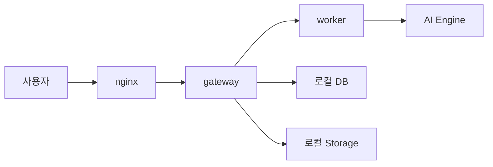

`docs/stories/09_SkinLens_3Tier_이전_이야기.md`에서는 이를 **“한 지붕 아래”** 구조로 설명한다.

### 장점

- 초기 구축이 단순하다.
- 모든 구성요소가 한 서버 안에 있어 개발 초기에는 관리가 쉽다.
- 네트워크 구간이 적다.
- 외부 서비스 의존성이 상대적으로 적다.
- 개발·테스트 단계에서 비용을 낮추기 쉽다.

### 단점

- 웹 서비스, DB, 파일 저장소, AI 처리 자원이 서로 영향을 준다.
- 이미지 업로드가 애플리케이션 서버의 대역폭을 사용한다.
- AI 처리량이 증가하면 웹 서비스까지 영향을 받을 수 있다.
- 서버 장애 시 여러 기능이 동시에 중단될 수 있다.
- 서버 확장 시 전체 시스템을 함께 확장해야 하는 문제가 생긴다.
- 백업과 장애복구를 직접 설계하고 운영해야 한다.

---

# 3. 비교 대상 아키텍처

SkinLens에 적용할 수 있는 대표적인 구조를 다음과 같이 비교한다.

| 구분 | 구조 | 핵심 특징 |
|---|---|---|
| A | 단일 서버 | 모든 기능을 한 서버에 집중 |
| B | 전통적 3-Tier 자체 구축 | Web / Application / DB를 직접 운영 |
| C | Vercel + Supabase + AI Server | 관리형 Front/DB + 전용 AI Server |
| D | 완전 클라우드 | Front + API + DB + AI까지 클라우드 관리 |
| E | 하이브리드 | 관리형 서비스와 자체 서버를 목적별 혼합 |

---

# 4. A안 — 단일 서버 구조

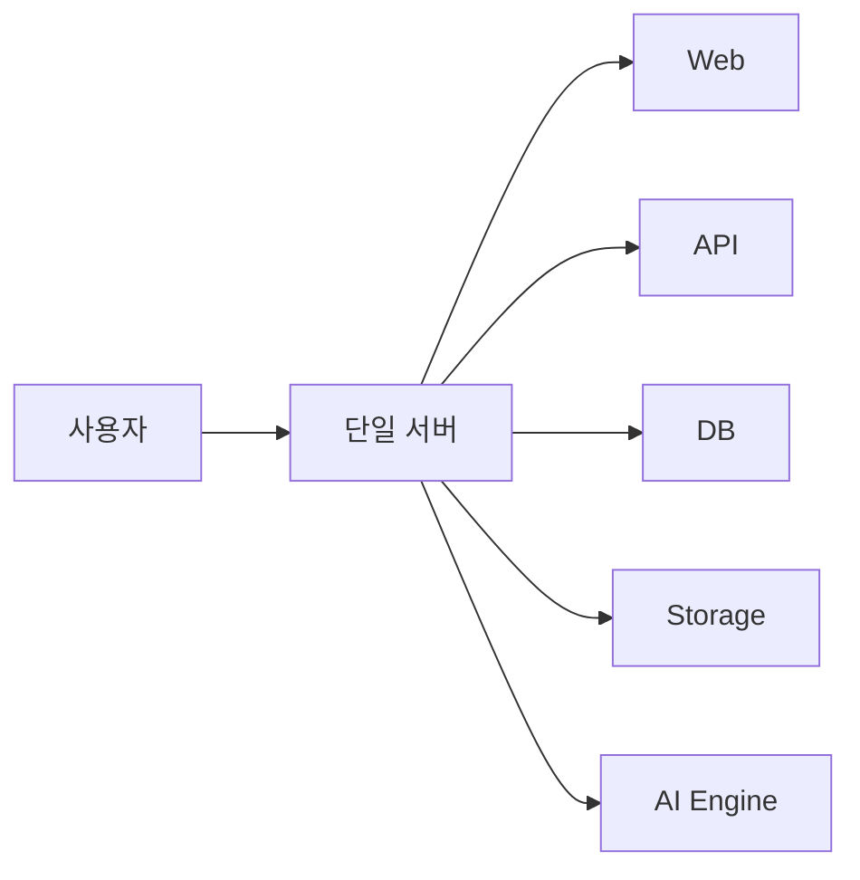

## 장점

1. 구축이 가장 쉽다.
2. 서버 수가 적어 운영 구조가 단순하다.
3. 초기 비용을 낮추기 쉽다.
4. 개발자가 전체 시스템을 한 곳에서 관리할 수 있다.

## 단점

1. 장애 격리가 어렵다.
2. AI 연산과 일반 웹 서비스가 자원을 경쟁한다.
3. 트래픽 증가 시 전체 서버를 증설해야 한다.
4. 이미지 저장공간과 네트워크가 서버에 집중된다.
5. 백업·복구를 직접 관리해야 한다.
6. 운영 규모가 커질수록 유지보수 부담이 빠르게 증가한다.

## 적합한 단계

- PoC
- 초기 개발
- 내부 테스트
- 사용자가 매우 적은 초기 서비스

**SkinLens의 장기 운영 구조로는 권장하지 않는다.**

---

# 5. B안 — 전통적 3-Tier 자체 구축

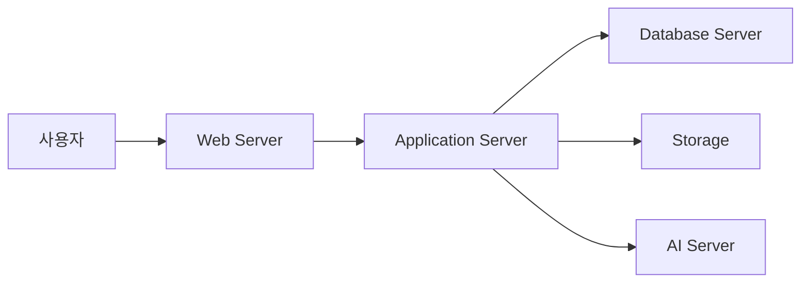

## 장점

- 계층별 역할이 명확하다.
- 서비스 규모에 따라 각 계층을 독립적으로 확장할 수 있다.
- 자체 서버에 대한 통제력이 높다.
- 외부 SaaS 의존도를 낮출 수 있다.

## 단점

- 서버를 직접 구축·운영해야 한다.
- DB 백업, 장애복구, 보안패치, 모니터링을 직접 책임져야 한다.
- Web/App/DB/Storage 각각의 운영 전문성이 필요하다.
- 초기 구축 및 운영비가 증가한다.
- 트래픽 증가에 따른 자동 확장이 어렵다.

## SkinLens 적합성

기술적으로 충분히 가능하지만, **AI 분석 서비스에 필요한 이미지 저장·인증·DB·웹 배포 기능까지 모두 직접 운영하는 것은 운영 부담이 크다.**

---

# 6. C안 — Vercel + Supabase + AI Server

## 권장 아키텍처

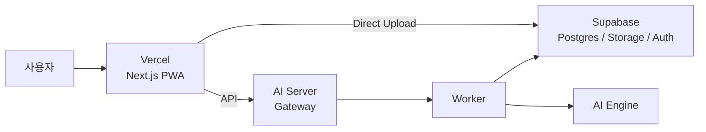

`docs/architecture/04_3Tier_Vercel_Supabase_AIServer_설계.md`에서 이 구조는 다음 세 영역으로 명확하게 분리된다.

- **Vercel = 쇼윈도**
- **Supabase = 데이터 창고**
- **AI Server = 우리 주방**

또한 사진 업로드는 다음 흐름으로 변경된다.

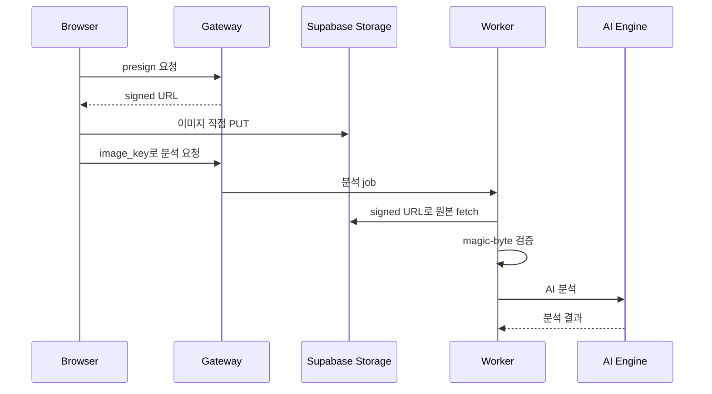

### 가장 중요한 장점

**이미지가 AI Server를 거치지 않는다.**

`docs/stories/09_SkinLens_3Tier_이전_이야기.md`에서는 기존에는 사진이 안내 데스크 → 주방장 → 저장고를 거쳤지만, 새로운 구조에서는 브라우저가 presigned URL을 받아 Supabase Storage로 직접 업로드하고 AI Server에는 `image_key`만 전달한다고 설명한다.

따라서 다음 효과를 기대할 수 있다.

- AI Server의 네트워크 부하 감소
- 이미지 업로드 대역폭 감소
- 서버의 파일 저장 부담 감소
- Storage와 AI 처리의 역할 분리
- 개인정보·민감 이미지의 데이터 이동 경로 단순화

단, **직접 업로드한다고 보안 검증이 없어지는 것은 아니다.** 문서에서는 worker가 실제 이미지인지 magic-byte를 재검증하도록 설계되어 있다.

## 장점

| 항목 | 평가 |
|---|---|
| 초기 구축 | ★★★★☆ |
| 운영 편의성 | ★★★★★ |
| 확장성 | ★★★★☆ |
| AI 서버 독립성 | ★★★★★ |
| DB 운영 부담 | ★★★★★ |
| 이미지 처리 효율 | ★★★★★ |
| 자체 통제력 | ★★★☆☆ |
| 비용 최적화 가능성 | ★★★★☆ |

## 단점

1. Vercel과 Supabase라는 외부 서비스에 의존한다.
2. 서비스별 장애를 독립적으로 관리해야 한다.
3. AI Server는 여전히 직접 운영해야 한다.
4. CORS, 인증, presigned URL, RLS 등의 경계 설정을 정확하게 해야 한다.
5. 서비스가 크게 성장하면 관리형 서비스 비용을 별도로 검토해야 한다.

## SkinLens 적합성

**현재 SkinLens에는 가장 균형이 좋은 구조로 판단된다.**

특히 AI 분석 서버와 일반 웹/DB 기능을 분리하면서도 DB·Storage·Auth 운영 부담을 크게 줄일 수 있다는 점이 중요하다.

---

# 7. D안 — 완전 클라우드 아키텍처

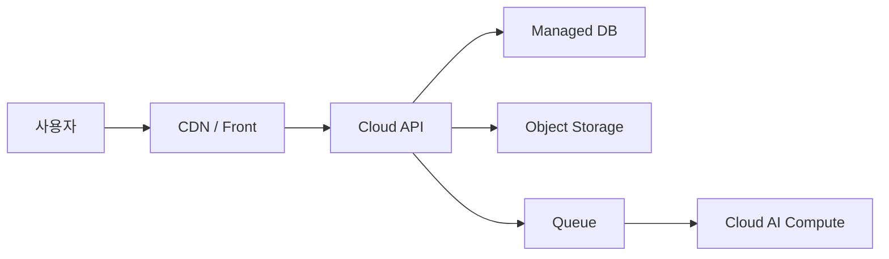

## 장점

- 확장성이 매우 높다.
- 자동화된 배포와 모니터링을 구축하기 쉽다.
- 장애 대응 및 고가용성 옵션을 확보하기 쉽다.
- AI 서버도 필요에 따라 GPU 클라우드로 확장할 수 있다.

## 단점

- 구조가 복잡해진다.
- 비용 구조를 이해하기 어렵다.
- 여러 클라우드 서비스에 대한 운영 지식이 필요하다.
- GPU 사용량이 증가하면 비용이 크게 증가할 수 있다.
- 초기 SkinLens 규모에서는 과도한 설계가 될 수 있다.

## 적합한 단계

- 대규모 사용자
- 높은 동시 AI 분석량
- 24시간 고가용성 요구
- 다지역 서비스
- GPU 자동 확장이 필요한 단계

---

# 8. E안 — 하이브리드 구조

하이브리드 구조는 관리형 서비스와 자체 서버를 목적별로 조합한다.

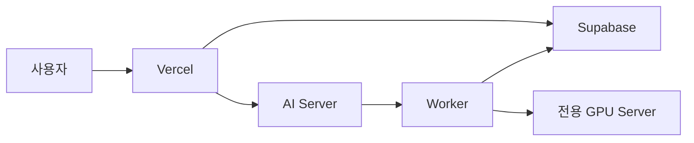

예를 들어:

- Frontend → Vercel
- DB/Auth/Storage → Supabase
- Gateway/Worker → 자체 서버
- AI Engine → RTX GPU 서버
- 필요 시 GPU 서버만 클라우드로 확장

## 장점

- AI 연산 자원을 자유롭게 선택할 수 있다.
- GPU 서버 비용을 직접 최적화할 수 있다.
- Vercel/Supabase의 관리형 기능을 활용할 수 있다.
- 장기적으로 비용과 성능을 균형 있게 조절할 수 있다.

## 단점

- 시스템 구성요소가 늘어난다.
- 네트워크 보안 설계가 중요해진다.
- 장애 지점이 늘어난다.
- 배포와 모니터링 체계가 복잡해진다.

**SkinLens가 AI 분석량이 커질 경우 C안에서 자연스럽게 발전할 수 있는 구조**다.

---

# 9. 핵심 비교표

| 평가항목 | A. 단일 서버 | B. 자체 3-Tier | C. Vercel+Supabase+AI | D. 완전 클라우드 | E. 하이브리드 |
|---|---:|---:|---:|---:|---:|
| 구축 난이도 | ★★★★★ | ★★★ | ★★★★ | ★★ | ★★☆ |
| 초기 비용 | ★★★★★ | ★★★ | ★★★★ | ★★ | ★★★ |
| 운영 편의성 | ★★★ | ★★ | ★★★★★ | ★★★★ | ★★★ |
| 확장성 | ★★ | ★★★★ | ★★★★ | ★★★★★ | ★★★★★ |
| AI 서버 독립성 | ★★ | ★★★★ | ★★★★★ | ★★★ | ★★★★★ |
| DB 운영 편의성 | ★★ | ★★ | ★★★★★ | ★★★★★ | ★★★★★ |
| Storage 확장성 | ★★ | ★★★ | ★★★★★ | ★★★★★ | ★★★★★ |
| 자체 통제력 | ★★★★★ | ★★★★★ | ★★★ | ★★ | ★★★★ |
| 장애 격리 | ★ | ★★★★ | ★★★★★ | ★★★★★ | ★★★★ |
| 운영 복잡도 | ★★★★★ | ★★ | ★★★★ | ★★ | ★★ |
| 데이터 소재지 통제 | ★★★★★ | ★★★★★ | ★★★☆☆ | ★★☆☆☆ | ★★★★☆ |
| 비용 예측가능성(운영 구간) | ★★★☆☆ | ★★★☆☆ | ★★★★☆ | ★★☆☆☆ | ★★★☆☆ |
| SkinLens 현재 적합성 | ★★ | ★★★ | **★★★★★** | ★★★ | ★★★★ |

※ 별점은 이 문서의 비교를 위한 상대적 평가이며, 실제 비용·성능은 트래픽과 AI 모델, GPU 사용량에 따라 달라질 수 있다.
※ "데이터 소재지 통제"에서 C안이 만점이 아닌 이유: 원본 이미지 저장이 Supabase 리전에 종속되어 자체 호스트만큼의 물리적 통제는 갖지 못하기 때문(13장). 리전을 국내로 고정하면 상향 가능. 두 행의 근거는 13·14장 참조.

---

# 10. SkinLens에 C안을 권장하는 이유

## 10.1 역할 분리가 명확하다

```text
Vercel
  └─ 사용자 화면 / PWA / 정적 자산

Supabase
  ├─ PostgreSQL
  ├─ Storage
  └─ Auth

AI Server
  ├─ Gateway
  ├─ Worker
  └─ AI Engine
```

각 구성요소가 자신의 역할에 집중한다.

## 10.2 AI 서버를 가볍게 유지할 수 있다

`docs/architecture/05_3Tier_이전_작업계획.md`에서는 기존 AI Server에서 nginx, 정적 웹, storage 등을 제거하고 gateway, worker, engine-* 중심으로 슬림화한 상태라고 설명한다.

즉 AI Server의 자원을 **AI 분석 자체에 집중**시키는 구조다.

## 10.3 이미지 업로드 구조가 특히 적합하다

SkinLens는 사용자 사진을 입력으로 사용하므로 이미지 트래픽이 일반 웹서비스보다 중요하다.

브라우저 → AI Server → Storage 방식보다

**브라우저 → Supabase Storage 직접 업로드**

방식이 AI Server의 네트워크와 저장 부담을 줄이는 데 유리하다.

## 10.4 향후 GPU 서버 확장이 쉽다

현재 AI Server가 gateway/worker/engine으로 분리되어 있으므로 향후 AI Engine만 별도의 GPU 서버로 이동하는 것도 가능하다.

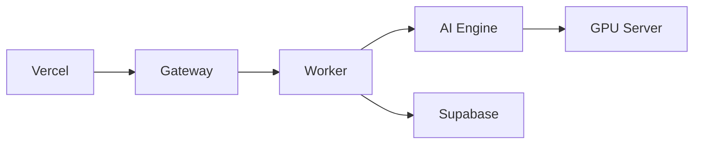

따라서 현재의 구조가 향후 대규모 구조로 발전하는 데에도 비교적 유리하다.

---

# 11. 권장 최종 구조

SkinLens의 현 단계에서는 다음 구조를 기준 아키텍처로 삼는 것을 권장한다.

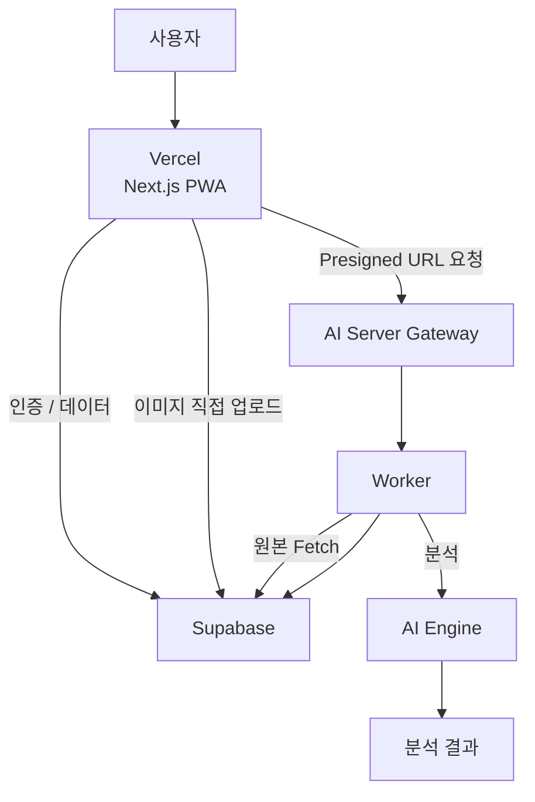

### 구성 원칙

1. **Frontend와 AI Backend를 분리한다.**
2. **DB와 Object Storage는 관리형 서비스로 분리한다.**
3. **이미지는 AI Server를 통과시키지 않는다.**
4. **AI Server에는 gateway/worker/engine 중심의 최소 기능만 둔다.**
5. **Storage 접근은 presigned URL과 인증 정책으로 통제한다.**
6. **Worker에서 이미지의 실제 형식을 재검증한다.**
7. **향후 AI Engine/GPU만 독립적으로 확장할 수 있도록 한다.**

---

# 12. 보안 관점의 핵심

SkinLens는 피부 사진을 취급하므로 일반적인 웹서비스보다 데이터 보호가 중요하다.

권장 데이터 흐름은 다음과 같다.

```text
사용자
  │
  ├── 인증
  ↓
Vercel
  │
  ├── presign 요청
  ↓
Gateway
  │
  └── signed URL
       ↓
사용자 ─────────→ Supabase Storage
                      │
                      ↓
                   Worker
                      │
                 magic-byte 검증
                      │
                      ↓
                  AI Engine
```

특히 다음을 유지해야 한다.

- Storage를 직접 공개하지 않는다.
- 짧은 만료시간의 signed URL을 사용한다.
- 업로드 객체의 소유권을 검증한다.
- `image_key` 형식을 검증한다.
- Worker에서 이미지의 실제 파일 형식을 검증한다.
- 인증·인가와 Storage 접근 정책을 분리하여 관리한다.
- 로그에 원본 이미지나 민감한 데이터를 남기지 않는다.

---

# 13. 데이터 소재지와 국외이전 관점

## 13.1 왜 이 장이 필요한가

SkinLens는 사용자의 **피부·얼굴 사진**을 입력으로 사용한다. 이미지가 계정·설문 등 식별정보와 결합되면 일반 웹서비스의 데이터보다 민감하게 취급해야 하며, 처리 위치가 국외이면 **개인정보 국외이전**에 해당한다.

C안(Vercel + Supabase + AI Server)은 관리형 서비스를 채택하는 대신, **데이터가 물리적으로 어느 나라에 저장·처리되는가**를 아키텍처 결정의 일부로 끌어들인다. 6장에서 정리한 C안의 장점(운영 편의성·확장성)은 이 장의 제약을 함께 확정해야 실제로 채택 가능한 결론이 된다.

> ⚠ 이 장의 법·규제 서술은 문서화를 위한 정리이며 법률 자문이 아니다. 실제 서비스 오픈 전 개인정보 전문 검토로 아래 "의무" 항목을 확정할 것.

## 13.2 계층별 데이터 소재지

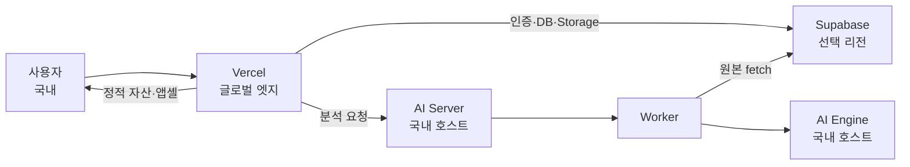

| 계층 | 무엇이 오가나 | 소재지 통제 | 국외이전 관점 |
|---|---|---|---|
| Vercel | 정적 자산·앱셸(JS/CSS)만. `/api`·Supabase 호출은 서비스워커 NetworkOnly 로 캐시 제외 | 엣지 위치는 통제 불가(글로벌) | **민감 데이터가 엣지에 상주하지 않는 것이 핵심**. 정적 자산만 이전되면 이전 대상이 아님 |
| Supabase | Postgres(설문·처방·잡)·Auth·Storage(원본 이미지) | **프로젝트 생성 시 리전 고정** | 리전이 국외면 국외이전. 원본 이미지가 여기 저장되므로 가장 중요 |
| AI Server | 분석 연산(이미지 바이트는 처리 중에만 메모리/tmpfs) | **국내 호스트로 자체 통제** | 국내 처리. 단 원본을 Supabase에서 fetch하므로 Supabase 리전에 종속 |

## 13.3 핵심 판단 — Supabase 리전이 사실상 데이터 소재지를 결정한다

원본 피부 이미지가 저장되는 곳은 **Supabase Storage** 하나다. 따라서 국외이전 여부는 거의 전적으로 **Supabase 프로젝트 리전 선택**으로 갈린다.

- **리전을 국내(가능한 경우)로 고정** → 원본·DB가 국내에 상주. 국외이전 부담이 크게 준다.
- **리전이 국외** → 국외이전에 해당. 아래 13.4의 의무를 충족해야 한다.

> AI Server를 국내에 두어도, 그 서버가 국외 리전 Supabase에서 원본을 fetch하면 **저장 위치는 여전히 국외**다. "연산이 국내"라는 사실이 "저장이 국내"를 만들지 않는다. 이 구분이 12장(보안)에서 다루지 않았던 지점이다.

## 13.4 국외이전이 불가피할 때의 의무(체크리스트)

Supabase 국내 리전이 불가하거나 비용·성능 때문에 국외 리전을 택한다면, 최소한 다음을 설계·운영·문서에 반영한다. (각 항목은 전문 검토 시 확정할 질문 목록으로도 쓴다.)

| # | 의무/조치 | 어디서 처리 |
|---|---|---|
| 1 | 국외이전 사실·항목·국가·목적·보유기간을 **처리방침에 명시**하고 이전 전 동의(또는 법적 근거) 확보 | 프런트 온보딩·처리방침 |
| 2 | 이전받는 자(Vercel·Supabase)와 이전 국가를 특정해 고지 | 처리방침 부속 문서 |
| 3 | 민감 이미지의 **보유기간 최소화** — 분석 완료 후 원본 자동 삭제 | `deploy/ops-jobs/retention.py` (KEEP_ORIGINAL_HOURS) |
| 4 | 전송·저장 구간 암호화(HTTPS/TLS, Storage 비공개 버킷 + signed URL) | Caddy·Supabase 정책 |
| 5 | 로그에 원본 경로·토큰·이미지가 남지 않도록 스크러빙 | `deploy/ops-jobs/log-scrub.py` |
| 6 | 파기 요청·열람 요청 대응 절차(계정 삭제 시 Storage 객체·행 동시 삭제) | Worker/ops-job + RLS |

## 13.5 SkinLens 권장

1. **1순위: Supabase 리전을 국내로 고정할 수 있는지 먼저 확인**한다. 가능하면 13.4의 상당수 의무가 "국외이전 아님"으로 소거된다 — 가장 단순하고 안전한 경로.
2. 국외 리전이 불가피하면, **원본 보존기간을 짧게(예: 분석 완료 후 24h 내 삭제)** 잡아 민감 데이터의 국외 상주 창을 최소화한다. 이미 `retention.py` 훅이 있으므로 정책값만 확정한다.
3. Vercel 엣지에는 **정적 자산만** 올라가고 민감 데이터는 통과만 하도록 현재의 서비스워커 정책(NetworkOnly for `/api`·Supabase)을 **문서의 근거로 명시**한다.

> 결론: C안은 데이터 소재지를 **Supabase 리전 하나로 수렴**시켜 통제점을 단순화한다는 장점이 있다. 단 그 하나의 선택이 국외이전 전체를 좌우하므로, **리전 결정을 아키텍처 확정과 동시에** 내려야 한다.

---

# 14. 비용 모델 관점

## 14.1 왜 별점이 아니라 임계값인가

9장 비교표는 비용을 별점(★)으로 다뤘다. 1인 운영 단계에서 실제로 중요한 질문은 "몇 점이냐"가 아니라 **"무료 티어가 어디서 끝나고, 무엇이 유료 전환을 트리거하느냐"**다. C안의 관리형 서비스는 초기 비용이 낮은 대신, 특정 사용량 구간을 넘으면 과금이 시작된다. 이 장은 그 **임계값과 트리거**를 정리한다.

## 14.2 과금이 발생하는 축

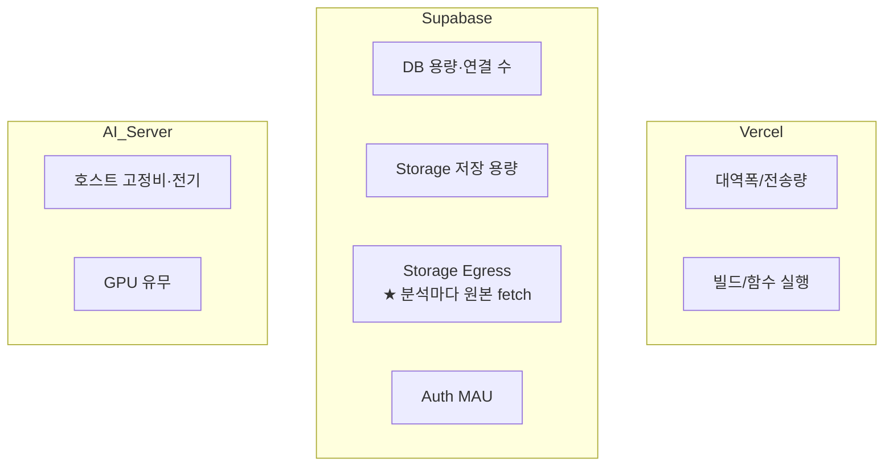

> ★ **주의 지점**: 6장·12장에서 강조한 "이미지가 서버를 안 거친다"는 **업로드**에 한한 이야기다. Worker는 분석할 때마다 원본을 Supabase에서 **다운로드(egress)** 하므로, 분석 1건당 **Storage egress가 1회씩** 발생한다. 이것이 사용량 증가 시 가장 먼저 커지는 축이다.

## 14.3 비용 축별 정리

| 과금 축 | 무엇이 소비하나 | 유료 전환 트리거(개념) | 완화책 |
|---|---|---|---|
| Supabase **Storage egress** | 분석마다 원본 fetch(원본 크기 × 분석 건수) | 월 분석 건수 급증 / 재처리 반복 | 원본 조기 삭제·재처리 최소화·리전 근접 |
| Supabase **Storage 용량** | 삭제 전까지 쌓인 원본 이미지 | 보존기간 × 건수 | `retention.py` 로 조기 삭제(파생만 유지) |
| Supabase **DB 용량/연결** | jobs·job_events·prescriptions 누적, 커넥션 풀 | row/용량 구간 초과, 동시연결 초과 | 이벤트 로그 주기 정리, 풀 상한 관리 |
| Supabase **Auth MAU** | 월 활성 사용자 수 | 무료 MAU 구간 초과 | (사용자 증가 시 자연 전환 — 계획된 비용) |
| Vercel **대역폭** | 정적 자산 전송(민감 데이터 아님) | 월 전송량 구간 초과 | 앱셸 경량화·엣지 캐시(정적만) |
| AI Server **고정비** | 호스트 상시 가동 + (선택)GPU | GPU 도입 시 급증 | Phase 3까지 CPU baseline, GPU는 처리량 임계 후 |

## 14.4 트래픽 가정별 성격(개념 시나리오)

정확한 요금은 각 서비스의 현재 요금제·리전·원본 크기에 따라 달라지므로 실제 단가는 서비스 콘솔에서 확인해 확정한다. 여기서는 **어느 축이 지배적으로 커지는지**의 성격만 정리한다.

| 단계 | 월 분석량(가정) | 지배적 비용 축 | 성격 |
|---|---|---|---|
| PoC/내부 | ~수십 건 | 사실상 없음(무료 티어 내) | AI Server 고정비만 |
| 초기 서비스 | 수백~수천 건 | AI Server 고정비 | Supabase는 대개 무료 구간, egress 미미 |
| 성장 | 수만 건+ | **Supabase Storage egress** | 분석 건수에 비례해 egress가 먼저 증가 |
| 대규모 | GPU 필요 구간 | **GPU 연산비** | Phase 3~4, 하이브리드(E안)로 GPU 분리 검토 |

## 14.5 SkinLens 권장

1. **원본 보존기간을 비용 레버로 인식**한다. Storage 용량·간접적으로 재처리 egress를 동시에 줄이는 가장 강력한 단일 손잡이다(`KEEP_ORIGINAL_HOURS`).
2. **egress를 모니터링 1순위 지표**로 둔다. "이미지가 서버를 안 거친다"는 인식 때문에 간과되기 쉬우나, 성장 구간에서 가장 먼저 커지는 축이다.
3. **GPU는 처리량 임계 전까지 도입하지 않는다.** 9장·15장(단계 전략)과 일관되게, Phase 3에서 Worker/Engine 분리가 필요해지는 시점까지 CPU baseline을 유지한다.
4. 실제 단가는 **서비스 오픈 전 각 콘솔에서 현재 요금제를 확인해 이 표의 "트리거" 옆에 숫자를 채운다.** 이 문서는 구조(무엇이 커지는가)를 고정하고, 숫자는 운영 시 갱신한다.

> 결론: C안의 "초기 비용 ★★★★"는 **초기 구간에 한해 정확**하다. 운영 관점의 진짜 질문은 "언제 무엇이 유료로 전환되는가"이며, SkinLens에서는 **Supabase Storage egress(분석마다 원본 fetch)**가 성장 구간의 1차 비용 동인이다. 이 축을 보존기간·모니터링으로 관리하는 것이 C안을 장기적으로 저비용으로 유지하는 핵심이다.

---

# 15. 단계별 발전 전략

## Phase 1 — 현재

**Vercel + Supabase + AI Server**

목표:

- 기존 단일 서버 구조 제거
- Next.js PWA 배포
- Supabase DB/Storage/Auth 정착
- presigned upload 적용
- AI Server 슬림화

## Phase 2 — 운영 안정화

추가:

- GitHub Actions 기반 배포
- 로그/모니터링
- 백업 및 복구 리허설
- 장애 알림
- AI Worker 안정화

## Phase 3 — AI 처리량 증가

필요할 경우:

- Worker와 AI Engine 분리
- GPU Server 분리
- Queue 도입
- AI 작업 병렬화
- GPU 자원 자동/수동 확장

## Phase 4 — 대규모 서비스

필요할 경우:

- Cloud GPU
- Queue/Job 시스템
- 다중 Worker
- 다중 AI Engine
- CDN/Edge 최적화
- 고가용성 구성

---

# 16. 결론

SkinLens의 서버 아키텍처는 **“모든 기능을 한 서버에 넣는 방식”에서 “기능별로 가장 적합한 전문 영역으로 분리하는 방식”으로 전환하는 것이 바람직하다.**

현재 단계에서 가장 현실적인 선택은:

> **Vercel + Supabase + AI Server의 3-Tier 구조**

이다.

이 구조의 핵심은 단순히 서버를 세 개로 나누는 것이 아니다.

**① Frontend를 Vercel에 맡기고  
② 데이터와 원본 이미지를 Supabase에 맡기며  
③ AI 연산만 전용 AI Server에서 수행하고  
④ 사용자의 이미지는 presigned URL로 Storage에 직접 전달하는 것**

이 핵심이다.

특히 `docs/stories/09_SkinLens_3Tier_이전_이야기.md`에서 설명한 현재 이전 작업은 이미 이 방향으로 상당 부분 진행되어 있다. 코드 측면에서는 Supabase Storage, Next.js PWA, AI Server 슬림화, presigned upload와 worker의 magic-byte 검증 등이 구현되어 있고, 실제 Supabase 프로젝트 연결·Vercel 연결·E2E 검증 등이 남은 상태로 정리되어 있다(설계·작업계획 정본: `docs/architecture/04_3Tier_Vercel_Supabase_AIServer_설계.md`, `docs/architecture/05_3Tier_이전_작업계획.md`).

따라서 지금은 아키텍처를 다시 크게 변경하기보다 **현재 3-Tier 구조를 실제 운영 가능한 수준으로 완성하고, 향후 AI 처리량이 증가할 때 Worker/AI Engine/GPU 계층만 독립 확장하는 전략**이 가장 합리적이다.

---

## 부록 — 한눈에 보는 의사결정

| 질문 | 권장 답 |
|---|---|
| 초기 PoC인가? | 단일 서버도 가능 |
| 실제 SkinLens 서비스인가? | **3-Tier 권장** |
| 이미지 트래픽이 많은가? | **Storage 직접 업로드 권장** |
| AI/GPU 부하가 큰가? | **AI Server 독립 운영** |
| DB 운영 부담을 줄이고 싶은가? | **Supabase** |
| Frontend 배포를 단순화하고 싶은가? | **Vercel** |
| AI 사용량이 급증하면? | Worker/Engine/GPU 분리 |
| 대규모 글로벌 서비스가 되면? | Cloud/Hybrid로 단계적 확장 |
