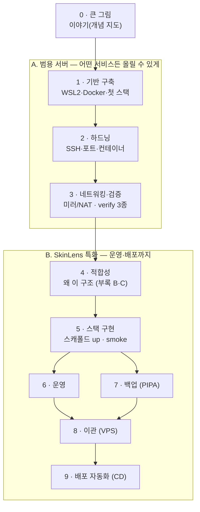

# 07. 학습 로드맵 — 서버 구축부터 배포·운영까지

세트의 **옛 번호 순서(04→01→02→03→05)** 는 성격별 분류(계보)이고, 이 문서는 **학습 의존성 순서**입니다.
큰 그림 → 범용 서버(구축·하드닝·검증) → SkinLens 특화(적합성·구현) → 운영·백업 → 이관 → 배포 자동화(맨 끝).
아래 문서 경로는 현재 monorepo 기준입니다(옛→현재 매핑은 `../README.md`).

**두 갈래로 쓰세요**
- **빠른 이해:** 0단계(이야기 6편) + `./06_운영·배포_체크리스트.md`만 읽어도 전체 흐름이 잡힙니다.
- **실제 구축:** 아래 단계를 순서대로 손으로 따라가되, 각 단계를 **이야기(개념) → 가이드/런북(실습) → 06 체크리스트(점검)** 의 3겹으로 도세요.

## 단계 의존성

> 근거 표기 약어는 `./06_운영·배포_체크리스트.md` 앞머리와 동일(가이드/런북/적합성/CD/이야기).

---

## 0단계 · 큰 그림 (개념 지도부터)

- **선수지식:** 없음. 명령어를 만지기 전에 멘탈 모델부터.
- **세트 문서:** `../stories/README.md`(허브) → `../stories/01_SkinLens_서버_이야기.md`(6막 + 막 0-B 주문 흐름) → `../stories/02_SkinLens_구축_이야기.md`·`../stories/07_SkinLens_배포_이야기.md`.
- **완료 기준:** [ ] "작은 식당" 비유로 안내데스크·주방장·리포트 담당·골방 엔진·창고 3종(이미지/데이터/임시 냉장고)의 역할을 말로 설명할 수 있다.

## 1단계 · 기반 구축 (빈 데스크톱 → 리눅스 집)

- **선수지식:** 0단계 · 리눅스 CLI 기초 · SSH 키 인증 개념 · Docker/compose 기본기.
- **세트 문서:** `../stories/02_SkinLens_구축_이야기.md` §1~5 → `../server-setup/windows11_ubuntu_server_setup.md` 2-1(.wslconfig)·5(SSH)·8(Docker)·9(첫 스택).
- **완료 기준:** [ ] WSL2 Ubuntu에서 뼈대 3종(nginx·fastapi·임시 냉장고 postgres)이 `compose up`으로 뜨고 헬스가 잡힌다.

## 2단계 · 하드닝 (자물쇠 채우기)

1단계 **직후에** 굳히는 게 핵심입니다.

- **선수지식:** 1단계 · iptables/방화벽 개념.
- **세트 문서:** `../stories/01_SkinLens_서버_이야기.md`(막 2) → `../server-setup/windows11_ubuntu_server_setup.md` 5-3·6-4(SSH 락아웃 안전)·9-3-1(포트 최소화)·9-4(비루트)·9-5(nginx 표면)·20(fail2ban·ufw) → `../changelog/server-setup_보완개선_v2_노트.md`·`server-setup_보완개선_v3_노트.md`.
- **완료 기준:** [ ] `../../deploy/scripts/verify_server.sh hardening` PASS(sshd 적용값·포트 노출·컨테이너 하드닝) · [ ] **다른 PC에서 `../../deploy/scripts/verify_client.ps1 -Check ports`(=`nc -vz`)로 db/관리포트 차단 확인**(ufw만 믿지 않기).

## 3단계 · 네트워킹 & 검증 (손님 받을 길 + 준공검사)

여기까지가 **"어떤 서비스든 올릴 수 있는 범용 서버"** 입니다.

- **선수지식:** 2단계 · DNS·포트포워딩 개념.
- **세트 문서:** `../stories/02_SkinLens_구축_이야기.md` §6·§7 → `../server-setup/windows11_ubuntu_server_setup.md` 10-3(미러)·16-2·17(portproxy)·11~15(검증 3종 순서).
- **완료 기준:** [ ] 미러 또는 NAT+portproxy로 LAN의 다른 PC에서 접속된다 · [ ] `../../deploy/scripts/verify_server.sh`·`verify_client.ps1`·`../../tests/test_environment.py` 3종 통과.

## 4단계 · SkinLens 적합성 (왜 이 구조인가)

범용 박스가 왜 부족한지 배우는 "다리".

- **선수지식:** 3단계(범용 서버 완성).
- **세트 문서:** `../architecture/SkinLens_서버구성_적합성_검토.md` §0~9 + **부록 B(목표 토폴로지)·부록 C(Job 생애주기)**. 흐름이 흐리면 `../stories/01_SkinLens_서버_이야기.md`(막 0-B) 재독.
- **완료 기준:** [ ] 3표면 라우팅·엔진 격리(Case A)·비동기 Job Queue·Supabase 정렬·GPU·PIPA 7가지 갭을 각각 한 줄로 설명할 수 있다.

## 5단계 · 실제 스택 구현 (구동 가능한 스캐폴드)

- **선수지식:** 4단계.
- **세트 문서:** `../../deploy/compose/`(+`../../services/`·`../../apps/`) 구성 → `docker compose -f ../../deploy/compose/compose.base.yml -f ../../deploy/compose/compose.dev.yml up -d --build` → 루트 `../../Makefile`의 `make smoke` → Case A 확인. 앱 계약: `../integration/flutter_app_contract.md`.
- **완료 기준:** [ ] `make smoke`(업로드→job_id→폴링) 성공 · [ ] 엔진이 외부로 못 나가고(internal) 호스트에 포트 미발행임을 확인.

## 6단계 · 운영 (하루를 영업)

- **선수지식:** 5단계(돌아가는 스택).
- **세트 문서:** `../stories/01_SkinLens_서버_이야기.md`(막 3) → `../server-setup/windows11_ubuntu_server_setup.md` 운영 파트·16(부팅)·21(재부팅·journald) → `./06_운영·배포_체크리스트.md`(B). 실행/진단: `./서버_실행_운영_가이드.md`·`./파이프라인_체크포인트_트러블슈팅.md`.
- **완료 기준:** [ ] `../../deploy/scripts/verify_ops.sh` PASS(복구·백업 신선도·리소스·갱신) · [ ] 부팅 자동 기동·`hwclock` 시계·healthcheck 동작 · [ ] **WSL idle → Windows 스케줄러**로 시간기반 작업이 깨어남을 확인.

## 7단계 · 백업 (장부 지키기 · PIPA)

- **선수지식:** 5단계 · (병행 가능) 6단계.
- **세트 문서:** `../stories/01_SkinLens_서버_이야기.md`(막 4) → `../server-setup/windows11_ubuntu_server_setup.md` 18·18-1·18-2-1 → `../../deploy/scripts/pg_backup.sh`·`wsl-backup-task.ps1` → `./06_운영·배포_체크리스트.md`(D).
- **완료 기준:** [ ] `.env` 기반 백업이 **성공 시에만 커밋**(0바이트 방지)·암호화·오프사이트·보존 하한·데드맨 신호 · [ ] `wsl --export` 스냅샷 1회.

## 8단계 · 이관 (집 → 상가 / VPS)

컷오버 **순서가 곧 안전장치**입니다.

- **선수지식:** 6·7단계.
- **세트 문서:** `../stories/01_SkinLens_서버_이야기.md`(막 5) → `../server-setup/server_migration_runbook.md` §3~§10 → `../../deploy/scripts/migrate_export.sh`·`migrate_import.sh` → `./06_운영·배포_체크리스트.md`(E).
- **완료 기준:** [ ] DNS TTL↓ → 쓰기 중지 → 델타 덤프 → `verify -Mode prod` → DNS 전환 → 롤백 대비 순서로 리허설 완료 · [ ] 운영은 로컬 db 미기동·Supabase 연결.

## 9단계 · 배포 자동화 (CD) — 맨 마지막

앞 단계가 갖춰진 대상 위에서만 의미가 있어 제일 나중입니다.

- **선수지식:** 8단계 · GitHub Actions 기본.
- **세트 문서:** `../stories/07_SkinLens_배포_이야기.md` → `../../.github/workflows/` + `../../deploy/scripts/deploy.sh` → `./06_운영·배포_체크리스트.md`(A).
- **완료 기준:** [ ] 서비스별 경로 필터(`on.push.paths`)·self-hosted 러너(pull)·하이브리드 빌드(정적 rsync/서버빌드/엔진 CI→GHCR) 동작 · [ ] `deploy.sh` 헬스게이트+롤백·운영 승인 게이트·스테이징/운영 프로파일 확인.

---

**한눈 요약:** 이야기로 지도(0) → 범용 서버를 짓고 굳히고 검증(1~3) → 왜 SkinLens는 더 필요한지(4) →
실제 스택 구현(5) → 운영·백업(6·7) → 이관(8) → 배포 자동화(9). 각 단계는 개념→실습→점검 3겹으로.
