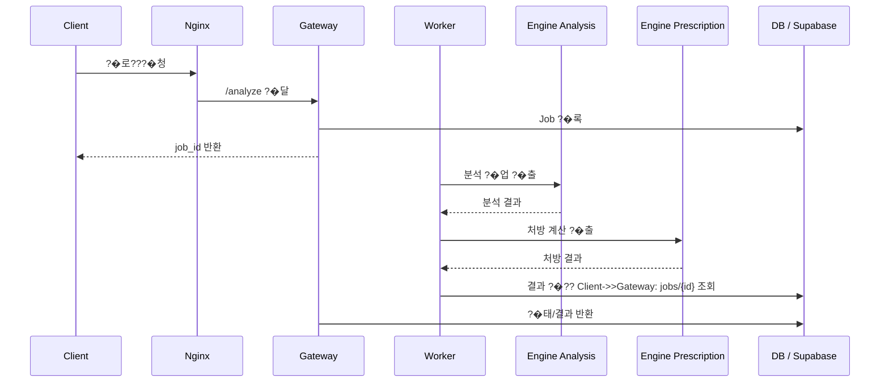
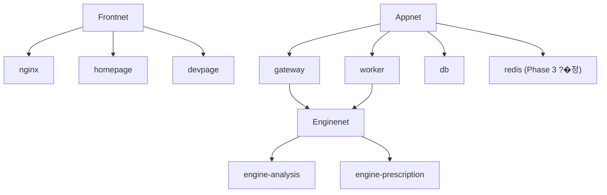

# SkinLens ?�로?�트 구현 ?�선?�위 · 배포 구조 · 리스???�리

## 1. ?�제 구현 ?�선?�위 ?�리

???�로?�트??문서·?�캐?�드·배포 ?�동?��? ?��? 준비되???�으므�? ?�제 구현?� ?�음 ?�서�?진행?�는 것이 가???�전?�니??

### 1) ?�버/?�경 검�??�정??
```mermaid
flowchart TD
    A[?�버 ?�경 준�? --> B[SSH/?�트?�크/?�커 검�?
    B --> C[보안 ?�드???��?]
    C --> D[?�영 ?�정???�인]
    D --> E[?�제 ?�비??구현 ?�작]
```

?�선?�으�??�인?�야 ?�는 ?�일?� ?�음?�니??

- `docs/server-setup/windows11_ubuntu_server_setup.md`
- `deploy/scripts/verify_server.sh`
- `tests/test_environment.py`

???�계가 ?�으�?배포 구조가 ?�무�?좋아???�경 불안?�성???�습?�다. ?�버 ?�드?? ?�비???�태 ?��?, SSH/?�커/?�트?�킹 검증이 ?�행?�어???�제 ?�영 ?�름???�전?�게 ?�릴 ???�습?�다.

### 2) ?�키?�처 기�? 고정

```mermaid
flowchart LR
    A[?�합??검?? --> B[4?�면 ?�우??
    A --> C[?�진 격리]
    A --> D[비동�?Job 구조]
    A --> E[Supabase ?�환 기�?]
    B --> F[?�제 구현 기�? ?�정]
    C --> F
    D --> F
    E --> F
```

?�음 문서�?기�??�로 구조�?고정?�야 ?�니??

- `../architecture/SkinLens_?�버구성_?�합??검??md`
- `docs/README.md`

?�기??결정?�는 ?�심?� ?�래?�니??

- 4?�면 ?�우?? www/dev/app/api 분리(?��? PWA ????+ 같�? ?�리�?/api)
- ?�진 격리: internal ?�트?�크, ?��? egress 금�?
- 비동�?Job 구조: gateway ??worker ??engine ?�출
- Supabase ?�환 기�?: 로컬 db??개발?? ?�영?� Supabase 중심

?�른 구현?� ??기�???벗어?�면 ???�니??

### 3) ?�제 ?�비??로직 교체

?�음 ?�일?�이 ?�제 구현???�심 교체 지?�입?�다.

- `services/gateway/app/main.py`
- `services/worker/worker.py`
- `services/engine-analysis/app/main.py`
- `services/engine-prescription/app/main.py`

?�재???�프??골격 검증용 ?�텁?��?�? ?�제 모델·?�로??처리·처방 로직?�로 바꾸??것이 가????구현 과제?�니??

### 4) ?�이??계층??Supabase 중심?�로 ?�환

?�영 ?�환 ???�심 문서???�음?�니??

- `docs/README.md`
- `deploy/supabase/policies/0001_rls_and_storage.sql`

?�재 로컬 `db`?� `storage`??개발 ?�의?�으�?보이�? ?�영?�서??Supabase 기반?�로 ?�환?�야 ?�니?? ?�기???�제 ?�비???�이?��? 보안 ?�책??결정?�니??

### 5) 배포 경로 고정

배포 ?�동??구조???��? 준비되???�습?�다.

- `deploy/scripts/deploy.sh`
- `.github/workflows/deploy-built-service.yml`
- `.github/workflows/build-and-deploy-engine.yml`
- `.github/workflows/deploy-static.yml`

???�계?�서??**?�비??코드(`services/`)?� 배포 ?�택(`deploy/`)·CD(`.github/workflows/`)????�� 분리**가 중요?�니?? push만으�?배포가 ?�도�??�계?�어 ?�기 ?�문?? ?�영 ?�경?�서 ?�제로는 ?�스체크·롤백?????�작?�는지 검증해???�니??

### 6) 보안·?�해복구 강화

?�영 ?�에???�래 문서�?반드???��??�야 ?�니??

- `../architecture/01_SkinLens_?�영?�키?�처_최종리뷰.md`
- `../architecture/02_PATCH_NOTES_P0_P1.md`
- `../architecture/03_DB_MIGRATION_ROLLBACK.md`

P0/P1 ?�슈�??�제 ?�버?�서 검증하지 ?�으�? 배포가 빨라질수�??�고가 커집?�다.

> 결론: ???�로?�트???�실??기능 구현?�보??먼�? ?�키?�처 기�?�??�영 ?�정?�을 고정?�는 것이 중요?�니?? 구조�?맞춘 ?? 로직??교체?�는 ?�서가 가???�전?�니??

---

## 2. 배포 구조?� ?�비???�름 ?�명

### 2-1. 배포 구조

```mermaid
flowchart LR
    A[services/ 코드 변�?push] --> B[.github/workflows/ ?�크?�로 · 경로?�터]
    B --> C[배포 ?�리�?
    C --> D[?�버: deploy/scripts/deploy.sh]
    D --> E[Docker Compose Up]
    E --> F[nginx ?�우??
    F --> G[Gateway / Worker / Engine]
    G --> H[결과 반영]
```

???�로?�트??**?�일 monorepo** ?�에??**배포 ?�택(`deploy/`)** �?**CD ?�크?�로(`.github/workflows/`)** �???��???�뉩?�다.
(??문서?�트??"?�영 배포 ?�포 + ?�비?�별 ?�포" 구조??monorepo�??�합?�었�? ?�비??구분?� ?�크?�로??**경로 ?�터**(`on.push.paths`)가 ?�당?�니??)

#### (1) 배포 ?�택 ??`deploy/`

- ?�치: `deploy/` (?�버??체크?�웃?�어 ?�제 ?�행 ?�경??책임�?
- ?�함 ?�소:
  - `compose/compose.base.yml` (+ `compose.{dev,staging,prod,gpu,tls}.yml` ?�버?�이)
  - `scripts/deploy.sh` (?�스 게이??+ ?�동 롤백 + flock)
  - `env/.env`, `env/.env.images`
  - `nginx/`, `caddy/`
  - `supabase/`, `db/`, `ops-jobs/`

?�적 ?�면(??`sites/` ?�레?�스?�???� `apps/`(homepage·devpage) ?�출물로 ?�체되?�습?�다.
배포 ?�택?� ?�버??docker compose·nginx·TLS·?�책·?�영 ?�을 ?�곳?�서 관리합?�다.

#### (2) CD ?�크?�로 ??`.github/workflows/`

- ?�치: `.github/workflows/` (monorepo ?�일 ?�치, `on.push.paths` 경로 ?�터�?변경된 ?�비?�만 ?�리�?
- ?�???�크?�로:
  - `deploy-static.yml` ??homepage/devpage 배포(?�너가 ?�빙 ?�더�?rsync)
  - `deploy-built-service.yml` ??gateway/worker 배포(?�버?�서 ?��?지 빌드 ??deploy.sh)
  - `build-and-deploy-engine.yml` ??engine 분석/처방 배포(CI 빌드 ??GHCR push ???�버 pull ??deploy.sh)
  - `tests.yml` ??PR/?�시 ??pytest ?�행

�? "배포 ?�행?� ?�버??`deploy/` 가 책임지�? 무엇???�제 배포?��???`.github/workflows/` ??경로 ?�터가 결정?�다"??구조?�니??

### 2-2. ?�비???�름



기본 ?�름?� `docs/README.md`???�명?�어 ?�습?�다.

#### ?�계 1: ?��? ?�청 진입

- `nginx/conf.d/www.conf` ??공개 ?�페?��?
- `nginx/conf.d/dev.conf` ??개발???�이지
- `nginx/conf.d/api.conf` ??API ?�우??
Nginx가 ?��? ?�청???�절???�비?�로 분기?�니??

#### ?�계 2: API??gateway�??�달

`gateway/app/main.py`가 API ?�청??받아 처리?�니??

?�기???�심 ?�작?� ?�음?�니??

- ?�로???�신
- ?�일 ?�??- Job ?�성
- 즉시 `job_id` 반환
- ?�후 polling?�로 ?�태 ?�인

??방식?� 비동�?처리???�합?�니?? ?�로?��? ?�래 걸려???�청??즉시 ?�답?????�습?�다.

#### ?�계 3: Worker가 비동�?처리 ?�행

`worker/worker.py`가 ?�에??Job??꺼내 처리?�니??

처리 ?�름:

- 분석 ?�진 ?�출
- 처방 ?�진 ?�출
- 결과 DB ?�??- ?�태 갱신

#### ?�계 4: ?�진?� ?��?망만 ?�용

`engine-analysis/app/main.py`?� `engine-prescription/app/main.py`??`enginenet` ?��?망에?�만 ?�작?�니??

?�는 Case A 격리 ?�칙?�니??

- ?�진?� ?��? ?�터?�에 직접 ?�결?��? ?�음
- ?�트 미발??- ?�격증명 ?�음
- ?��? egress 금�?

??구조??AI/?��?지 처리 ?�진???��?�??�출?��? ?�게 ?�려??목적?�니??

#### ?�계 5: 결과 조회

?�라?�언?�는 `jobs/<id>` 경로�??�태?� 결과�?조회?�니??

결과?�는 ?�급, 처방 비율, ?�수 관?�값???�함?????�으�? ?�제 로직 ?�에???�수 ???�급 ??비율 변?�이 진행?�니??

### 2-3. 배포 ?�영 ?�의 ?�심 ?�인??
- Nginx??보안 ?�더?� rate limit ?�용
- Dev ?�이지??Basic Auth 보호
- 배포???�스체크 + ?�동 롤백 구조
- `.env`?� `.env.images`???�버별로 분리
- `staging`/`production` ?�경??분리??
??구조???�순???�버�??�우??것이 ?�니?? ?�영 ?�경?�서 ?�전?�게 배포?�고 복구?????�도�??�계??것입?�다.

---

## 3. 주요 ?�일�?리스??체크리스??
### 1) `deploy/compose/compose.base.yml`



리스??

- ?�트?�크 분리 ?�패 ???�진???��????�출?????�음
- 리소???�한???�으�?CPU/GPU 과�???가??- 보안 ?�션???�하�?컨테?�너 ?�출 ?�는 권한 ?�승 ?�험???�음

?�인 ?�인??

- `enginenet`??`internal: true`?��?
- ?�진 컨테?�너???�트 ?�출???�는지
- `no-new-privileges`, `cap_drop`, 비루???�정???�는지

### 2) `services/gateway/app/main.py`

리스??

- 첨�? ?�일 검�?부�?- ?�로??과다 ??메모�??�스???�수
- Job ?�성 ?�패 ???�용?�에�??�못???�답 가??- ?�태 조회 경로가 비정?�적?�로 지?�될 ???�음

?�인 ?�인??

- ?�일 ?�??검�?- ?�로???�기 ?�한
- job ?�성 ?�외 처리
- ?�?�아??�??�시???�계

### 3) `services/worker/worker.py`

리스??

- ?�진 ?�출 ?�패 ??job??stuck ?�태�??�음
- ?�시??로직???�으�??�애가 ?�적??- 결과 ?�???�패가 반복?�면 ?�용???�태가 ?�확?��? ?�음

?�인 ?�인??

- ?�시??backoff 처리
- dead-letter ?�??- ?�태 ?�이???�자??- ?�진 ?�출 timeout

### 4) `deploy/scripts/deploy.sh`

리스??

- ?�스체크가 ?�하�???버전 배포 ???�비???�작??가??- 롤백 로직??부?�하�??�애 복구 지??- ?��?지 ?�그가 꼬이�??�전 버전 복구가 불�?

?�인 ?�인??

- health check ?��?- ?�동 롤백 ?�작
- `.env.images` 기반 ?�그 ?��????��?

### 5) `deploy/compose/compose.base.yml`

리스??

- staging�?production ?�경 ?�정???�재?�면 ?�못???�비?��? ?�라�?- ?�영 DB가 로컬 DB�??�결?�는 ?�수 가??- ?�트?�크 �??�트???�경 차이 ?�해 가??
?�인 ?�인??

- `.env`?� `.env.images` 분리
- ?�로?�일(profile) 구분 명확
- ?�제 ?�영??DB/Storage 경로 검�?
### 6) `deploy/supabase/policies/0001_rls_and_storage.sql`

리스??

- ?�용??�??�이??침범 가??- Storage 비공�??�책 ?�락 ??민감 ?��?지 ?�출 가??- ?�책???�용?��? ?�는 경우 보안 ?�고 발생

?�인 ?�인??

- RLS가 강제?�는지
- ?�용?�별 ?�이???�근 ?�한
- Storage ?�근 권한 ?�한

### 7) `../architecture/03_DB_MIGRATION_ROLLBACK.md`

리스??

- 코드 롤백�?DB ?�키�?롤백???�동
- 비�???마이그레?�션??발생?�면 복구가 ?�려?�

?�인 ?�인??

- expand/contract ?�략 ?�용
- 백업 ?��?
- 배포 ????마이그레?�션 ?�서

### 8) `deploy/ops-jobs/log-scrub.py` �?`deploy/ops-jobs/nginx-log-privacy.conf`

리스??

- 로그???�큰, 개인?�보, 쿼리?�트링이 ?�아 보안 ?�험 발생
- ?�용???�별 ?�보가 로그???�출?????�음

?�인 ?�인??

- ?�큰/URL/PII 마스??- 쿼리 문자??비수�?- ?�증 ?�더 로그 ?�외

---

## 최종 ?�리

???�로?�트??가?????�점?� ?�계 문서?� ?�영 문서, 그리�?배포 ?�동?��? 모두 ??구조?�되???�다???�입?�다. ?�제 구현??진행?�려�??�래 ?�서가 가???�합?�니??

1. ?�버/?�경 검�?2. ?�키?�처 기�? ?�정
3. gateway/worker/engine 구현
4. ?�이??계층 Supabase ?�환
5. 배포 ?�동???��?
6. 보안/복구/롤백 검�?
�? ???�로?�트???��? ?�운??가?�한 ?�키?�처??골격?�을 갖춘 ?�태?�며, ?�제 ?�제 ?�비??로직�??�영 조건???�결?�는 것이 ?��? ?�심 과제?�니??
