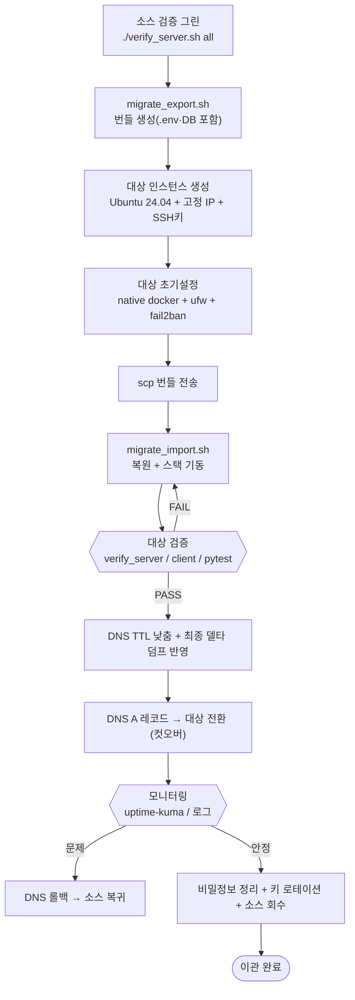

# 외부 서버 이관 런북 (WSL2 검증 → 호스팅 서버 운영)

`windows11_ubuntu_server_setup.md`로 구축·검증한 스택을 **외부 호스팅 서버(VPS/클라우드)** 로 옮기는 절차입니다.

> [!IMPORTANT]
> **3-Tier 관리형 서비스 전환 안내**
> SkinLens 프로젝트는 자체 가상 서버(VPS/클라우드 VM)에 Nginx, DB 등을 직접 기동하던 방식에서, **Vercel (Frontend) + Render (Backend) + Supabase (Database/Storage)** 기반의 3-Tier 관리형 아키텍처로 전환되었습니다.
> 이에 따라, 일반적인 운영 환경에서는 자체 Linux 서버(VPS)의 고정 IP나 방화벽, Nginx 등을 직접 관리·설정할 필요가 없습니다.
> - **도메인 및 IP 구성 설정**: [`Vercel_Render_기반_웹서비스_도메인_IP_구성_가이드_수정본.md`](file:///c:/Project/SkinServer/docs/server-setup/Vercel_Render_기반_웹서비스_도메인_IP_구성_가이드_수정본.md) 참조
> - **전체 마이그레이션 계획**: [`SkinLens_3Tier_Migration.md`](file:///c:/Project/SkinServer/SkinLens_3Tier_Migration.md) 참조
>
> *이 런북은 레거시 호스팅 환경이나, 방화벽 IP Allowlist 제한 등으로 인해 반드시 **자체 고정 IP가 부여된 단일 Linux 서버**를 직접 운영해야 하는 특수 상황의 구축 참고용으로만 유지됩니다.*


> 핵심 원칙: **애플리케이션 계층은 그대로, 인프라 계층만 바뀐다.**
> 옮겨가는 것 → `docker-compose.yml`, `nginx/`·`caddy/` 설정, `api/` 코드, `.env`, DB 데이터, 검증 스크립트.
> 바뀌는 것 → Docker 설치 방식(Desktop→native), 네트워킹(portproxy→공인 IP), 방화벽(Windows→보안그룹+ufw), 도메인·TLS(로컬 없음→실도메인).

---

## 1. WSL2 검증 환경 vs 외부 운영 서버 — 무엇이 바뀌나

| 항목 | WSL2 검증 환경 | 외부 호스팅 서버 |
|---|---|---|
| Docker | Docker Desktop + WSL 통합 | **native docker-ce + systemd** (8-B장 방식) |
| 네트워킹 | NAT + `netsh portproxy` | **공인 IP 직접** (portproxy 불필요) |
| 방화벽 | Windows 방화벽 | **클라우드 보안그룹 + ufw** |
| 접근 경로 | LAN / localhost | 공인 IP / **도메인** |
| TLS/HTTPS | 없음(로컬) | **실도메인 + Let's Encrypt** |
| 상시 가동 | 작업 스케줄러로 WSL 기동 | **OS 부팅 시 systemd 자동** |
| 서버 IP | 재부팅 시 변동 | **고정 공인 IP** |
| 비밀 관리 | `.env` 로컬 | `.env` (+ 선택: 시크릿 매니저) |
| 컨테이너 스택 | 동일 | **동일 (그대로 이식)** ← 이관의 핵심 이점 |

즉, `docker-compose.yml` 스택이 그대로 도는 것이 이 구성의 최대 장점입니다. 인프라 항목만 새로 설정하면 됩니다.

---

## 2. 호스팅 선택 (참고)

정답은 없으며, 규모·예산·운영 부담으로 고릅니다.

- **일반 VPS** (국내외 VPS 상품): 월 정액, 단순·저렴. 고정 IP 기본 제공이 많아 소규모 상시 서버에 적합. 부가 관리형 서비스는 적음.
- **관리형 클라우드** (AWS EC2 / Azure VM / GCP VM): 확장성·부가 서비스(로드밸런서·오브젝트 스토리지·모니터링)·IAM이 강점. 대신 과금 모델이 복잡하고 운영 학습 곡선이 있음.
- **관리형 DB 옵션** (RDS / Cloud SQL 등): PostgreSQL을 컨테이너로 자가 운영하는 대신 관리형으로 분리할 수 있음. 이 경우 `postgres` 서비스를 빼고 `DATABASE_URL`을 관리형 엔드포인트로 바꾸며, 백업·패치·가용성을 provider가 담당. DB 운영 부담을 줄이려면 유력한 선택.

> 이 런북은 **단일 Ubuntu 서버에 컨테이너 스택 전체(DB 포함)를 올리는 기본안**을 기준으로 하고, 관리형 DB로 분리하는 경우의 차이는 6-4장에서 짚습니다.

---

## 3. 이관 전 준비 (소스 측 freeze & 검증)

1. **검증 그린 상태 확보** — 소스(WSL2)에서 전체 검증을 통과시킨 뒤 이관을 시작합니다.

   ```bash
   $ ./verify_server.sh all        # 모두 PASS(또는 무시 가능한 WARN)인지 확인
   ```

2. **이미지 버전 고정** — `docker-compose.yml`의 이미지 태그를 구체 버전으로 고정합니다(예: `postgres:16`, `nginx:1.27`). `latest`는 이관 후 예기치 않은 변화를 부릅니다.

3. **비밀·환경변수 목록화** — `.env` 키 목록과 외부 자격증명(API 키 등)을 정리합니다. 이관 후 값 재확인용.

4. **이관 번들 생성** — 첨부 `migrate_export.sh` 실행.

   ```bash
   $ chmod +x migrate_export.sh
   $ ./migrate_export.sh
   # → ~/migration/migration_YYYYMMDD_HHMMSS.tgz  (DB덤프 + 프로젝트 + .env + 매니페스트)

   > [!WARNING]
   > **보안 경고:** 이관 번들(`.tgz`) 파일에는 내부 애플리케이션의 모든 DB 데이터뿐만 아니라 `.env`에 정의된 실서비스 자격증명(패스워드, 외부 API 키 등)이 평문으로 들어가 있습니다.
   > - 생성된 번들 파일은 절대 공개 경로에 노출하거나 평문 이메일/메신저 등으로 전달해서는 안 됩니다.
   > - 이관 작업이 마무리된 후 소스 서버와 대상 서버에서 번들 파일을 즉시 안전 파쇄 삭제하십시오(6-2장 참고).
   ```

   > 운영 중 데이터라면 덤프 시점 이후의 쓰기를 막기 위해, 컷오버 직전에 한 번 더 최신 덤프를 뜨는 것을 권장합니다(8장).

---

## 4. 대상 서버 프로비저닝

1. **인스턴스 생성** — Ubuntu Server 24.04 LTS, 최소 2 vCPU / 4GB RAM(스택 3~5개 컨테이너 기준, 여유 있게 8GB 권장), 디스크 40GB+.
2. **SSH 키 등록** — 인스턴스 생성 시 공개키를 등록(비밀번호 로그인 대신 키 인증).
3. **고정 공인 IP** — Elastic IP(AWS)/고정 IP 옵션을 할당해 재부팅 시 IP가 바뀌지 않게 합니다.
4. **최초 접속 확인**:

   ```bash
   local$ ssh -i ~/.ssh/<키> ubuntu@<공인_IP>
   ```

---

## 5. 대상 서버 초기 설정 (본 가이드 재사용)

본 설정 가이드의 해당 장을 **native 환경 기준으로** 재적용합니다. WSL 전용 단계(2장 WSL 설치, 10-2 portproxy, 16장 작업 스케줄러)는 **건너뜁니다.**

| 적용할 가이드 장 | 대상 서버에서 할 일 | WSL과의 차이 |
|---|---|---|
| 3장 기본 설정 | 사용자·apt 업데이트·기본 도구·시간대 | systemd는 기본 활성(설정 불필요) |
| 5장 SSH 서버 | sshd 이미 동작 → `sshd_config` 강화만 (⚠ `AllowUsers`는 대상 계정 `ubuntu`로 변경) | 22 포트 충돌 이슈 없음 |
| 8-B장 Docker | **native docker-ce + compose 설치** | Docker Desktop 아님 |
| 20~21장 보안 | fail2ban·ufw·자동 업데이트 | ufw가 1차 방어선(호스트 방화벽) |

방화벽은 **클라우드 보안그룹**과 **ufw** 두 겹으로 잡되, 최소 포트만 엽니다(7장).

> ⚠ 가이드 5-3의 `sshd_config`에는 `AllowUsers coteleaf`가 들어 있습니다. 대상 서버 계정은 보통 `ubuntu`이므로, 그대로 복사하면 **SSH 로그인이 잠깁니다.** 반드시 `AllowUsers ubuntu`(또는 실제 계정)로 바꾸고, 기존 세션을 연 채 새 창에서 접속을 확인한 뒤 원래 세션을 닫으세요.

```bash
# 대상 서버(native docker 설치는 가이드 8-B장 그대로)
$ sudo apt update && sudo apt upgrade -y
$ sudo apt install -y git curl ufw fail2ban

# (v3) 데몬 하드닝 — 가이드 8-B장의 /etc/docker/daemon.json 을 그대로 적용
#      (live-restore·전역 로그 상한·no-new-privileges)
$ sudo mkdir -p /etc/docker
$ sudo tee /etc/docker/daemon.json >/dev/null <<'EOF'
{
  "live-restore": true,
  "log-driver": "json-file",
  "log-opts": { "max-size": "10m", "max-file": "3" },
  "no-new-privileges": true
}
EOF
$ sudo systemctl enable --now docker        # native docker 서비스 상시 기동
$ sudo systemctl restart docker             # daemon.json 반영
```

---

## 6. 애플리케이션 · 데이터 이관

### 6-1. 번들 전송

```bash
local$ scp ~/migration/migration_YYYYMMDD_HHMMSS.tgz ubuntu@<공인_IP>:~/
# (소스에서 직접 대상으로) $ scp ~/migration/migration_*.tgz ubuntu@<공인_IP>:~/
```

### 6-2. 복원, 기동 및 임시 번들 안전 파쇄

대상 서버에서 첨부 `migrate_import.sh` 실행. 프로젝트/.env 복원 → postgres 먼저 기동 → DB 복원 → 전체 스택 기동을 자동 처리합니다.

```bash
$ chmod +x migrate_import.sh
$ ./migrate_import.sh ~/migration_YYYYMMDD_HHMMSS.tgz
```

> [!IMPORTANT]
> **임시 번들 파일 안전 파쇄 (Cleanup)**
> 이관 및 복원 작업이 끝난 후에는 디스크에 방치된 임시 번들(`.tgz`) 파일을 복구 불가능하게 안전 삭제하여 패스워드 등 민감한 자격증명 유출을 반드시 차단하십시오.
> 
> **1. 소스 서버 (예: WSL2)에서 삭제**
> ```bash
> # 리눅스 shred 도구를 이용한 안전 파쇄 (비워진 흔적 덮어쓰기)
> $ shred -u ~/migration/migration_YYYYMMDD_HHMMSS.tgz
> ```
> 
> **2. 대상 서버 (예: VPS)에서 삭제**
> ```bash
> $ shred -u ~/migration_YYYYMMDD_HHMMSS.tgz
> ```
> 
> *참고: 만약 `shred` 도구가 설치되지 않은 환경이라면 `rm -f` 명령어로 즉시 지우고, 가급적 `shred`를 설치하여 파쇄할 것을 강력히 권장합니다.*

### 6-3. 즉시 스모크 테스트

```bash
$ cd ~/projects/webstack
$ docker compose ps
$ curl -s http://localhost/               # Nginx → FastAPI
$ curl -s http://localhost/health/db      # FastAPI → PostgreSQL
$ ./verify_server.sh all                  # 검증 스크립트도 그대로 사용
```

### 6-4. (선택) 관리형 DB로 분리하는 경우

관리형 PostgreSQL(RDS/Cloud SQL 등)로 옮긴다면:

1. `docker-compose.yml`에서 `postgres` 서비스와 `pgdata` 볼륨을 제거.
2. `.env`/`DATABASE_URL`을 관리형 엔드포인트로 변경(호스트·포트·SSL 옵션 포함).
3. 데이터는 컨테이너 복원 대신 관리형 인스턴스로 직접 복원:

   ```bash
   $ pg_restore -h <관리형_호스트> -U <user> -d <db> --clean --if-exists db.dump
   ```

4. 백업·패치·가용성은 provider가 담당하므로 18장(자가 백업)은 보조 수단이 됩니다.

---

## 7. 네트워킹 · 도메인 · HTTPS

### 7-1. 포트 정책 (최소 개방)

**공인 서버는 열린 포트가 곧 공격 표면**입니다. WSL의 portproxy는 필요 없고, 대신 보안그룹 + ufw로 아래만 엽니다.

| 포트 | 용도 | 공개 범위 |
|---|---|---|
| 22 | SSH 관리 | **내 IP로 제한** 권장 (가능하면 VPN/배스천) |
| 80 | HTTP (→HTTPS 리다이렉트) | 전체 |
| 443 | HTTPS | 전체 |
| 5432 / 8080 / 3001 | DB · adminer · uptime-kuma | **외부 차단** (SSH 터널/내부망만) |

```bash
# ufw (보안그룹과 병행)
$ sudo ufw default deny incoming
$ sudo ufw allow 22/tcp
$ sudo ufw allow 80/tcp
$ sudo ufw allow 443/tcp
$ sudo ufw enable
```

> 관리 콘솔(adminer/uptime-kuma)은 SSH 터널로만 접근: `ssh -L 8080:localhost:8080 ubuntu@<서버>` 후 로컬 브라우저에서 `localhost:8080`.

> ⚠ **ufw만으로는 5432/8080/3001이 막히지 않습니다(중요).** native Docker는 발행 포트를 iptables `DOCKER` 체인에서 ufw INPUT보다 먼저 처리하므로, compose가 이 포트를 `0.0.0.0`으로 발행하면 `ufw default deny`가 걸려 있어도 **외부에서 그대로 열립니다.** 반드시 다음 중 하나로 실제 차단하세요.
> - **가장 확실:** compose에서 해당 서비스를 **`127.0.0.1:`에만 바인딩**(가이드 9-3-1 / 부록 최종본은 이미 적용됨). 이러면 포트 자체가 host 밖으로 안 나갑니다.
> - **클라우드 보안그룹**으로 host 바깥에서 차단(인바운드 22/내IP·80·443만 허용). 보안그룹은 host의 iptables 밖 계층이라 Docker 우회의 영향을 받지 않습니다.
> - 위 둘을 **병행**하는 것이 정석입니다. 이관 직후 반드시 **다른 네트워크에서** `nc -vz <서버> 5432 8080 3001`가 전부 실패(차단)하는지 확인하세요.

### 7-2. 도메인 연결

DNS에서 A 레코드를 서버 공인 IP로 지정합니다.

```text
A    your.domain.com   →   <공인_IP>
```

### 7-3. HTTPS 자동화 (Caddy 권장)

실도메인이 생겼으므로 이제 진짜 인증서를 붙입니다. 본 가이드 22-A장의 Caddy 구성을 그대로 사용하면 Let's Encrypt 인증서가 자동 발급·갱신됩니다.

```text
your.domain.com {
    reverse_proxy fastapi:8000
}
```

> 인증서 발급을 위해 80/443이 외부에서 도달 가능해야 하고 DNS 전파가 끝나 있어야 합니다.

---

## 8. 컷오버 (전환)

무중단에 가깝게 넘기려면:

1. **사전 전파 시간 단축** — 전환 전 DNS TTL을 낮춰(예: 300초) 둡니다.
2. **(v3) 소스 쓰기 중지 — 점검 모드** — 최종 덤프와 DNS 전환 사이에 소스로 들어오는 **신규 쓰기는 유실**됩니다. DB가 계속 쓰이는 서비스라면, 최종 덤프 **직전에 소스를 읽기 전용/점검 모드로 전환**해 쓰기를 멈춥니다. 예: 게이트웨이를 점검 페이지로 돌리거나(nginx 503 유지보수 응답), 앱을 read-only 플래그로 재기동, 또는 DB 계정 권한을 일시적으로 읽기 전용으로. 이러면 "덤프 이후~전환" 구간에 새 쓰기가 발생하지 않아 **데이터 정합성**이 보장됩니다.
3. **최종 델타 덤프** — 쓰기가 멈춘 상태에서 소스를 마지막으로 한 번 더 `migrate_export.sh`(또는 DB만 재덤프)해 대상에 반영합니다.
4. **대상 검증 통과 확인** — `./verify_server.sh all` + 로컬 `verify_client.ps1` + `pytest`(9장). 데이터 정합성 스팟체크(§9의 행수 비교)도 여기서 수행.
5. **DNS 전환** — A 레코드를 대상 서버로 변경. (대상이 이제 유일한 쓰기 수용처)
6. **모니터링** — uptime-kuma/로그로 오류·트래픽을 관찰.
7. **소스 유지** — 문제 시 즉시 되돌릴 수 있도록 소스(WSL2)는 당분간 켜 둡니다(롤백용). 단, 롤백하지 않는 한 **소스의 점검 모드는 그대로 두어** 양쪽에 동시에 쓰기가 들어가는 스플릿브레인을 막습니다.

> ⚠ **(v3) 트레이드오프 명시.** 2번(쓰기 중지)은 **짧은 다운타임(쓰기 불가 구간)을 감수하는 대신 데이터 정합성을 얻는** 선택입니다. 반대로 다운타임이 전혀 허용되지 않는다면, 점검 모드 대신 **논리 복제(예: 소스→대상 스트리밍)로 델타를 따라잡은 뒤 전환**하는 방식을 검토해야 합니다(구성 복잡도↑). 대부분의 초기 운영 규모에서는 **수 분의 쓰기 중지 창**이 가장 단순하고 안전합니다.

---

## 9. 이관 후 검증 (기존 스크립트 재사용)

검증 스크립트 3종을 **대상 도메인/IP** 기준으로 그대로 씁니다.

```bash
# 대상 서버에서
$ ./verify_server.sh all
```

```powershell
# 로컬 PC에서 (원격 대상 서버 대상) — 이관 후에는 -Mode prod
#   (22/80/443 + https 로 확인, 8000/5432 는 외부 차단이 정상이라 검사 제외)
local$ .\verify_client.ps1 -RemoteHost your.domain.com -SshUser ubuntu -Mode prod
```

```bash
# 공통 pytest — 이관 후에는 MODE=prod (HTTPS·도메인 기준, 8000/5432 검사 제외)
$ TARGET_HOST=your.domain.com SSH_USER=ubuntu MODE=prod pytest test_environment.py -v
```

> `-Mode prod` / `MODE=prod` 를 빼고 그대로 돌리면, 방화벽으로 정상 차단된 8000·5432 와 평문 HTTP 검사가 **FAIL(오탐)** 로 뜹니다. 대상 서버는 반드시 prod 모드로 검증하세요.

**데이터 정합성 스팟체크** (덤프 누락 여부 확인):

```bash
# 소스와 대상에서 각각 핵심 테이블 행수 비교
$ docker exec -it postgres psql -U appuser -d appdb -c "SELECT count(*) FROM <핵심테이블>;"
```

---

## 10. 롤백 계획

- **전환 직후 문제 발생** → DNS A 레코드를 소스로 되돌림(TTL을 낮춰뒀으므로 빠르게 복구). 소스는 8-6에서 켜 둔 상태.
- **데이터 꼬임** → 대상에서 `docker compose down -v` 후 최신 덤프로 재복원(`migrate_import.sh` 재실행).
- **원인 규명 전 성급한 소스 폐기 금지** — 최소 며칠 안정 운영을 확인한 뒤 소스를 정리합니다.

---

## 11. 이관 후 정리 (보안)

- **비밀정보 흔적 제거** — 전송한 번들·`db.dump`·`.env` 사본을 소스/전송 경로/대상 홈에서 안전 삭제(`shred -u` 또는 삭제 후 휴지통 비우기).
- **키 로테이션 검토** — 이관 과정에서 노출 가능성이 있던 자격증명(.env의 DB 비밀번호 등)은 새 서버에서 교체하는 것을 권장.
- **비밀번호 로그인 차단 확인** — 대상 `sshd_config`에서 `PasswordAuthentication no` 적용 여부 재확인(가이드 6-4장).
- **소스 회수** — WSL2 서버는 검증·개발용으로 계속 쓰거나, 필요 없으면 `.env`·백업을 지우고 정리.

---

## 부록. 이관 순서 (Mermaid)



## 부록 B. 이관 체크리스트

```text
[준비]
[ ] 소스 verify_server.sh all 그린
[ ] 이미지 태그 버전 고정(latest 제거)
[ ] .env 키·외부 자격증명 목록화
[ ] migrate_export.sh 번들 생성

[대상 구축]
[ ] Ubuntu 24.04 인스턴스 + 고정 공인 IP + SSH 키
[ ] native docker + compose 설치 (가이드 8-B)
[ ] sshd 강화 / ufw / fail2ban / 자동 업데이트
[ ] 보안그룹 22(내 IP)·80·443만, 5432/8080/3001 차단

[이관]
[ ] scp 번들 전송
[ ] migrate_import.sh 복원 + 스택 기동
[ ] 스모크 테스트 + verify_server.sh all

[네트워크·전환]
[ ] DNS A 레코드 준비, TTL 낮춤
[ ] Caddy로 도메인 HTTPS 발급 확인
[ ] 최종 델타 덤프 반영
[ ] DNS 컷오버 → 모니터링

[사후]
[ ] 로컬 verify_client.ps1 / pytest(도메인 기준) 통과
[ ] 외부에서 5432/8080/3001 차단 확인 (다른 망에서 nc -vz <서버> 5432 8080 3001 → 전부 실패)
[ ] 데이터 행수 정합성 스팟체크
[ ] 번들·덤프·.env 사본 안전 삭제
[ ] 비밀번호 로그인 차단 확인, 키 로테이션
[ ] 안정 확인 후 소스(WSL2) 정리
```
