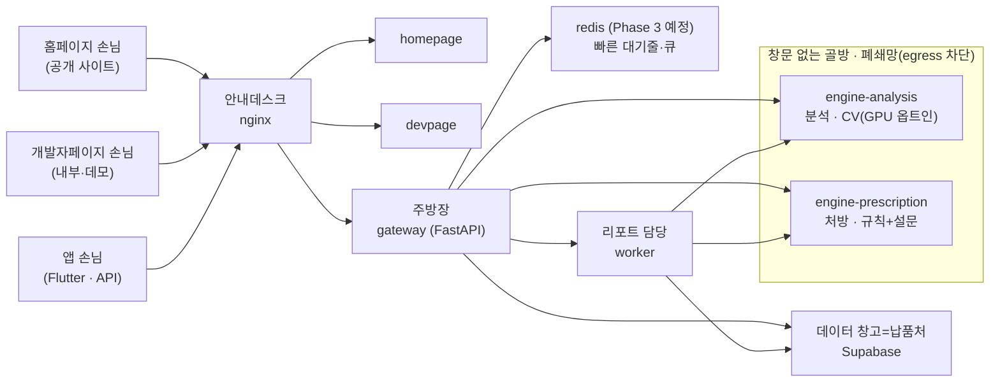
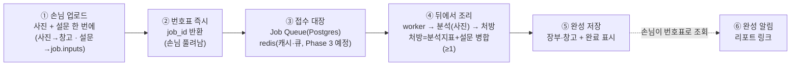
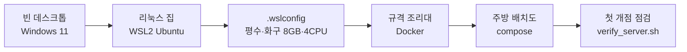
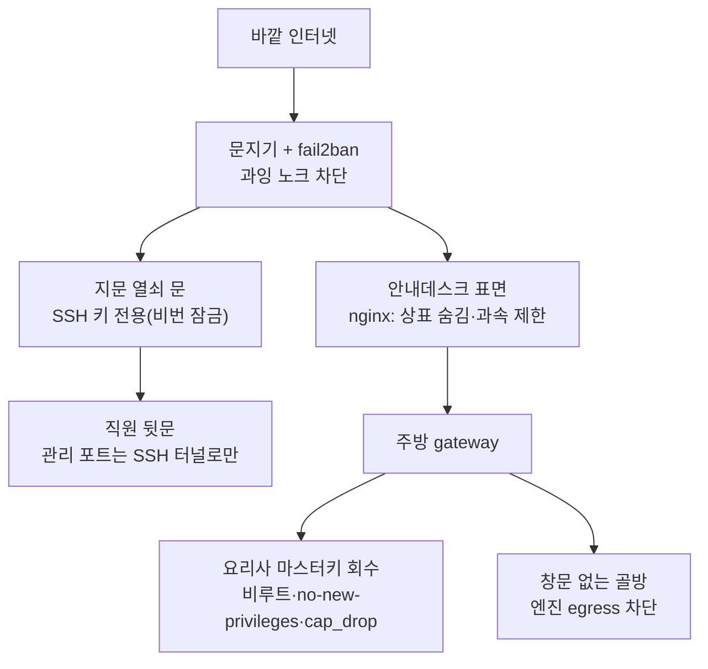
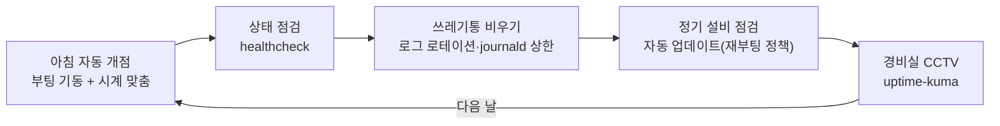
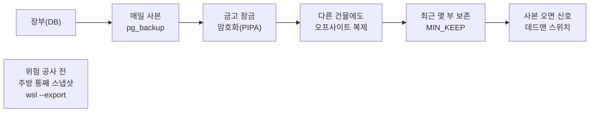
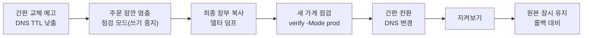
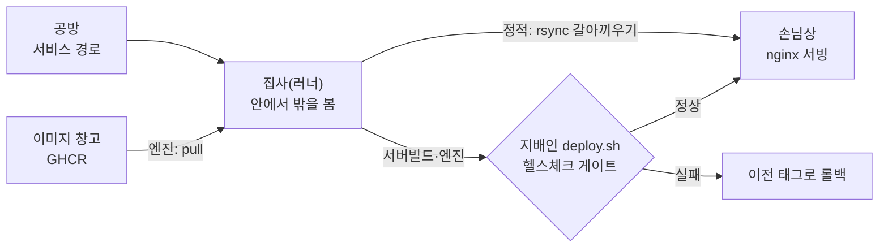
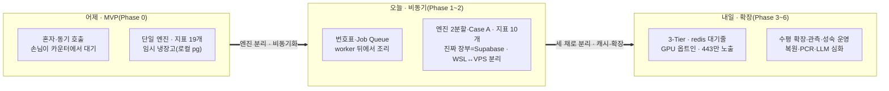

# SkinLens 서버 이야기 — 빈 데스크톱이 식당이 되기까지

> 「SkinLens 배포 이야기」가 **마지막 한 장면**(코드 한 줄이 손님상까지)이었다면,
> 이 문서는 **처음부터 끝까지**의 이야기입니다 — 빈 데스크톱에 주방을 짓고(구축),
> 자물쇠를 채우고(하드닝), 하루를 영업하고(운영), 장부를 지키고(백업),
> 더 좋은 자리로 이사하고(이관), 새 요리를 손님상에 올리기까지(배포).
> 같은 "작은 식당" 세계관으로 이어집니다.

> **읽는 순서·공용 비유 사전·심화편 로드맵**은 `./README.md`(허브)에 모여 있습니다.
> 심화편은 지금 **구축·하드닝·운영·백업·이관·배포** 여섯 편이 있고(막 1·2·3·4·5·6),
> 아래 각 막의 끝에서 "더 자세히 →" 링크로 이어집니다.

## 등장인물 (부품 ↔ 비유)

| 비유 | 실제 부품 |
|---|---|
| 빈 데스크톱 위에 지은 작은 집/주방 | Windows 11 안의 WSL2 Ubuntu |
| 주방 평수·화구 배정 | `.wslconfig` (메모리 8GB·CPU 4·swap 2GB) |
| 손님 없으면 불 끄는 타이머 | `vmIdleTimeout` |
| 규격 조리대 / 주방 배치도 | Docker / `deploy/compose/compose.base.yml` |
| 안내데스크 | nginx(엣지) |
| 주방장 / 리포트 담당 | gateway(FastAPI) / worker |
| 창문 없는 골방(폐쇄망) | `enginenet`(internal) — 아래 두 요리사가 사는 방 |
| 분석 요리사 / 처방 요리사(독립 주문도 받음) | engine-analysis / engine-prescription(분석의 하위가 아니라 독립 진입점) |
| 데이터 창고 = 납품처 | Supabase(Postgres·Storage) — 실운영 장부·원본 |
| 임시 냉장고(연습용) | 로컬 db(postgres 컨테이너) — 스테이징 전용 |
| 지문 열쇠 문 | SSH 키 인증(비밀번호 로그인 잠금) |
| 문지기 / 노크 차단 | 방화벽(ufw) / fail2ban |
| 직원 전용 뒷문 | 관리 포트(adminer 8080·uptime-kuma 3001·db 5432)를 SSH 터널로만 |
| 경비실 CCTV | uptime-kuma |
| 매일 장부 사본 / 주방 통째 스냅샷 | `pg_backup.sh` / `wsl --export` |
| 연습 주방 / 영업점 | 스테이징(WSL) / 운영(VPS) |

세부 배포 등장인물(공방=서비스 경로, 집사=러너, **이미지 창고**=GHCR, 지배인=`deploy.sh` …)은 「SkinLens 배포 이야기」에 있고, 공용 매핑은 `./README.md`(비유 사전)에 모여 있습니다.

---

## 막 0. 무대 — 이 식당은 왜 이렇게 생겼나

SkinLens는 손님이 세 부류입니다. 그냥 구경 오는 **홈페이지 손님**, 내부·데모용 **개발자페이지 손님**, 그리고 앱(Flutter)으로 주문을 넣는 **API 손님**. 이들을 **안내데스크(nginx)** 한 명이 맞아 알맞은 방으로 보냅니다. 앱 손님은 **배달 주문**에 가깝고, 앱이 결과를 잠시 들고 있는 **오프라인 캐싱**은 자주 오는 손님의 **단골 장부** 같은 것 — 편하지만 민감정보라 보관 규칙(PIPA)을 지켜야 합니다.

주방 안에는 **주방장(gateway)** 이 주문을 받고, **리포트 담당(worker)** 이 뒤에서 결과지를 만듭니다. 진짜 무거운 조리는 **창문 없는 골방**에 있는 두 요리사가 맡습니다 — **분석 요리사(engine-analysis)** 는 피부 사진을 재서 점수를 내고, **처방 요리사(engine-prescription)** 는 그 결과로 처방을 짭니다. 다만 처방 요리사는 분석의 하위 단계가 아니라 **독립 주문도 받는 진입점**이에요 — 분석 결과·설문·PCR 중 **하나만 있어도** 조리를 시작합니다. 이 골방엔 창문이 없어요(폐쇄망, egress 차단). 손님의 **피부 사진** 같은 민감한 재료를 다루는 방이라, 바깥으로 통하는 길 자체를 없앴습니다. 그래서 이 골방 요리사들은 **데이터 창고=납품처(Supabase) 열쇠를 아예 갖고 있지 않습니다** — 창고에 드나드는 건 주방장과 리포트 담당뿐입니다.

> 솔직한 전제 하나. 이 주방은 **집(데스크톱) 안**에 있습니다. 개발과 리허설엔 완벽하지만, **실제 손님의 피부 사진(민감 개인정보)** 을 집 주방에서 인터넷에 열어 두고 받는 건 권하기 어렵습니다(PIPA). 그래서 이야기의 후반(막 5)에서 **상가로 이사**하고, 진짜 장부는 **데이터 창고=납품처(Supabase)** 에 둡니다. 골방 요리사가 GPU 하나를 나눠 쓰는 것도 부담이라(분석·처방 동시에 뜨거우면 VRAM 경합), 실운영에선 엔진을 웹과 분리하는 방향이 맞습니다. (지금 엔진은 **CPU baseline**로 돌고, GPU는 운영에서 `../../deploy/compose/compose.gpu.yml` 오버레이로 **옵트인**입니다 — 아키텍처 감사 `../architecture/01_SkinLens_운영아키텍처_최종리뷰.md §①-A` 참조.)

---

## 막 0-B. 주문 처리 순서 — 사진 한 장이 리포트가 되기까지

막 0이 "누가 어디 있나"였다면, 여기선 "주문이 어떻게 흐르나"입니다. SkinLens의 실제 UX는 **비동기**예요 — 손님을 카운터에 세워 두고 다 만들 때까지 붙잡지 않습니다.

손님이 사진을 올리겠다고 하면, 앱(Flutter)은 **사진 한 장만 달랑 내미는 게 아니라, 짧은 자가보고 설문지도 함께 접수합니다** — 사진과 설문(그리고 있으면 PCR 결과)이 **한 번의 요청(multipart `POST /analyze`)** 으로 **주방장(gateway)** 에게 같이 들어와요. 주방장이 그 자리에서 받아, 무거운 원본 사진은 **데이터 창고(Supabase Storage)** 에 넣고, 가벼운 **설문(JSON)** 은 **접수 대장(Job Queue)의 주문 줄(job.inputs)** 에 붙여 조리 때까지 사진과 함께 따라가게 합니다. 그리고 손님에게 **번호표(job_id)** 를 **즉시** 건넵니다. 여기서 손님은 풀려납니다 — 안내데스크(nginx)의 줄을 오래 붙잡지 않아요(그래서 504 타임아웃도 안 납니다).

조리는 **뒤에서** 진행됩니다. **리포트 담당(worker)** 이 접수 대장에서 주문을 집어(행 잠금) **분석 요리사** 를 부르고(측정지표·점수), 이어 **처방 요리사** 를 부릅니다(분석/설문/PCR 중 하나 이상 → 등급·처방 비율). 여기서 **설문이 제 몫을 합니다** — 분석 요리사는 오직 **사진** 만 보지만(설문은 건네지 않아요), 처방 요리사는 분석 지표에 **설문에서 얻은 지표(민감성·복합성처럼 사진만으론 알기 어려운 것)** 를 **병합**해 등급과 처방 비율을 정합니다. 완성되면 결과를 **장부(데이터 창고 DB)** 와 **창고(Storage)** 에 넣고 대장에 "완성" 도장을 찍습니다. 손님이 번호표로 다시 물어보면(폴링/구독) 그제야 주방장이 **"완성 + 리포트 링크"** 를 건넵니다.

> **redis(빠른 대기줄·큐, Phase 3 예정)** 의 자리: 접수 내역 자체는 장부(Postgres 기반 Job Queue)에 남기고, redis는 그 앞단의 **빠른 신호·임시 메모** 로 씁니다("새 주문 들어왔다"는 호출벨에 가깝습니다).

> **등급→비율(예):** 처방 요리사는 점수 구간으로 강도를 정합니다 — 76+ '양호' 0% · 60~76 '경미' 0.5% · 40~60 '보통' 1.0% · 40 미만 '위험/심각' 3.0%(집중 케어). 구간표는 처방 엔진의 확정 규칙입니다(→ `../architecture/SkinLens_서버구성_적합성_검토.md`).

> 업로드 계약(사진+설문 필드·설문 shape·오류 코드)의 정본은 **`../integration/flutter_app_contract.md`** 와 공용 규격 **`../../packages/common/skinlens_contract`**(`Survey`·`UPLOAD_FIELDS`)입니다. 설문 → 지표 매핑은 `../../services/engine-prescription/app/survey.py`.

> 지금 구현은 **주방장이 multipart로 직접 접수**해 창고에 넣는 방식입니다(`services/gateway/app/main.py` → `storage.save`). 대용량 원본을 손님이 **창고에 직접 올리는 presigned 업로드**는 부록 C에 설계된 **후속 최적화**입니다.
> 더 자세히(시퀀스·presigned·상태 조회) → **`../architecture/SkinLens_서버구성_적합성_검토.md` 부록 C(비동기 분석 Job 생애주기)**.

---

## 막 1. 구축 — 빈 데스크톱에 주방을 짓다

먼저 빈 데스크톱 안에 **작은 리눅스 집**을 들입니다(WSL2 Ubuntu). 집에 들어오면 제일 먼저 **평수와 화구를 정합니다**(`.wslconfig` — 메모리 8GB, CPU 4, swap 2GB). 손님이 없을 때 불을 끄는 타이머(`vmIdleTimeout`)도 이때 값으로 박아 둡니다. 그다음 아무 냄비나 쓰지 않도록 **규격 조리대(Docker)** 를 깔고, 어떤 화구에 무엇을 올릴지 **배치도(compose)** 를 그립니다. 마지막으로 불을 한 번 붙여 **첫 개점 점검**(`verify_server.sh`)을 돌려, 물이 나오고 가스가 들어오는지 확인합니다.

> 이 막을 더 자세히 — 골조·SSH 열쇠·다중 계정·조리대·네트워킹·준공 검사까지는 **「SkinLens 구축 이야기」**(`./02_SkinLens_구축_이야기.md`)에서 단계별로 다룹니다.

---

## 막 2. 하드닝 — 자물쇠를 채우고 경비를 세우다

주방이 서면 곧바로 문단속입니다. 바깥에서 문을 계속 두드리는 사람은 **문지기(방화벽)** 와 **fail2ban**이 쫓아냅니다. 사람이 드나드는 문은 **지문 열쇠(SSH 키)** 로만 열리게 하고, 비밀번호로는 못 들어오게 잠급니다. 열쇠 문을 바꿀 땐 반드시 "기존 문을 열어둔 채 새 문으로 들어와 보고" 확인합니다 — 안 그러면 오타 하나로 **자기가 밖에 갇힙니다**(락아웃).

직원 전용 계기판(adminer·uptime-kuma·DB)은 **정문에 안 냅니다.** 오직 **직원 뒷문(SSH 터널)** 으로만 닿게 해 둬요. 안내데스크(nginx)는 **간판에서 상표·버전을 지우고**(server_tokens off), 보안 헤더를 붙이고, **과속 손님을 제한**(rate limit)합니다. 요리사들에게는 **마스터키를 주지 않습니다**(비루트 실행 + `no-new-privileges` + `cap_drop`) — 혹시 한 명이 사고를 쳐도 주방 전체를 장악하지 못하게요. 그리고 앞서 말한 **창문 없는 골방**이 여기서 진짜 위력을 발휘합니다.

> 여기에 유명한 함정이 하나 있습니다. **방화벽(ufw)만 믿으면 안 됩니다** — 규격 조리대(Docker)가 발행한 화구는 방화벽을 우회해 배관에 직접 연결되기 때문에, 포트를 **루프백에만 바인딩**하거나 클라우드 보안그룹으로 막아야 실제로 닫힙니다. (이건 v2에서 이미 잡은 항목입니다.)

> **데몬 하드닝(daemon.json)** 도 여기 속합니다 — 「구축 이야기」 5장에서 조리대를 들일 때 함께 깐 규칙(재시작 유지·로그 상한)은 성격상 이 하드닝 막의 일부입니다.
>
> 이 막을 단계별로 더 자세히 → **「SkinLens 하드닝 이야기」**(`./03_SkinLens_하드닝_이야기.md`).
> 세부 명령·설정 → **`../server-setup/windows11_ubuntu_server_setup.md`**(SSH·컨테이너 비루트·`no-new-privileges`·`cap_drop`·Nginx 표면 하드닝). 실제 배선은 `../../deploy/compose/compose.base.yml`·`../../deploy/nginx/`.

---

## 막 3. 운영 — 하루를 영업하다

이제 매일이 반복됩니다. 아침이면 집이 깨어나며 **자동으로 개점**하고(부팅 기동), 절전에서 깬 뒤 어긋난 **벽시계를 맞춥니다**(`hwclock`). 영업 중에는 **상태 점검(healthcheck)** 이 돌아 아픈 화구를 알아채고, **쓰레기통이 넘치지 않게**(로그 로테이션·journald 상한) 비웁니다. 정기적으로 **설비 점검(자동 업데이트)** 을 하되, 재부팅은 함부로 하지 않습니다 — 집(WSL)에선 끄고, 영업점(VPS)에선 손님 없는 새벽으로. 그리고 **경비실 CCTV(uptime-kuma)** 가 가게가 계속 열려 있는지 지켜봅니다.

> 더 자세히 → **「SkinLens 운영 이야기」**(`./04_SkinLens_운영_이야기.md`) 및 **`../server-setup/windows11_ubuntu_server_setup.md`**(부팅 기동·`hwclock` 시계·healthcheck·로그 로테이션·자동 업데이트/재부팅 정책). 운영 점검 스크립트는 `../../deploy/scripts/verify_ops.sh`.

---

## 막 4. 백업 — 장부와 주방을 지키다

장사에서 제일 무서운 건 **장부를 잃는 것**입니다. 그래서 매일 **장부 사본**을 뜨고(`pg_backup.sh`), 사본은 **금고에 넣어 잠급니다**(암호화 — 피부 이미지 같은 민감정보라 필수). 사본을 같은 건물에만 두면 불나면 같이 타니 **다른 건물에도 한 부**(오프사이트) 두고, 사본이 며칠 안 떠도 **최근 몇 부는 무조건 남깁니다**(보존 하한). 사본이 잘 왔으면 **"왔다"는 신호**를 보내고, 신호가 안 오면 외부가 알려줍니다(데드맨 스위치). 커널·설비를 크게 손대기 전에는 **주방을 통째로 스냅샷**(`wsl --export`) 떠 두어, 잘못되면 한 줄로 되돌립니다.

> **임시 냉장고는 스테이징 전용, 실장부는 처음부터 데이터 창고(Supabase)입니다.** 영업점의 진짜 장부는 **데이터 창고=납품처(Supabase)** 에 있어 백업·시점복구(PITR)를 그쪽이 담당하고, 위 `pg_backup` 루틴은 **연습 주방의 임시 냉장고**(스테이징 db, `staging` 프로파일에서만 켜짐)를 위한 것입니다 — 필요하면 `pg_dump -h <supabase-host>`로 관리형 장부를 직접 대상으로 삼습니다.
>
> 더 자세히 → **「SkinLens 백업 이야기」**(`./05_SkinLens_백업_이야기.md`) 및 **`../../deploy/scripts/`의 `pg_backup.sh`·`wsl-backup-task.ps1`**(오프사이트·암호화·보존 하한·데드맨 스위치). 운영 원본/PII 정리는 `../../deploy/ops-jobs/retention.py`.

---

## 막 5. 이관 — 더 좋은 자리로 이사하다

집 주방은 연습과 리허설엔 최고지만, **실제 손님의 민감한 재료**를 다루기엔 맞지 않습니다(NAT 뒤·상시부하·PIPA). 그래서 **상가(VPS·고정 IP·도메인·TLS)** 로 이사합니다. 이사에서 제일 조심할 건 **간판을 바꾸는 순간 손님이 흘리는 주문**이에요. 그래서 순서가 중요합니다 — 먼저 **간판 교체를 예고**(DNS TTL 낮춤)하고, **잠깐 주문을 멈추고**(점검 모드), 그 사이 **최종 장부를 복사**(델타 덤프)한 뒤, 새 가게를 **점검**(`verify -Mode prod`)하고, 그제서야 **간판을 전환**(DNS 변경)합니다. 이사 뒤에도 **원본 주방은 잠시 켜 둡니다** — 문제가 생기면 되돌리려고요.

> 이사하면 **임시 냉장고**(로컬 postgres 컨테이너)는 치우고, 납품을 **데이터 창고(Supabase)** 로 바꿉니다(`DATABASE_URL` 교체 · 운영에선 db 컨테이너 미기동). 비밀번호 특수문자가 접속 문자열을 깨뜨리지 않게 `URL.create`로 조립하는 습관은 여기서도 그대로입니다.
>
> 이 막을 단계별로 더 자세히 → **「SkinLens 이관 이야기」**(`./06_SkinLens_이관_이야기.md`).
> 세부 절차 → **`../server-setup/server_migration_runbook.md`**(DNS TTL·점검 모드·델타 덤프·컷오버 정합성). 이관 번들은 `../../deploy/scripts/migrate_export.sh`·`migrate_import.sh`.

---

## 막 6. 배포 — 새 요리를 손님상에 올리다

이제 문을 연 가게에 **새 메뉴(코드 변경)** 를 안전하게 반영할 차례입니다. 이건 이미 「SkinLens 배포 이야기」에서 자세히 다뤘으니 뼈대만 되짚습니다 — **공방(서비스 경로)** 에 올리면 주방에 상주하는 **집사(러너)** 가 집어 와서, 정적(홈페이지·개발자페이지)은 **갈아 끼우기만** 하면 되고(빌드·게이트 없음), 서버 코드는 그 자리서 만들고, 무거운 엔진은 **이미지 창고(GHCR)** 에서 꺼내 옵니다. 조리가 필요한 길만 **지배인(`deploy.sh`)** 이 **시식(헬스체크)** 에 통과할 때 손님상에 올리고, 아니면 **되돌립니다(롤백)**.

> 자세한 세 여정(정적·서버빌드·엔진)과 스테이징/운영 두 갈래는 **「SkinLens 배포 이야기」** 문서를 보세요.

---

## 막 7. 시간 — 어제의 주방, 오늘의 식당, 내일의 골목

막 1~6이 "가게 한 곳을 **어떻게** 여는가"였다면, 여기선 같은 가게가 시간을 따라 **어떻게 자라 왔고 어디로 가는지**를 봅니다. 비유는 그대로지만, 이번엔 벽에 걸린 달력을 넘기는 이야기예요. 이 식당은 처음부터 지금 모습이 아니었고, 지금 모습으로 끝나지도 않습니다.

### 어제 — 첫 개업: 집 주방에서, 혼자, 한 번에 하나씩 (과거)

처음엔 **주방장 한 사람이 주문받고·조리하고·결과지까지 다** 했습니다(동기 호출 MVP, Phase 0). 손님은 사진을 내밀고 **카운터 앞에 그대로 선 채** 리포트가 나올 때까지 기다렸어요(blocking `POST /analyze`). 조리가 길어지면 안내데스크 줄이 막히고, 지친 손님이 돌아가기도 했습니다(504 위험). 요리사도 **한 명**이라, 지금은 둘로 나뉜 **분석과 처방을 한 사람이 겸했습니다**(단일 엔진). 진짜 장부는 **연습용 임시 냉장고**(로컬 postgres 컨테이너)에 적었죠 — 집 주방(WSL)에서 리허설 하기엔 충분했지만 실손님 장부를 두기엔 위태로웠습니다. 메뉴판도 지금보다 **길고 복잡**했고(측정지표 19개), 개업 초기엔 **열쇠 구멍 몇 개를 급히 메워야** 했습니다(P0 보안·로직 정리 — path traversal·IDOR·점수 계산 오류 등).

### 오늘 — 지금의 식당: 번호표를 나눠주고, 요리사를 나누고, 창고를 따로 두다 (현재)

이제 손님은 **번호표(job_id)** 를 받고 곧장 풀려납니다(비동기 Job Queue, Phase 2). 카운터를 붙잡지 않으니 줄이 막히지 않고, 조리는 **리포트 담당(worker)** 이 뒤에서 합니다. 요리사도 **둘로 나뉘었습니다** — 분석 요리사와 처방 요리사(engine-analysis / engine-prescription). 처방 요리사는 분석의 하위가 아니라 **독립 진입점**이라, 분석·설문·PCR 중 **하나만 있어도** 조리를 시작해요. **진짜 장부는 데이터 창고(Supabase)** 로 옮겼고, 임시 냉장고는 이제 **연습 주방(스테이징)** 에서만 씁니다. 골방 요리사는 창고 열쇠를 **아예 갖지 못하게** 신뢰 경계를 그었습니다(Case A — 쓰기는 gateway·worker만). 메뉴판은 **10가지 핵심 지표**로 다듬고 처방 배합도 활성 믹스 M01~M11 + PCR 믹스 PM01~PM03로 정리했습니다. **연습 주방(WSL)과 영업점(VPS)을 나누고**, 새 메뉴는 **집사(러너)가 받아 시식(헬스체크)에 통과할 때만** 손님상에 올립니다(CD·`deploy.sh` 원자교체+롤백). 무거운 원본 사진은 손님이 **창고에 직접 올리는** 방식으로 바꾸는 중이고(presigned 업로드), 낡은 간판(nginx)도 **새 간판(Caddy)** 으로 갈아 끼우는 중입니다.

### 내일 — 다음 골목: 세 채로 나눠 짓고, 대기줄을 세우고, 지점을 늘리다 (미래)

한 건물에 다 넣는 대신 **세 채로 나눠** 짓습니다(3-Tier) — 손님 응대(Vercel의 Next.js PWA)·창고와 장부(Supabase)·무거운 조리(AI Server)를 각자 자리에 두고, 조리장만 **443 한 문**으로 여닫으며 GPU 화구는 필요할 때만 옵트인으로 켭니다. 접수 앞단엔 **빠른 대기줄(redis)** 을 세워(Phase 3 예정) "새 주문 들어왔다"는 호출벨과 임시 메모로 씁니다. 손님이 몰리면 **같은 요리사를 여러 명**으로 늘려 나눠 받게 하고(수평 확장, Phase 5), 가게가 스스로 상태를 말하도록 관측 장비를 답니다(관측 가능성, Phase 4). 그렇게 **성숙한 운영(Phase 6)** 으로 갑니다. 요리 자체도 깊어져요 — 흐릿한 사진을 되살리는 복원 조리법(GAN/diffusion), 피부 미생물을 읽는 PCR 리포트, LLM 리포트의 안정화까지 올려 나갑니다.

> 솔직한 전제 하나. **오늘의 모습은 완성이 아니라 경유지**입니다. 위 세 시기는 깔끔히 끊기지 않아요 — 지금도 presigned 업로드·Caddy 이주처럼 "오늘→내일"의 공사가 **가게를 연 채로** 진행 중입니다(막 5·6의 무중단 원칙이 그대로 적용됩니다). "내일"의 redis·수평 확장·관측은 **예정된 자리만 비워 둔** 상태고, 배관을 실제로 잇는 건 손님이 늘어 병목이 보일 때입니다 — 미리 다 짓지 않는 것도 설계입니다.
>
> 시기별 근거 문서 → 로드맵 Phase 0~6은 **`../architecture/`**(운영 아키텍처·적합성 검토), 3-Tier 이전 정본·작업계획은 **3Tier 설계/작업계획 문서(04·05)**, 무중단 이사·컷오버는 막 5의 **`../server-setup/server_migration_runbook.md`**.

---

## 한 편으로 다시

**빈 데스크톱에 리눅스 집을 들여 주방을 짓고(구축) → 문에 지문 열쇠를 달고 골방에 창을 없애고(하드닝) → 매일 아침 자동으로 열어 상태를 점검하며 영업하고(운영) → 장부를 금고에 넣어 다른 건물에도 복사하고(백업) → 실손님을 받을 상가로 조심히 이사한 뒤(이관) → 새 메뉴는 시식을 통과할 때만 손님상에 올린다(배포).**

집에서 시작해 상가에서 완성되는, 작은 식당 한 곳을 여는 이야기입니다.

그리고 그 식당은 **혼자 한 번에 하나씩 받던 어제**에서, **번호표를 나눠주고 요리사를 나눈 오늘**을 지나, **세 채로 나눠 지어 여러 손님을 함께 받는 내일**로 걸어가는 중입니다(막 7). 문을 연 채로 조금씩 고쳐 짓는, 아직 끝나지 않은 이야기이기도 합니다.
