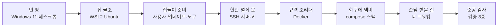
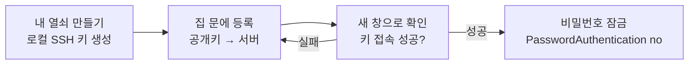
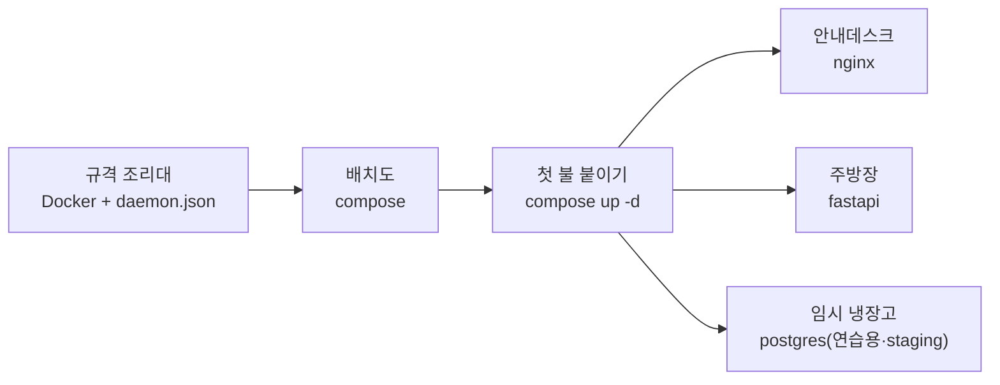
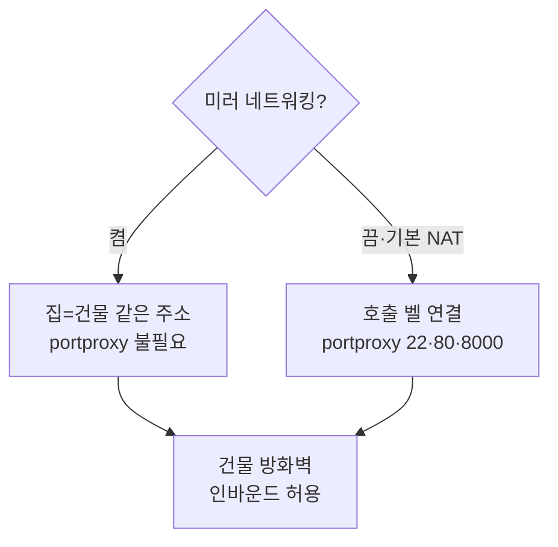
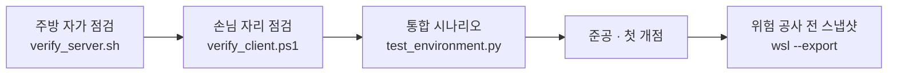

# SkinLens 구축 이야기 — 빈 땅에 주방을 세우기까지

> 「서버 이야기」의 **막 1(구축)** 을 깊게 파고든 편입니다. 「배포 이야기」가 *배포 한 장면*을
> 자세히 봤듯, 이 문서는 *빈 데스크톱이 검증된 주방이 되기까지*를 자세히 봅니다.
> 세부 명령·설정은 `../server-setup/windows11_ubuntu_server_setup.md`(0~15장)에 있고, 여기선 그 흐름을 이야기로 잇습니다.

> **v2 노트:** 창고 용어를 통일했습니다 — 연습용 로컬 db는 **임시 냉장고**, 실운영은 **데이터 창고(Supabase)**.
> 공용 비유 사전·읽는 순서는 `./README.md`(허브)를 참조하세요.

## 한 줄 요약

빈 땅(데스크톱)에 집 골조를 세우고(WSL2) → 평수와 설비를 정하고(`.wslconfig`) → 집들이 준비를 하고(Ubuntu 초기 설정) → 현관에 지문 열쇠 문을 달고(SSH) → 두 개의 우편함을 놓고(GitHub 다중 계정) → 규격 조리대를 들이고(Docker) → 화구에 냄비를 올리고(compose 스택) → 바깥 손님 받을 길을 트고(네트워킹) → 준공 검사를 통과한다(검증 3종).

## 구축 로드맵

---

## 1. 골조 — 집 안에 리눅스 집을 들이다

빈 데스크톱(Windows) 안에 **작은 리눅스 집**을 들입니다(WSL2 Ubuntu). 집을 들이면 곧바로 **평수와 설비를 배정**합니다(`.wslconfig` — 메모리 8GB, CPU 4, swap 2GB). 손님이 없을 때 불을 끄는 타이머(`vmIdleTimeout`)도 값으로 박아 둡니다. 절전에서 깨어난 뒤 **벽시계가 어긋나는** 버릇이 있어(막 3의 시계 이슈), 이 집은 나중에 부팅 때 시계를 다시 맞추도록 손봅니다.

## 2. 집들이 — 살 수 있게 정리하다

골조만 있는 집은 아직 살 수 없어요. **살림 주인을 정하고**(전용 사용자 계정), **묵은 먼지를 털고**(`apt update && upgrade`), **기본 연장을 들여놓습니다**(git·curl 등 필수 도구). 요리 연습을 위해 **한쪽에 연습대도 깔아 둡니다** — 프로젝트마다 재료가 섞이지 않게 하는 Python 가상환경(venv)입니다.

## 3. 현관 열쇠 — 지문으로만 열리는 문

집에 드나들려면 현관문이 필요합니다(SSH 서버). 이 문은 **지문 열쇠(SSH 키)** 로만 열리게 할 겁니다. 순서가 중요해요 — 먼저 **내 열쇠를 만들어**(로컬에서 키 생성) **집 문에 등록**하고, **새 창으로 실제로 열리는지 확인**한 다음에야 **비밀번호로는 못 들어오게 잠급니다**. 이 "확인 후 잠금" 순서를 지키지 않으면 오타 하나로 **자기가 밖에 갇힙니다**(락아웃) — 그래서 항상 기존 문을 열어둔 채 새 문을 시험합니다.

## 4. 두 개의 우편함 — GitHub 다중 계정

이 집 주인은 우편함을 **두 개** 씁니다(`coteleafdev`·`skygoldlee-cyber`). 편지(코드)를 올바른 우편함으로 부치도록, 열쇠(SSH 키)를 계정별로 나눠 두고 **어느 원격을 어느 열쇠로** 밀지 규칙을 정합니다(SSH config의 호스트 별칭). 코드 자체는 이제 **하나의 monorepo**(서비스별 경로 `services/`·`apps/`)라 저장소가 여럿으로 쪼개지진 않지만, 계정·원격이 둘이라 이 열쇠 분리는 여전히 필요합니다 — 나중에 배포 이야기의 "공방(서비스 경로)"이 맞는 우편함(계정/원격)으로 깔끔히 연결됩니다.

> `coteleafdev`·`skygoldlee-cyber`는 **이 프로젝트 작성자의 실제 계정 예시**입니다. 포크·재사용 시 본인 계정으로 바꾸세요(개념은 "계정별 키 분리 + 호스트 별칭").

## 5. 조리대와 화구 — Docker와 첫 스택

이제 주방 설비입니다. 아무 냄비나 쓰지 않도록 **규격 조리대(Docker)** 를 들입니다(설치하며 데몬 관리 규칙 `daemon.json`도 함께 — 재시작해도 요리를 유지하고 로그가 넘치지 않게). 그다음 **배치도(compose)** 대로 화구에 냄비를 올려 **첫 불을 붙입니다**. 처음엔 배우기 좋은 **뼈대 3종**(안내데스크 nginx · 주방장 fastapi · **임시 냉장고** postgres)으로 시작해, 물이 나오고 가스가 들어오는지 봅니다.

> 이 3종은 **뼈대 예제**입니다. SkinLens의 실제 배치(안내데스크 뒤에 홈페이지·개발자페이지·주방장, 창문 없는 골방의 엔진 둘, **데이터 창고=납품처(Supabase)**)로 갈아끼우는 근거와 방법은 `../architecture/SkinLens_서버구성_적합성_검토.md`와 실제 스택(`../../deploy/compose/`·`../../deploy/nginx/`·`../../services/`)에 있습니다.

## 6. 손님 받을 길 — 두 갈래의 네트워킹

집 안에서만 요리하면 손님이 못 옵니다. 바깥(적어도 같은 LAN의 다른 PC)에서 닿게 길을 터야 하는데, 갈림길이 있습니다. **미러 네트워킹**을 켜면 집이 **건물(Windows)과 같은 주소**를 쓰게 되어 길 트기(포트포워딩)가 통째로 필요 없어집니다. 켜지 않으면 기본(NAT)이라, 건물 관리실에서 **호출 벨을 안쪽 집으로 연결**해 줘야 합니다(portproxy 22·80·8000). 어느 쪽이든 **건물 방화벽 인바운드 허용**은 필요합니다.

> **갈림길 트레이드오프.** 미러 모드는 편하지만 **비교적 최신 Windows에서 안정적이고 일부 툴·구성과는 호환이 덜한** 편이라, 안 되면 기본(NAT)으로 돌아가는 게 안전합니다. 그리고 NAT를 쓰면 **WSL 내부 IP가 재부팅 때 바뀔 수 있어**, 그때마다 **portproxy를 갱신**해 줘야 호출 벨이 계속 안쪽 집으로 연결됩니다.

> 진짜 인터넷 공개는 별개 이야기입니다 — 공유기 포트포워딩·DDNS·**HTTPS 필수**·SSH 하드닝이 붙고, 무엇보다 **집(데스크톱)에 실손님의 민감 재료를 노출하지 말 것**(PIPA)이라는 원칙 때문에, 실서비스는 「서버 이야기」 막 5(이관)에서 상가로 옮깁니다.

## 7. 준공 검사 — 세 각도에서 확인

주방을 열기 전, **세 각도로 준공 검사**를 합니다. 주방 안에서 스스로 점검하고(`verify_server.sh`), 손님 자리(로컬 PC)에서 문·물·불이 실제로 되는지 확인하고(`verify_client.ps1`), 통합 시나리오를 한 번에 돌려봅니다(`test_environment.py`). 그리고 이후 **위험한 공사(커널·데몬 변경) 전에는 주방을 통째로 스냅샷**(`wsl --export`) 떠, 잘못되면 한 줄로 되돌립니다.

---

## 다음 이야기로

여기까지가 **빈 땅 → 검증된 주방**입니다. 이 뒤로는

- 문에 자물쇠를 채우고 골방에 창을 없애는 **하드닝** — 「서버 이야기」 막 2,
- 매일 여는 **운영**과 장부를 지키는 **백업** — 막 3·4,
- 실손님을 위한 **이사(이관)** — 막 5,
- 새 메뉴를 손님상에 올리는 **배포** — 「배포 이야기」

로 이어집니다.

## 한 줄로 다시

**빈 땅에 집을 들여(WSL2) 살림을 정리하고(초기 설정) 지문 열쇠 현관을 달고(SSH) 두 우편함을 놓고(다중 계정) 조리대와 화구를 들여(Docker·compose) 손님 받을 길을 튼 뒤(네트워킹) 세 각도의 준공 검사를 통과한다(검증).**
