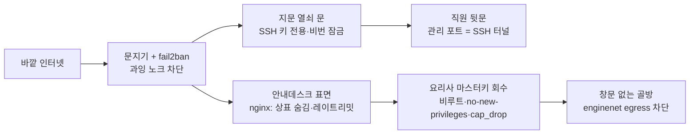
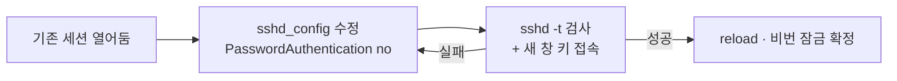
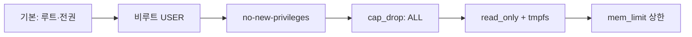

# SkinLens 하드닝 이야기 — 문을 잠그고 경비를 세우기까지

> 「서버 이야기」의 **막 2(하드닝)** 를 깊게 파고든 편입니다. 「구축 이야기」가 *빈 땅 → 검증된 주방*을
> 자세히 봤듯, 이 문서는 *열린 주방 → 잠긴 주방*을 자세히 봅니다.
> 세부 명령·설정은 `../server-setup/windows11_ubuntu_server_setup.md`(SSH·컨테이너·Nginx 하드닝)에 있고, 여기선 그 흐름을 이야기로 잇습니다.

> **비유 사전·읽는 순서**는 `./README.md`(허브)에 모여 있습니다. 이 편이 새로 쓰는 캐스트만 아래 표에 둡니다.

## 이 편의 새 등장인물

| 비유 | 실제 부품 |
|---|---|
| 문지기 / 노크 차단 | 방화벽(ufw) / fail2ban |
| 지문 열쇠 문 | SSH 키 인증(비밀번호 로그인 잠금) |
| 직원 전용 뒷문 | 관리 포트(adminer·uptime-kuma·db)를 SSH 터널로만 |
| 마스터키 회수 | 컨테이너 비루트 · `no-new-privileges` · `cap_drop` |
| 창문 없는 골방 | `enginenet`(internal) — egress 차단(공용 사전에도 있음) |

## 한 줄 요약

문지기를 세우고(ufw·fail2ban) → 현관을 지문 열쇠로만 열리게 잠그되 **밖에 갇히지 않게 확인 후 잠그고**(SSH) → 직원 계기판은 정문 대신 뒷문으로만(관리 포트 터널) → 간판에서 상표를 지우고 과속을 막고(nginx 표면) → 요리사 마스터키를 거두고(컨테이너 하드닝) → 골방에 창을 없앤다(엔진 egress 차단). 단, **방화벽만 믿으면 안 된다**(Docker 우회).

## 하드닝 로드맵

---

## 1. 문지기 — 두드리는 사람부터 거른다

주방이 서면 곧바로 문단속입니다. 바깥에서 문을 계속 두드리는 사람은 **문지기(ufw)** 와 **fail2ban**이 쫓아냅니다. ufw는 "어느 문(포트)을 열어둘지"를 정하고, fail2ban은 "같은 사람이 자꾸 헛노크하면 한동안 못 오게" 차단합니다. 열어둘 문은 최소로 — 손님이 드나드는 80/443과, 직원이 쓰는 22 정도입니다.

> **유명한 함정 — 방화벽만 믿으면 안 됩니다.** 규격 조리대(Docker)가 발행한 화구(publish 포트)는 문지기(ufw)를 **우회해 배관에 직접** 연결됩니다. 그래서 관리·내부 포트는 아예 발행하지 않거나 **루프백(127.0.0.1)에만 바인딩**하고, 클라우드에선 보안그룹으로 막아야 실제로 닫힙니다. (이건 v2에서 이미 잡은 항목입니다.)

## 2. 지문 열쇠 — 밖에 갇히지 않게 잠근다

사람이 드나드는 현관(SSH)은 **지문 열쇠(SSH 키)** 로만 열리게 합니다. 순서가 생명입니다 — **① 기존 문을 열어둔 채 ② 새 열쇠로 실제로 들어와 보고 ③ 그제서야 비밀번호 문을 잠급니다.** 이 "확인 후 잠금"을 어기면 오타 하나로 **자기가 밖에 갇힙니다**(락아웃). 설정을 바꾼 뒤에도 `sshd -t`로 문법을 먼저 검사하고, 지금 접속한 세션은 유지한 채 새 창으로 재접속을 확인합니다.

## 3. 직원 전용 뒷문 — 계기판은 정문에 안 낸다

관리 도구(adminer·uptime-kuma·DB)는 **정문(공개 포트)에 내지 않습니다.** 오직 **직원 뒷문(SSH 터널)** 으로만 닿게 합니다 — 로컬에서 `ssh -L`로 터널을 뚫어 내 PC의 포트로 당겨 씁니다. 이러면 계기판이 인터넷에 노출되지 않으면서도 관리자는 필요할 때 안전하게 들여다봅니다. §1의 "관리 포트는 루프백에만" 원칙과 한 몸입니다.

## 4. 간판 정리 — 안내데스크(nginx) 표면 하드닝

안내데스크는 **간판에서 상표·버전을 지우고**(`server_tokens off`), 손님 브라우저를 보호하는 **보안 헤더**(nosniff·X-Frame-Options·Referrer-Policy)를 붙이고, **과속 손님을 제한**(rate limit)합니다. 특히 **업로드 엔드포인트**는 스토리지 남용을 막게 더 강한 존을 겁니다. TLS를 켠 뒤에는 **HSTS**를 열고, 개발자페이지는 Basic Auth를 **TLS 뒤로** 둡니다.

> CSP는 아직 빈자리입니다(후속 P2). 업로드 전용 레이트리밋·CSP는 감사 문서 `../architecture/01_SkinLens_운영아키텍처_최종리뷰.md`(②-F)와 `../roadmap/04_후속보완_로드맵.md`에 후속으로 정리돼 있습니다.

## 5. 마스터키 회수 — 요리사에게 전권을 주지 않는다

요리사(컨테이너)에게 **마스터키를 주지 않습니다.** 전부 **비루트**로 돌리고, `no-new-privileges`로 권한 상승을 막고, `cap_drop`으로 불필요한 능력을 떼고, `read_only`+`tmpfs`로 쓰기 면적을 줄이고, `mem_limit`으로 폭주를 막습니다. 혹시 한 명이 사고를 쳐도 주방 전체를 장악하지 못하게요. 조리대 자체의 규칙(`daemon.json` — 재시작 유지·로그 상한)도 성격상 이 막의 일부입니다(「구축 이야기」 5장에서 함께 깔았습니다).

## 6. 창문 없는 골방 — 하드닝의 정점

앞의 모든 잠금 위에서, **엔진 두 요리사(engine-analysis·engine-prescription)** 는 **창문 없는 골방**(`enginenet`, `internal: true`)에 삽니다. 이 방은 바깥으로 통하는 길 자체가 없어(egress 차단), 실수로 자격증명이 들어가도 **나갈 통로가 없습니다.** 그래서 엔진엔 데이터 창고(Supabase) 열쇠를 아예 주지 않고, 창고에 드나드는 건 주방장(gateway)과 리포트 담당(worker)뿐입니다. "설정이 아니라 **네트워크 구조로** 보장되는 신뢰경계(Case A)"가 여기서 완성됩니다.

> 더 자세히 → **`../server-setup/windows11_ubuntu_server_setup.md`**(SSH·컨테이너 비루트·`no-new-privileges`·`cap_drop`·Nginx 표면 하드닝). 실제 배선은 `../../deploy/compose/compose.base.yml`·`../../deploy/nginx/`. 신뢰경계 근거는 `../architecture/SkinLens_서버구성_적합성_검토.md §3`.

---

## 다음 이야기로

여기까지가 **열린 주방 → 잠긴 주방**입니다. 이 뒤로는 매일 여는 **운영**(막 3)과 장부를 지키는 **백업**(막 4), 실손님을 위한 **이관**(→ 「이관 이야기」), 새 메뉴를 올리는 **배포**(→ 「배포 이야기」)로 이어집니다.

## 한 줄로 다시

**문지기를 세우고(ufw·fail2ban) 확인 후 현관을 잠그고(SSH) 계기판은 뒷문으로만(터널) 간판을 정리하고(nginx) 요리사 마스터키를 거두고(컨테이너 하드닝) 골방에 창을 없앤다(엔진 egress 차단) — 단, 방화벽만 믿지 말 것(Docker 우회).**
