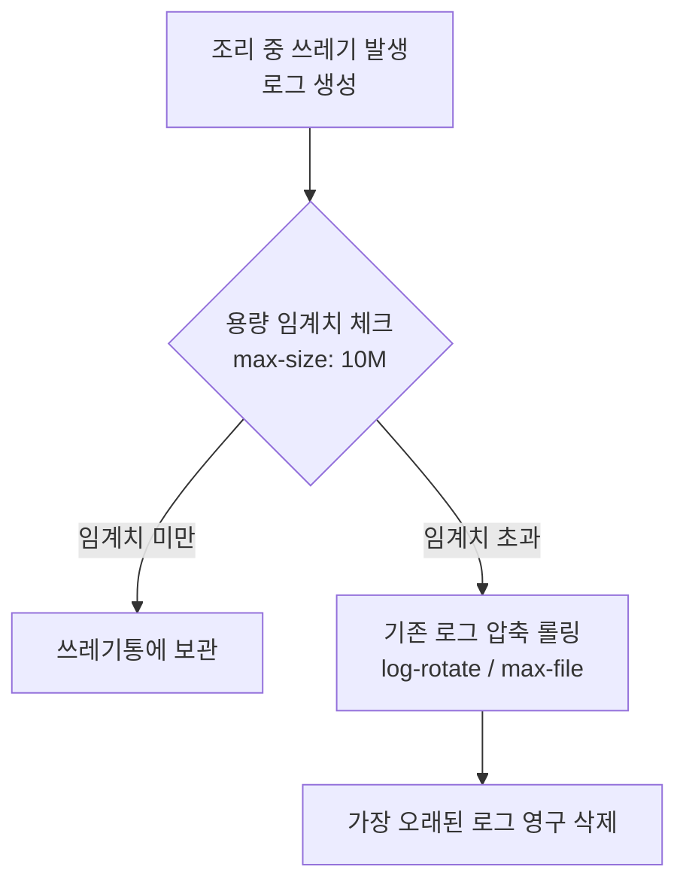
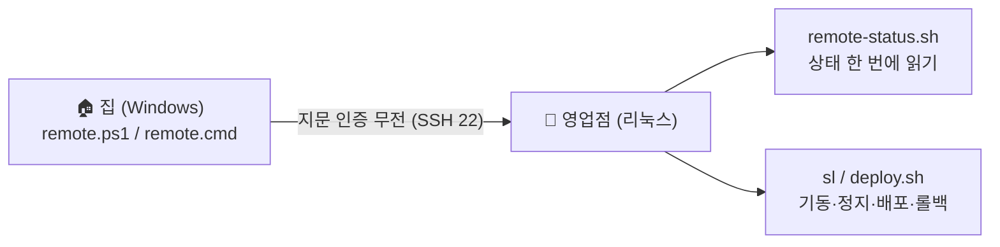

# SkinLens 운영 이야기 — 매일의 평화로운 영업을 지키는 비결

> 이 문서는 **「SkinLens 서버 이야기」**의 **막 3(운영)**을 다루는 심화편입니다.
> 주방(WSL2 리눅스 서버)을 구축하고 보안 자물쇠를 채운 뒤, **매일 아침 주방을 열고, 청소하고, 감시하며 평화롭게 영업을 이어가는 백그라운드 관리 프로세스**를 식당 비유로 풀어 씁니다.

---

## 1. 아침 자동 개점 (자동 기동 및 restart 정책)
장사를 하려면 매일 아침 문을 열어야 합니다. 만약 주방장이 매일 아침 출근해서 불을 켜고, 냄비를 올리고, 재료를 준비하는 작업을 수작업으로 해야 한다면 매우 번거로울 것입니다.

*   **비유**: 주방 문을 열면 자동으로 화구에 불이 켜지고 조리대 배치가 정렬되는 자동화 설비.
*   **실제 기술**: 
    *   리눅스 시스템이 켜질 때 Docker 데몬이 자동으로 기동(`systemctl enable docker`)됩니다.
    *   Docker Compose 내 개별 서비스 컨테이너에 `restart: unless-stopped` 정책을 지정하여, 예기치 않게 화구가 꺼지거나 서버가 재부팅되어도 컨테이너들이 스스로 다시 켜지도록 설계했습니다.

---

## 2. 어긋난 벽시계 맞추기 (시계 동기화 · hwclock)
집 주방(WSL2)은 독특한 문제가 있습니다. 데스크톱 컴퓨터를 닫아(절전 모드) 주방이 잠시 멈췄다가 다시 열리면, **주방 안의 벽시계(WSL 커널 시간)가 잠들기 전 시간에 멈춰 있습니다.** 시계가 안 맞으면 영수증(로그)에 찍히는 주문 시간이 과거로 기록되어 장부 정리가 엉망이 됩니다.

*   **비유**: 주방 문을 열 때마다 바깥 상가의 표준 시계를 보고 주방 안의 고장 난 시계를 동기화하는 작업.
*   **실제 기술**:
    *   WSL2가 절전 모드에서 깰 때 표준 시간 서버(NTP) 또는 윈도우 호스트의 물리 시계(`hwclock -s` 또는 `wsl --shutdown` 후 재진입)와 시간을 강제로 맞추는 스크립트 배선.
    *   이를 통해 모든 로그와 비동기 Job 이벤트의 타임스탬프가 실시간 정합성을 유지하도록 보장합니다.

---

## 3. 쓰레기통이 넘치지 않게 비우기 (로그 로테이션 · journald 상한)
조리를 하다 보면 필연적으로 껍질이나 찌꺼기 같은 **쓰레기(로그 데이터)**가 나옵니다. 쓰레기통을 비우지 않고 계속 방치하면 결국 주방 전체가 쓰레기로 가득 차서 더 이상 조리대(디스크 공간)를 쓸 수 없게 됩니다.

*   **비유**: 쓰레기통의 크기를 제한하고, 매일 밤 헌 쓰레기봉투는 묶어서 창고로 보내며, 너무 오래된 봉투는 버리는 청소부.
*   **실제 기술**:
    *   **Docker 데몬 하드닝**: `/etc/docker/daemon.json`에서 개별 컨테이너 로그 파일의 최대 크기(`max-size: "10m"`)와 개수(`max-file: "3"`)를 강제 제한합니다.
    *   **systemd journald 설정**: 시스템 로그 역시 `SystemMaxUse=50M` 등으로 총용량 상한을 걸어 디스크 풀(Full)로 인한 서버 마비 장애를 사전 방지합니다.

---

## 4. 정기 설비 점검 (자동 업데이트 및 재부팅 정책)
식당의 가스 배관이나 수도(OS 커널, 보안 패치)는 정기적으로 점검해야 안전합니다. 하지만 점검을 한답시고 **대낮 영업 중에 가스 밸브를 잠그고 설비를 재부팅하면** 손님들의 주문이 모두 날아갑니다.

*   **비유**: 손님이 없는 새벽 시간에만 배관 점검을 하고, 영업 중에는 점검 알림을 받아도 임의로 가스를 차단하지 않는 정책.
*   **실제 기술**:
    *   보안 패치를 자동으로 내려받는 `unattended-upgrades`를 설정하되, 서비스 재시작이나 OS 재부팅이 수반되는 큰 패치는 낮 영업 시간을 피해 새벽에만 실행되도록(`Unattended-Upgrade::Automatic-Reboot-Time "04:00"`) 설정합니다.
    *   WSL 연습 주방 환경에서는 개발자가 수동으로 빌드 타이밍을 제어하므로 자동 재부팅을 비활성화합니다.

---

## 5. 집에서 주방 들여다보기 (원격 모니터링 · 제어)
주방이 우리 집(WSL2)이 아니라 **떨어진 영업점(외부 리눅스 서버)**에 있으면, 주방장(운영자)은 매일 그 가게에 출근할 수 없습니다. 집(외부 Windows PC) 소파에 앉아서도 **가게 상태를 보고(모니터링), 필요하면 불을 조절(제어)** 할 수단이 필요합니다.

*   **비유**: 주인이 집에서 가게로 거는 **전용 무전기**. 버튼 하나로 "지금 화구 몇 개 켜져 있어? 장부 얼마나 쌓였어?" 물으면 가게 쪽 점원이 한꺼번에 읽어 주고, "3번 화구 꺼줘" 하면 끄는 양방향 무전. 선은 **주인만 쓰는 지문 인증 회선**이라 도청·남용이 안 됩니다.
*   **실제 기술**:
    *   **SSH 단일 회선**: 별도 포트·에이전트를 새로 열지 않고, 이미 있는 **SSH 키 인증(22번)** 하나로 모든 운영 트래픽이 오갑니다. 보안 표면을 넓히지 않으면서 원격 운영이 됩니다.
    *   **모니터링(읽기)**: Windows 쪽 `deploy/scripts/remote.ps1 status` 가 서버의 `deploy/ops/remote-status.sh` 를 SSH 한 번으로 호출해, 컨테이너·헬스·디스크·메모리·큐 적체·GPU·최근 오류를 **한 번의 왕복으로** 모아 돌려줍니다. `status -Watch` 는 몇 초마다 새로고침되는 원격 대시보드이고, `ps`·`logs`·`health`·`doctor` 로 쪼개 볼 수도 있습니다.
    *   **제어(쓰기)**: 같은 무전기로 서버의 총지배인(`sl`)과 지배인(`deploy.sh`)을 원격 지시합니다 — `up`/`down`/`restart`/`deploy <서비스> <이미지>`. prod(영업점)를 건드리는 동사는 "정말 끌까요?" **한 번 더 확인**하고, 배포는 서버에서 헬스체크 후 실패 시 **이전 버전으로 스스로 롤백**합니다.
    *   **직원 뒷문(터널)**: 외부에 열지 않은 관리 포트(DB·콘솔)는 `remote.ps1 tunnel 8080` 처럼 **SSH 로컬 포워딩**으로만 열어 봅니다(§5-직원 전용 뒷문과 같은 원칙).

> 포인트는 **"보고"와 "만지는" 것을 같은 무전기로 하되, 읽기는 자유롭게·쓰기는 확인을 거치게** 나눈 것입니다. 그리고 이 무전은 주방 구조를 전혀 바꾸지 않습니다(무침투).

---

## 6. 경비실 CCTV 가동 (uptime-kuma 및 Webhook 알림)
주방장이 주방 안에서 요리만 하고 있으면 정문 안내데스크(Nginx)가 고장 났는지, 정전이 되었는지 알기 어렵습니다. 가게 밖에서 가게의 생존 여부를 주기적으로 감시해 주는 경비원이 필요합니다.

*   **비유**: 주방 밖에서 5초마다 안내데스크 노크를 해보고, 대답이 없으면 주방장 휴대폰으로 긴급 무전을 치는 경비실.
*   **실제 기술**:
    *   **Uptime Kuma**: 외부 격리 영역 혹은 별도 컨테이너에서 Gateway의 `/healthz` 및 Nginx 표면에 5~10초 간격으로 HTTP Ping을 보냅니다.
    *   **데드맨 스위치 & Webhook**: 서비스가 3회 이상 응답하지 않거나 지연시간이 급증하면 개발자 슬랙/디스코드 채널로 실시간 경보 메시지(`alert.sh`)를 발송하여 장애 인지 타임(MTTR)을 최소화합니다.

---

## 7. 요약
식당이 매일 평화롭게 굴러가는 것은 보이지 않는 곳에서 **자동으로 켜지는 화구(restart)**, **시간 맞추기(hwclock)**, **쓰레기 비우기(log limit)**, **새벽 설비 점검(auto reboot)**, **집에서 거는 무전(원격 모니터링·제어)**, **CCTV 감시(uptime-kuma)**가 유기적으로 작동하고 있기 때문입니다.

> [!TIP]
> 상세한 운영 명령어 배선 상태와 크론탭 설정법은 [`../../deploy/ops-jobs/README.md`](../../deploy/ops-jobs/README.md) 및 [`../operations/서버_실행_운영_가이드.md`](../operations/서버_실행_운영_가이드.md)를 참고하세요.
