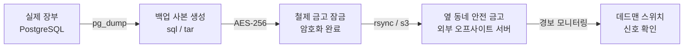

# SkinLens 백업 이야기 — 불이 나도 장부를 지켜내는 이중 금고 규칙

> 이 문서는 **「SkinLens 서버 이야기」**의 **막 4(백업)**를 다루는 심화편입니다.
> 주방의 가장 소중한 자산인 **고객 장부(DB)와 피부 사진(Storage)을 예기치 못한 사고(하드웨어 고장, 화재, 랜섬웨어)로부터 완벽히 격리하고 복구하는 보안 아키텍처**를 식당 비유로 풀어 씁니다.

---

## 1. 장부 사본 매일 생성 (데이터베이스 덤프 · pg_backup.sh)
식당에 불이 나거나 도둑이 들어와 실제 장부(DB)를 찢어버리면, 그동안 손님들이 맡겨둔 처방 기록과 분석 리포트가 모두 허공으로 사라집니다. 이를 막기 위해 영업 종료 후 매일 밤 장부 복사본을 만드는 절차가 필요합니다.

*   **비유**: 매일 밤 마감 후 장부의 모든 페이지를 복사하여 별도의 가죽 바인더로 묶는 마감 서기.
*   **실제 기술**: 
    *   `pg_backup.sh` 스크립트가 크론탭(Cron) 스케줄러에 의해 매일 자동으로 작동합니다.
    *   PostgreSQL의 `pg_dump` 도구를 활용하여 트랜잭션 일관성이 유지된 논리적 데이터 백업 원본(`.sql` 또는 `.bak`)을 추출합니다.

---

## 2. 금고에 넣어 잠그기 (백업 암호화)
장부 사본을 그냥 조리대 위에 올려두고 퇴근했는데, 도둑이 들어와 사본을 훔쳐 가면 **고객의 민감한 피부 사진과 개인정보가 세상에 노출**됩니다. 백업 사본은 반드시 열쇠가 없으면 읽을 수 없도록 꽁꽁 잠가두어야 합니다.

*   **비유**: 장부 사본을 복사하자마자 비밀번호 다이얼이 달린 철제 금고에 넣어 잠그는 것.
*   **실제 기술**:
    *   백업 파일 생성 즉시 대칭키 암호화 알고리즘(예: `gpg` 또는 `openssl enc -aes-256-cbc`)을 적용하여 암호화된 파일로 변환합니다.
    *   개인정보보호법(PIPA)에 따른 암호화 규격(AES-256)을 강제하여 백업 보관소의 탈취 시나리오에도 데이터 노출을 완벽히 방어합니다.

---

## 3. 다른 건물에 백업 보관 (오프사이트 복제)
아무리 사본을 튼튼한 금고에 넣어 잠갔어도, **식당 건물 자체가 불타서 무너지면** 금고와 원본 장부가 함께 녹아버립니다. 진짜 안전하려면 사본 중 하나는 멀리 떨어진 다른 동네의 은행 금고(외부 서버)에 보관해야 합니다.

*   **비유**: 매일 아침 오토바이를 타고 옆 동네 안전 금고로 전날 장부 금고를 배달하는 보안 직송 조.
*   **실제 기술**:
    *   암호화된 백업 파일을 `scp`, `rsync` 또는 S3 API 연동 도구를 사용해 물리적으로 분리된 외부 백업 서버나 클라우드 오브젝트 스토리지(Supabase Storage 또는 AWS S3 등)로 자동 업로드합니다.

---

## 4. 최근 몇 부 남기기 (보존 연한 및 최소 수량 제한 · MIN_KEEP)
매일 장부 사본을 무제한으로 쌓아두면 창고가 가득 차서 정작 새 재료를 둘 공간이 없어집니다. 하지만 그렇다고 너무 빨리 버리면, 3일 전에 장부가 오염된 것을 뒤늦게 발견했을 때 되돌릴 방법이 없습니다.

*   **비유**: "최소 7일 치 장부는 보관하되, 창고가 넘칠 것 같으면 8일 전 것부터 순서대로 파쇄한다"는 보관 수칙.
*   **실제 기술**:
    *   백업 디렉토리 용량을 검사하여 순차 삭제(Retention)하되, 환경 변수 `MIN_KEEP_BACKUPS`(기본값 7~14일)를 두어 디스크 용량이 부족하더라도 최소한의 복구 히스토리는 남기도록 락을 겁니다.

---

## 5. 장부 신호 확인 (데드맨 스위치 · Deadman's Switch)
가장 위험한 함정은 **"백업이 매일 잘 돌고 있겠지"라고 믿고 방치하는 것**입니다. 백업 스크립트에 오타가 나거나 크론탭이 죽어서 백업이 안 돌고 있는데, 아무 경고도 없다가 나중에 서버가 터졌을 때야 백업 사본이 하나도 없다는 것을 깨닫게 됩니다.

*   **비유**: "백업을 무사히 금고에 넣었다"는 편지가 경비실에 매일 오는데, 하루라도 편지가 배달되지 않으면 경비실에서 강제로 비상경보를 울리는 안심 장치.
*   **실제 기술**:
    *   성공적인 백업 완료 시 외부 관측 서버(예: healthchecks.io 등)에 핑(curl)을 보냅니다.
    *   외부 모니터링 도구는 정해진 시간(예: 24시간) 내에 핑이 도달하지 않으면 **"백업 파이프라인 중단"**으로 간주하고 개발자에게 긴급 알림(Slack Webhook)을 보냅니다.

---

## 6. 위험 공사 전 주방 통째 스냅샷 (`wsl --export`)
가스 배관을 바꾸거나 주방 인테리어를 완전히 뜯어고치는 큰 공사(OS 패치, Docker 네트워크 개편)를 하기 전에는 장부 복사만으로는 모자랍니다. 공사가 잘못되면 주방 문을 다시 열지 못할 수도 있습니다.

*   **비유**: 큰 공사 직전의 주방 모습을 설계도부터 냄비 위치까지 통째로 사진 찍어 3D 스캔본으로 복제해 두는 것.
*   **실제 기술**:
    *   WSL2 환경 전체를 이미지 파일로 통째로 추출하는 `wsl --export Ubuntu-22.04 wsl_snapshot.tar` 명령 실행.
    *   공사 실패 시 `wsl --import` 한 줄로 주방의 골조 전체를 10분 만에 공사 전으로 되돌립니다.

---

## 7. 복구 리허설 (연습 주방에서의 실전 복구 · restore-rehearsal.sh)
"백업 파일을 여는 열쇠를 잃어버렸거나", "사본에 빈 페이지만 복사되고 있었다"는 사실을 실제 재난 상황에서 알게 된다면 파멸입니다. 정기적으로 백업 금고를 열어 실제로 원본과 똑같이 주방 장부로 복구할 수 있는지 **가짜 주방(Staging)**에서 훈련을 해봐야 합니다.

*   **비유**: 한 달에 한 번, 밤에 백업 장부 바인더를 들고 연습 주방(Staging)으로 가서 장부를 펼쳐보고 실제 영업 장부와 일치하는지 대조하는 모의 훈련.
*   **실제 기술**:
    *   [`restore-rehearsal.sh`](../../deploy/ops-jobs/restore-rehearsal.sh)를 가동하여 백업 데이터 복호화, 로컬/Staging DB 스키마 복원, 데이터 무결성 체크를 자동 수행합니다.
    *   이때 **RPO**(복구 시점 목표 - 데이터 유실 기간)와 **RTO**(복구 시간 목표 - 복구에 걸리는 시간)를 측정하여 기록표([`restore-rehearsal.md`](../../deploy/ops-jobs/restore-rehearsal.md))에 기록해 둡니다.

---

## 8. 요약
SkinLens의 데이터 안심망은 **매일 장부 덤프(pg_backup)**, **철제 금고 잠금(암호화)**, **다른 상가 보관(오프사이트 복제)**, **편지 확인(데드맨 스위치)**, **통째 설계도 복사(wsl export)**, 그리고 **실전 이사 연습(복구 리허설)**이라는 유기적인 안전장치를 통해 구축됩니다.

> [!IMPORTANT]
> 실운영 서버(`production`)의 경우, 진짜 장부는 원천적으로 **클라우드 데이터 창고 (Supabase)**에 올라가 있으므로 백업 및 30일 시점 복구(PITR) 정책이 자동으로 위임되어 작동합니다. 위 백업/복구 리허설 스크립트 프로세스는 주로 **연습 주방의 임시 냉장고(Staging DB) 백업 보장** 및 로컬 데이터 복원력을 모니터링하기 위해 사용됩니다.
