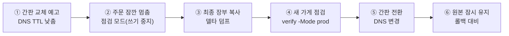
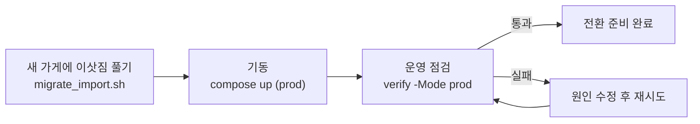

# SkinLens 이관 이야기 — 집 주방에서 상가로 이사하기까지

> 「서버 이야기」의 **막 5(이관)** 를 깊게 파고든 편입니다. 「구축 이야기」가 *빈 땅 → 검증된 주방*을,
> 「하드닝 이야기」가 *열린 주방 → 잠긴 주방*을 봤다면, 이 문서는 *집 주방 → 영업점*으로의 이사를 자세히 봅니다.
> 세부 절차는 `../server-setup/server_migration_runbook.md`에 있고, 여기선 그 흐름을 이야기로 잇습니다.

> **비유 사전·읽는 순서**는 `./README.md`(허브)에 모여 있습니다. 이 편이 새로 쓰는 캐스트만 아래 표에 둡니다.

## 이 편의 새 등장인물

| 비유 | 실제 부품 |
|---|---|
| 집 주방 / 영업점 | 스테이징(WSL, NAT 뒤) / 운영(VPS·고정 IP·도메인·TLS) |
| 간판 | DNS 레코드(도메인 → 서버 IP) |
| 간판 교체 예고 | DNS TTL 낮추기(전환을 빠르게) |
| 주문 잠깐 멈춤 | 점검 모드(쓰기 중지) — 컷오버 정합성 |
| 최종 장부 복사 | 델타 덤프(마지막 변경분만) |
| 이삿짐 | 이관 번들(`migrate_export.sh` — ⚠ `.env` 포함) |

## 한 줄 요약

간판 교체를 예고하고(DNS TTL↓) → 잠깐 주문을 멈추고(점검 모드) → 그 사이 최종 장부를 복사하고(델타 덤프) → 새 가게를 점검하고(`verify -Mode prod`) → 간판을 전환하고(DNS 변경) → 문제 대비로 원본을 잠시 켜 둔다(롤백 대비). 데이터는 **처음부터 데이터 창고(Supabase)** 라 이삿짐이 가볍습니다.

## 왜 이사하나

집 주방(WSL)은 연습·리허설엔 최고지만 **실손님의 민감한 재료**(피부 사진, PIPA)를 다루기엔 맞지 않습니다 — NAT 뒤라 문을 뚫어야 하고, 상시 부하에 약하고, idle에 잠들며, 절전 후 시계가 어긋납니다. 그래서 **상가(VPS·고정 IP·도메인·TLS)** 로 옮깁니다. 다만 진짜 장부(운영 데이터)는 **처음부터 데이터 창고=납품처(Supabase)** 에 있어, 이사는 사실 "가게(앱·설정)만 옮기고 창고는 그대로 두는" 가벼운 이사입니다.

## 이관 로드맵

---

## 1. 예고 — 간판을 빨리 바꿀 수 있게 준비

간판(DNS)은 **캐시**가 있어, 바꿔도 손님 눈에는 한동안 옛 주소가 보입니다. 그래서 이사 **전날 미리 TTL을 낮춰**(예: 300초) 캐시 수명을 줄여 둡니다. 그래야 실제 전환 순간에 손님들이 **빠르게** 새 주소로 옮겨옵니다.

## 2. 멈춤 — 컷오버 정합성의 핵심

이사에서 제일 위험한 건 **간판을 바꾸는 순간 손님이 흘리는 주문**입니다. 옛 가게와 새 가게가 동시에 주문을 받으면 장부가 갈라집니다(split-brain). 그래서 **잠깐 주문을 멈춥니다**(점검 모드 = 쓰기 중지). 읽기는 열어둬도 되지만, **쓰기는 한쪽에서만** 일어나게 해 정합성을 지킵니다.

## 3. 복사 — 마지막 변경분만 델타로

멈춘 사이, 그동안의 **최종 변경분만** 복사합니다(델타 덤프). 큰 이삿짐(초기 대량 데이터)은 미리 옮겨 두고, 컷오버 창에서는 마지막 차이만 좁게 복사해 **멈춤 시간을 최소화**합니다. 운영이 Supabase면 대개 창고는 그대로라 이 단계가 매우 가볍습니다.

> [!WARNING]
> **이삿짐 주의(보안 비밀정보 유출 위험):** `migrate_export.sh`가 만드는 이관 번들(tgz)에는 **`.env`(평문 비밀번호 및 API 키)+DB 덤프**가 날것으로 들어갑니다.
> - 파일 전송 시 반드시 SSH/SCP 등 **암호화 채널**만 사용하십시오.
> - 이관 완료 후, 소스 및 대상 서버 양쪽에서 임시 번들 파일을 즉시 **안전 파쇄(shred -u 등)**하여 흔적을 지우십시오. 비밀번호가 포함된 tgz 파일을 디스크에 방치하지 마세요. (운영 아키텍처 감사 `../architecture/01_SkinLens_운영아키텍처_최종리뷰.md ②-E` 참조)

## 4. 점검 — 새 가게가 실제로 되나

간판을 돌리기 **전에** 새 가게(VPS)를 손님 자리에서 점검합니다 — `verify_client.ps1`을 **운영 모드**(`-Mode prod`)로 돌려 문·물·불(HTTPS·API·헬스)이 실제로 되는지 확인합니다. 여기서 통과하지 못하면 간판을 돌리지 않습니다.

## 5. 전환 — 간판을 돌린다

점검을 통과하면 **간판(DNS)을 새 IP로** 돌립니다. TTL을 미리 낮춰 뒀으니 손님들이 빠르게 새 가게로 옮겨옵니다. 이때 **임시 냉장고**(로컬 postgres 컨테이너)는 치우고, 납품을 **데이터 창고(Supabase)** 로 바꿉니다 — `DATABASE_URL`을 Supabase 엔드포인트로 교체하고, 운영에선 db 컨테이너를 아예 기동하지 않습니다(`staging` 프로파일에서만 켜짐). 비밀번호 특수문자가 접속 문자열을 깨뜨리지 않게 `URL.create`로 조립하는 습관은 여기서도 그대로입니다.

## 6. 대비 — 원본은 잠시 켜 둔다

전환 뒤에도 **원본 주방은 잠시 켜 둡니다.** 새 가게에 문제가 생기면 간판을 되돌리려고요(롤백 대비). 며칠 지켜본 뒤 이상이 없으면 그때 원본을 정리합니다.

> 더 자세히 → **`../server-setup/server_migration_runbook.md`**(DNS TTL·점검 모드·델타 덤프·컷오버 정합성·롤백). 이관 번들 스크립트는 `../../deploy/scripts/migrate_export.sh`·`migrate_import.sh`. 관리형 DB 정렬(로컬 postgres 제거·`DATABASE_URL` 교체)은 `../architecture/SkinLens_서버구성_적합성_검토.md §6`.

---

## 다음 이야기로

이사를 마치면 남은 건 **배포**입니다 — 문을 연 영업점에 새 메뉴(코드 변경)를 안전하게 올리는 이야기(→ 「배포 이야기」). 스테이징(연습 주방)에서 먼저 리허설하고 운영(영업점)으로 승격하는 두 갈래가 그쪽에서 이어집니다.

## 한 줄로 다시

**간판 교체를 예고하고(DNS TTL↓) 주문을 잠깐 멈추고(점검 모드) 최종 장부만 복사한 뒤(델타 덤프) 새 가게를 점검하고(verify prod) 간판을 돌리고(DNS 전환) 원본은 롤백 대비로 잠시 켜 둔다 — 데이터는 처음부터 데이터 창고(Supabase)라 이삿짐은 가볍다.**
