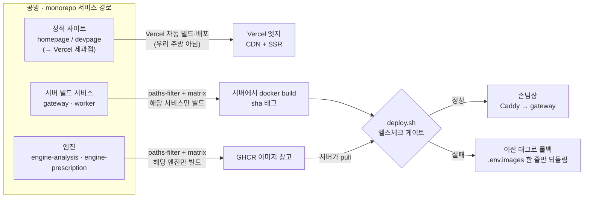

# SkinLens 배포 이야기 — 코드 한 줄이 손님상까지

> CD 파이프라인(monorepo 경로 필터 + matrix 분기 · 하이브리드 빌드 · 스테이징(WSL)/운영(VPS))을,
> 부품 이름 대신 "작은 식당 주방" 비유로 풀어 쓴 문서입니다.

> **v2 노트:** 창고 용어를 통일했습니다 — GHCR은 **이미지 창고**, Supabase는 **데이터 창고(납품처)**,
> 연습용 로컬 db는 **임시 냉장고**. 공용 비유 사전은 `./README.md`(허브)에 있습니다.

## 한 줄 요약

공방(서비스 경로)에 코드를 올리면 → 주방에 상주하는 집사(러너)가 알아서 집어 와서 →
가벼운 건 그 자리에서 만들고 무거운 건 이미지 창고에서 꺼내 오고 →
지배인(`deploy.sh`)이 시식(헬스체크)에 통과할 때만 손님상에 올리고, 아니면 되돌린다.
연습 주방에서 먼저 핵보고, 점장 승인을 받아 영업점에 낸다.

**v3 핵심 변화:**
- **C5-2 해결** — worker만 고쳐도 gateway가 재배포되는 낭비가 사라졌습니다. paths-filter + matrix 분기로
  "누가 바뀌었는지"를 먼저 확인하고, 해당 요리사만 주방에 들어옵니다.
- **Phase 5 완료** — 홈페이지·개발자페이지는 더 이상 이 주방에서 요리하지 않습니다. Vercel이라는
  **전문 제과점**에 위탁했고, 우리 주방은 AI Server(게이트웨이·워커·엔진)만 집중합니다.
- **Render 검토 완료** — Render는 GPU를 지원하지 않아 엔진 요리를 할 수 없고, Case A 폐쇄망
  (`enginenet: internal`)을 구현할 수 없어 채택하지 않았습니다. 현재 3-Tier 구조를 유지합니다.

## 등장인물 (부품 ↔ 비유)

| 비유 | 실제 부품 | 하는 일 | 비고 |
|---|---|---|---|
| 공방 | monorepo의 서비스별 경로(`services/`·`apps/`) | 요리(서비스)마다 폴터(칸)를 나눠 두고, 워크플로가 경로 필터 + matrix로 구분 | C5-2로 정확한 분기 가능 |
| 집사 | self-hosted 러너 | 주방에 상주하며 GitHub 게시판을 힐끔힐끔 봄(아웃바운드 폴닝·polling) | NAT 뒤에 있어도 됨 |
| 중앙 공장 | GitHub-hosted 러너 | 무거운 요리(엔진)를 대신 구움 | GPU 없이도 빌드 가능 |
| 이미지 창고 | GHCR(컨테이너 레지스트리) | 완제품 엔진 이미지를 보관 | `ghcr.io/owner/skinlens-engine-*:sha` |
| 지배인 | `deploy.sh` | 시식(헬스체크) 통과 시에만 손님상에, 실패 시 롤백 | flock으로 동시 배포 잠금 |
| 시식 검사관 | 컨테이너 healthcheck | 새 접시가 정상인지 확인 | `curl -f http://localhost:8000/health` |
| 주방 화이트보드 한 줄 | `.env.images` | "지금 어떤 버전을 쓰는지"를 한 줄로 기록 → 롤백이 즉시 | `GATEWAY_IMAGE=sl_gateway:abc123` |
| 안내 데스크 | Caddy(엣지) | 손님을 알맞은 방으로 안내, HTTPS 인증서 자동 갱신 | nginx는 제거됨(Phase 3) |
| 창문 없는 골방 | `enginenet`(internal) | 엔진 방 — 바깥으로 아무것도 못 낼볼냄(낼 수 없음 · 민감 재료 유출 차단) | Case A 보안 경계 |
| 연습 주방 / 영업점 | 스테이징(WSL) / 운영(VPS) | 리허설용 / 실제 손님용 | `develop` → `main` 브랜치 |
| 전문 제과점 | Vercel | 홈페이지·개발자페이지·Next.js PWA를 구움 | 우리 주방에서 완전 분리 |
| 데이터 창고(납품처) | Supabase | Postgres·Auth·Storage·RLS 정책 | 피부 이미지는 여기에만 |
| 재료 검수원 | `validate_image_bytes()` | worker가 엔진 호출 전에 이미지 magic-byte 재검증 | presigned 업로드의 실질 방어선 |

> 공용 비유(안내 데스크·주방장·데이터 창고 등)의 **정본은 허브 비유 사전**(`./README.md`)입니다.
> 아래 표는 배포 편이 새로 쓰는 캐스트 위주입니다.

## 흐름 그림

> 색/상태로 읽으면 — 지나가는 단계는 중립, `deploy.sh`는 판정(게이트), 롤백은 실패, 손님상은 성공.
> 그리고 이 모든 걸 가능하게 하는 전제: **집사(러너)가 안에서 밖을 내다볼므로(내다보기 때문에), 집 서버(NAT 뒤)에 문(인바운드)을 뚫을 필요가 없다.**

## 세 가지 여정

### 1) 정적 — 홈페이지 문구를 고쳤을 때 (Vercel 제과점)

**이제 우리 주방에서 하지 않습니다.** 홈페이지·개발자페이지·Next.js PWA는 전문 제과점(Vercel)에 위탁했습니다.
`apps/webapp-next`에 코드를 올리면 Vercel이 자동으로 빌드하고 전 세계 CDN에 배포합니다.
우리 주방의 집사는 이 일을 전혀 신경 쓰지 않습니다. Phase 5.1에서 `deploy-static.yml`과 `deploy-webapp.yml`을
완전히 제거했기 때문입니다.

### 2) 서버 빌드 — gateway/worker 코드를 고쳤을 때

조리가 필요합니다. 주방 안 집사가 **그 자리에서 직접 요리**하고(서버에서 `docker build`),
갓 만든 접시에 커밋 번호 딱지를 붙입니다(`sl_gateway:abc123def`).

**C5-2 해결로 달라진 점:**
- 예전: worker만 고쳐도 gateway가 재배포되는 낭비가 있었습니다.
- 지금: `dorny/paths-filter`가 먼저 "누가 바뀌었는지" 확인하고, `strategy.matrix`가
  해당 서비스만 빌드·배포합니다. `packages/**`가 바뀌면 공통 재료이므로 둘 다 재배포합니다.

그다음 지배인(`deploy.sh`)이 손님상에 올리기 전에 **시식 검사관**을 부릅니다.
"정상"이 나올 때까지 기다렸다가 통과하면 손님상으로, "이상"이면 **직전에 잘 나가던 접시로 되돌립니다**(롤백).
되돌리기가 즉각적인 이유는, 어떤 버전을 쓰는지가 화이트보드에 **딱 한 줄**(`.env.images`)로 적혀 있어
그 줄만 이전 값으로 바꾸면 되기 때문입니다.

**gateway만의 특별한 의무:** DB 마이그레이션입니다. deploy 이전에 `alembic upgrade head`를 실행해
스키마를 "전진"시킵니다. 이것이 실패하면 deploy 스텝에 도달하지 않아 스키마가 깨진 채 이미지가 교철되는
사고를 막습니다. (03_DB_MIGRATION_ROLLBACK.md)

### 3) 엔진 — 모델을 교체했을 때

엔진 요리는 무겁고 오래 걸립니다. 집 주방에서 구우면 온 주방이 매달려 다른 손님을 못 받습니다.
그래서 엔진만은 **중앙 공장**(GitHub-hosted 러너)이 대신 굽고, 완제품을 **이미지 창고**(GHCR)에 넣습니다.
주방 집사는 이미지 창고에서 **꺼내오기만** 하면 됩니다(pull). 이후는 2)와 똑같아요 — 지배인이 시식시키고,
통과하면 상에, 실패하면 롤백.

> 참고: 공장은 "굽기"가 아니라 "포장까지"만 하는 셈이라 GPU 없이도 이미지를 만들 수 있습니다.
> GPU가 실제로 필요한 건 나중에 그 요리를 손님 앞에서 **데울 때**(운영 서버에서 돌릴 때)입니다.

## 연습 주방에서 영업점으로 — 승격

- `develop`에 올리면 집사가 **집 연습 주방(WSL)에서 먼저 리허설**합니다. 손님이 없어 뭐가 깨져도 안전합니다.
- 만족스러우면 `main`에 올려 **영업점(VPS)으로** 냅니다. 단, 영업점은 문 앞에 **점장 승인**(GitHub Environment 승인 게이트)을 둬서,
  "오케이" 이후에만 실제 손님상 메뉴가 바뀝니다.
- 재료 납품처도 바릅니다 — 연습 주방은 **임시 냉장고**를 직접 두고 쓰고(로컬 db, `staging` 프로파일에서만 켜짐),
  영업점은 **데이터 창고=납품처(Supabase)** 에서 받습니다. 그래서 운영에서는 db 컨테이너를 아예 안 켜고 `.env`에 Supabase 주소를 연결합니다.

## 이 구조가 주는 안심

- **똑똑한 공방·똑똑한 러너** — 워크플로가 경로 필터(`on.push.paths`) + **matrix 분기**로 나뉘어,
  홈페이지 문구만 고쳤다고 엔진이 다시 구워지지 않습니다. C5-2 해결로 worker만 고쳐도 gateway가 재배포되는 일은 없습니다.
- **정확한 재료 투입** — `packages/**`가 바뀌면 공통 계약 패키지이므로 gateway와 worker가 동시에 재배포됩니다.
  engine-analysis와 engine-prescription은 각각 독립 matrix로 분리되어 한쪽만 바뀌면 한쪽만 배포됩니다.
- **비밀 배합표는 금고에** — `.env`는 각 주방(서버)에만 있고 배포가 건드리지 않습니다. 러너/CI는 화이트보드(`.env.images`)의
  버전 한 줄만 갱신합니다. Supabase service_role 키는 `.env`에만 있고, 엔진 방(enginenet)에는 아무 자격증도 없습니다.
- **정적은 무중단·묻빌드(빌드 없음)** — Vercel 제과점이 알아서 하므로 우리 주방은 신경 쓰지 않습니다.
- **동시에 두 배포가 엉키지 않음** — 배포 중에는 잠금(concurrency)이 걸립니다. 같은 브랜치의 배포는 직렬화됩니다.
- **집 서버에 문을 뚫지 않아도 됨** — 집사가 안에서 밖을 볼므로(보기 때문에) NAT 뒤 WSL이라도 웹훅·공인 IP·포트 개방이
  필요 없습니다. 다만 집사가 잠 깨어 있어 WSL이 잠심에서 깨드는(idle 종료) 문제에 신경써야 합니다.
- **피부 이미지는 안전하게** — 브라우저가 Supabase Storage에 직접 PUT하고, gateway는 `image_key`만 받습니다.
  worker가 원본을 fetch할 때 magic-byte를 재검증하므로, gateway가 바이트를 보지 않는 구조에서도 실질 방어선이 유지됩니다.
- **Render는 왜 안 쓰나** — GPU를 지원하지 않아 엔진 요리를 할 수 없고, Private Network로 Case A 폐쇄망을
  완전히 재현할 수 없습니다. 현재 3-Tier(Vercel + Supabase + self-hosted AI Server)가 최적입니다.

## 한 줄로 다시

**"공방에 올리면 → 집사가 집어 와서 → 누가 바뀌었는지 확인하고 해당 요리사만 움직여서 →
가벼운 건 그 자리, 무거운 건 이미지 창고에서 → 지배인이 시식에 통과할 때만 손님상에, 아니면 되돌린다.
연습 주방에서 먼저, 점장 승인 받아 영업점에. 홈페이지는 Vercel 제과점에 맡긴다."**
