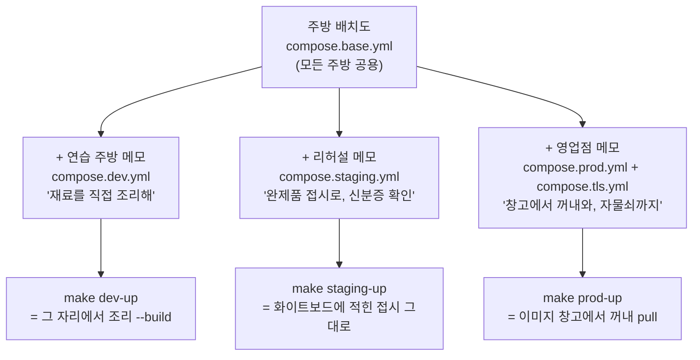

# SkinLens 기동 이야기 — 주방의 불을 켜는 세 가지 방법

> 환경별 빌드·기동 절차(dev / staging / prod)를, 명령어 목록 대신
> **"작은 식당 주방"** 비유로 풀어 쓴 문서입니다.
> 실제 명령·설정의 정본은 [`../operations/환경별_빌드_기동_절차.md`](../operations/환경별_빌드_기동_절차.md)에 있습니다.

## 한 줄 요약

같은 주방 배치도(`compose.base.yml`)를 쓰되, **연습 주방(dev)에서는 재료(소스)를 그 자리에서 직접 조리하고, 리허설 주방(staging)과 영업점(prod)에서는 이미 만들어진 접시(이미지)를 꺼내 올리기만 한다.** 손님을 맞는 방식도 다르다 — 연습 주방은 얼굴만 보여주면 들어오고, 영업점은 신분증(JWT)이 없으면 문도 못 연다.

## 등장인물 (이번 편에서 새로 쓰는 비유)

| 비유 | 실제 부품 | 하는 일 |
|---|---|---|
| 주방 배치도 | [`deploy/compose/compose.base.yml`](../../deploy/compose/compose.base.yml) | 모든 주방이 공유하는 단일 진실원본 — 어느 환경이든 이 도면 위에 덧그린다 |
| 덧그린 메모 | `compose.<env>.yml` 오버레이 | 환경별 차이(직접 조리냐, 완제품이냐, 신분증 확인이냐)를 배치도 위에 얹는 쪽지 |
| 재료 꾸러미 | 소스 코드(`services/*`) | 조리가 필요한 날것 그대로의 상태 |
| 완제품 접시 | 컨테이너 이미지 | 조리가 끝난 상태 — 데워서 올리기만 하면 됨 |
| 버전 화이트보드 | `deploy/env/.env.images` | "지금 어떤 접시를 쓰는지" 딱 한 줄씩 적힌 판 |
| 연습 주방 | dev 환경 | 손님 없이 마음껏 시연하는 곳 — 깨져도 안전 |
| 리허설 주방 | staging 환경 | 영업점과 똑같은 복장·절차로 연습하는 곳 |
| 영업점 | prod 환경 | 실제 손님이 오는 곳 — 문지기가 까다롭다 |
| 문지기 | `AUTH_MODE` | dev=얼굴 확인, strict=신분증(JWT) 필수 |
| 자물쇠 마법 | `ENV=prod` fail-fast | 복장이 엉망이면 주방 문이 아예 안 열림 |

> 공용 비유(안난데스크·주방장·이미지 창고·데이터 창고·임시 냉장고·지배인 등)의 정본은
> 허브 비유 사전([`README.md`](README.md))에 있습니다.

## 흐름 그림



## 제1막 — 연습 주방(dev): "그 자리에서 조리한다"

연습 주방에 처음 들어서면 해야 할 일이 있다. **재료 창고 열쇠**(`.env`)를 챙기는 것이다.
배치도는 있어도 창고 주소(`DATABASE_URL`)가 적힌 쪽지가 없으면 주방장(gateway)은 부팅조차 거부한다.
이건 고집이 아니라 안전장치다 — 약한 기본값으로 몰래 문을 여는 사고를 막기 위해,
배치도 구석구석에 "이 값 없으면 멈춰라"(`:?`)라는 주문이 새겨져 있다.

열쇠를 챙겼다면, 이제 불을 켠다:

```bash
make dev-up
```

이 한 마디가 하는 일은 이렇다. 연습 주방 메모(`compose.dev.yml`)에는
**"접시를 사 오지 말고, 재료 꾸러미(소스)를 그 자리에서 직접 조리해"**라고 적혀 있다.
그래서 주방 집사는 주방장 방·리포트 담당 방·두 요리사 방의 문 앞에서
각각 조리(`docker build`)를 시작한다. 조리가 끝난 접시는 바로 식탁에 오른다.

연습 주방의 특혜가 세 가지 있다:

- **슬로모션 모드**(`STAGE_DELAY_SEC=1`) — 주문이 들어가고, 번호표가 뽑히고, 요리사가 조리하는
  각 단계 사이에 1초씩 쉼표를 넣는다. 눈으로 진행을 따라갈 수 있다.
- **엿보기 창**(`DEV_DEBUG=1`) — 골방(엔진)은 창문이 없어 밖에서 들여다볼 수 없는데,
  연습 주방에서만 주방장이 대신 안을 들여다보고 알려주는 창구(`/debug/engines`)를 열어 둔다.
- **얼굴 패스**(`AUTH_MODE=dev`) — 신분증 없이 "나 단골이요"(`X-User-Id` 헤더) 하면 들여볼내 준다.

문을 여는 방법은 안난데스크 규칙을 따라야 한다. 이 주방은 가게 간판(Host 헤더)으로
손님을 구분하기 때문에, 동네 지도(hosts 파일)에 `api.localhost`를 등록해 두고:

```bash
curl -H 'Host: api.localhost' http://localhost/health
```

주방장이 `{"status":"ok"}`라고 대답하면 불이 켜진 것이다.
이어서 `make smoke`를 외치면, 사진 한 장을 올려서 번호표가 뽑히고 `done`이 될 때까지의
전 과정을 눈앞에서 시연해 보여준다.

## 제2막 — 리허설 주방(staging): "완제품 접시로, 복장은 영업점과 같이"

리허설 주방은 겉보기엔 영업점과 똑같이 움직인다. 가장 큰 차이는 **조리대에 불을 안 켠다**는 것.
이 주방의 메모에는 조리법(`build:`)이 없다. 대신 버전 화이트보드(`.env.images`)에
"오늘 쓸 접시"가 한 줄씩 적혀 있고, 집사는 그대로 꺼내 올릴 뿐이다.

```bash
make staging-up
```

접시는 어디서 왔는가? 두 길이 있다. 중앙 공장(CI)이 구워서 배달해 준 것이거나,
연습 주방에서 직접 구워 둔 것(`docker build -t sl_gateway:<태그>`)이다.
어느 쪽이든 리허설 주방은 "만드는 곳"이 아니라 "올리는 곳"이다.

복장 규정도 영업점과 같다. **문지기가 신분증(JWT)을 요구**한다(`AUTH_MODE=strict`).
"나 단골이요"는 더 이상 통하지 않는다. 엿보기 창도 닫혔다 — 이제 골방의 안은
컨테이너 건강검진표(healthcheck)로만 확인한다.

한 가지 더, 리허설 주방에는 **지배인(`deploy.sh`)이 상주**한다.
"주방장 접시만 새 것으로 바꿔"라고 하면, 지배인은 이렇게 움직인다:

```bash
deploy/scripts/deploy.sh --service gateway --image sl_gateway:<태그> --env staging
```

1. 화이트보드의 해당 줄을 새 태그로 바꾼다 — 이때 **잠금(flock)**을 걸어서,
   두 지배인이 동시에 화이트보드를 고쳐 싸우는 일이 없게 한다.
2. 새 접시를 식탁에 올린다(`up -d`).
3. **시식 검사관**을 불러 "정상"이 나올 때까지 기다린다.
4. "이상"이 나오면? 당황하지 않고 화이트보드를 **직전 값으로 되돌리고**,
   잘 나가던 접시를 다시 올린다. 롤백이 한 줄 수정으로 끝나는 이유다.

## 제3막 — 영업점(prod): "창고에서 꺼내와, 자물쇠까지"

영업점은 리허설 주방에서 한 발 더 나간다. 세 가지가 달라진다.

**첫째, 접시는 반드시 이미지 창고(GHCR)에서 꺼낸다.**
영업점 메모에는 `pull_policy: always`라고 적혀 있어, 집사는 뒷마당에 남아 있는
헌 접시를 쓰지 않고 매번 창고에서 신선한 것을 가져온다.

**둘째, 자물쇠 마법(`ENV=prod` fail-fast)이 걸린다.**
이 마법이 걸린 주방은 복장이 엉망이면 **문 자체가 안 열린다**:

- 문지기가 "얼굴 패스" 모드로 서 있으면(`AUTH_MODE != strict`) → 주방장이 부팅을 거부한다.
- 처방 요리사가 "예시 배합표(example config)"로 얼버무리려 하면 → 부팅 거부.
- 창고 주소(`DATABASE_URL`)가 비어 있으면 → 배치도 단계에서 즉시 멈춘다.

즉, 잘못된 설정으로 손님을 받았다가 사고 치는 것보다,
**차라리 문을 안 여는 쪽**을 택한 것이다.

**셋째, 간판에 금테를 두른다(TLS).**
영업점 앞에는 금테 담당(Caddy, `compose.tls.yml`)이 함께 선다.
동네 지도(DNS)가 이 집을 가리키고 있으면, 금테 담당이 알아서 인증서를 발급받아
모든 왕래를 암호화한다.

불을 켜는 방법은 익숙한 한 마디:

```bash
make prod-up
```

접시를 바꿀 때도 지배인에게 맡기면 된다. 다만 이번에는 창고에서 꺼내오라는 말(`--pull`)을 덧붙인다:

```bash
deploy/scripts/deploy.sh --service engine-analysis \
  --image ghcr.io/coteleafdev/skinlens-engine-analysis:<sha> --env production --pull
```

손님을 맞는 방식은 가장 엄격하다. 이제 `https://api.example.com`이라는 금테 간판으로만
들어올 수 있고, 모든 주문에는 신분증이 따라붙는다. 없으면 문지기가 401로 돌려볼냈다.

## 세 주방을 한 표로 다시 보기

| | 연습 주방 (dev) | 리허설 주방 (staging) | 영업점 (prod) |
|---|---|---|---|
| 접시를 만드는 곳 | **그 자리에서 조리** (`--build`) | 조리 없음 — 화이트보드의 접시 | 조리 없음 — **창고에서 pull** |
| 불 켜는 말 | `make dev-up` | `make staging-up` | `make prod-up` |
| 문지기 | 얼굴 패스 (`dev`) | 신분증 (`strict`) | 신분증 + **자물쇠 마법** |
| 엿보기 창 | 열림 (`/debug/engines`) | 닫힘 | 닫힘 |
| 슬로모션 | 1초 간격 | 없음 | 없음 |
| 간판 | `*.localhost` (동네 지도) | `*.localhost` | 금테 간판 (도메인 + TLS) |

## 이 구조가 주는 편안함

- **배치도는 하나다** — 세 주방이 같은 도면을 쓰므로, "연습에선 되고 영업에선 안 되는"
  구조 차이가 원천 차단된다. 다른 건 덧그린 메모뿐.
- **만드는 일과 올리는 일이 분리됐다** — 영업점에서 조리하지 않으므로, 빌드 실패가
  손님 시간에 영향을 주지 않는다.
- **되돌리기가 한 줄이다** — 화이트보드에 버전이 한 줄씩이라, 롤백은 그 줄을 지우고
  이전 값을 쓰는 것으로 끝난다.
- **잘못된 설정은 문도 못 연다** — 자물쇠 마법 덕분에 "설정 실수로 열린 영업"이라는
  사고 유형이 사라진다.

## 한 줄로 다시

**"같은 배치도, 다른 메모 — 연습 주방은 그 자리에서 조리하고 얼굴로 들어오고,
영업점은 창고에서 꺼내 올리고 신분증을 검사하며, 복장이 엉망이면 아예 문이 안 열린다."**

> **실무 메모:** 이야기 속 "불 켜는 말"들은 실제로는 [`deploy/scripts/sl`](../../deploy/scripts/sl) 하나에 모여 있다.
> `./sl up dev`, `./sl up staging`, `./sl up prod` — 어느 주방이든 같은 동사다.
> 처음 세팅은 `./sl init dev`, 문 열기 전 점검은 `./sl doctor prod`.
> 명령의 정본은 [`../operations/환경별_빌드_기동_절차.md`](../operations/환경별_빌드_기동_절차.md).
