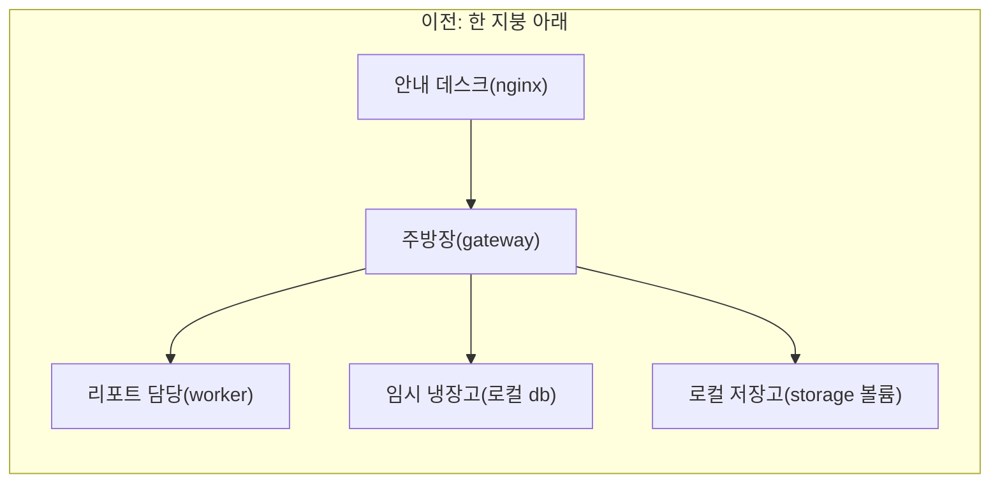
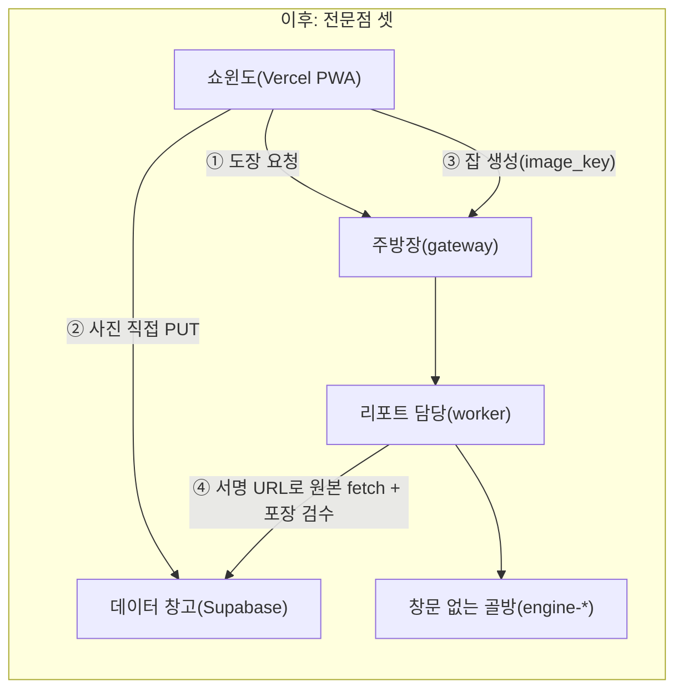
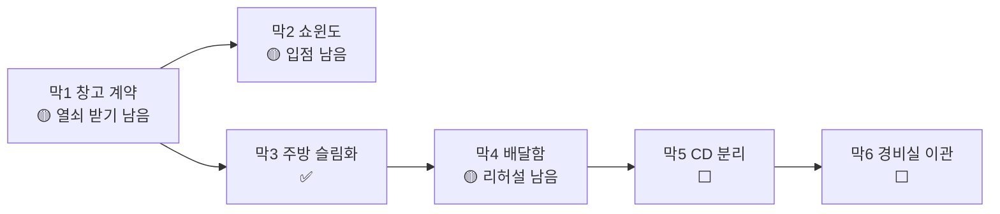

# SkinLens 3-Tier 이전 이야기 — 집 주방 간판 떼고, 전문점 셋으로 나누기

> 「서버 이야기」의 6막(구축→하드닝→운영→백업→이관→배포)을 지나온 주방이, 이번엔 **구조 자체를 바꾸는** 이야기입니다.
> 한 지붕 아래 몰려 있던 가게를 **셋으로 나눕니다** — 손님이 보는 간판은 **Vercel(쇼윈도)**, 장부·원본은 **Supabase(데이터 창고)**, 조리는 **AI Server(우리 주방)**.
> 세부 작업계획은 [`../architecture/05_3Tier_이전_작업계획.md`](../architecture/05_3Tier_이전_작업계획.md), 설계는 [`../architecture/04_3Tier_Vercel_Supabase_AIServer_설계.md`](../architecture/04_3Tier_Vercel_Supabase_AIServer_설계.md)에 있고, 여기선 그 **진행 상황**을 이야기로 잇습니다.
>
> **비유 사전·읽는 순서**는 `./README.md`(허브)에 모여 있습니다. 이 편이 새로 쓰는 캐스트만 아래 표에 둡니다.

## 이 편의 새 등장인물

| 비유 | 실제 부품 |
|---|---|
| 쇼윈도(간판 가게) | Vercel — Next.js PWA를 전 세계에 띄우는 프런트 |
| 데이터 창고(납품처) | Supabase — Postgres + Storage + Auth |
| 우리 주방 | AI Server — gateway/worker/engine-* 만 남긴 슬림한 백엔드 |
| 손님이 직접 싣는 배달함 | presigned 업로드 — 사진이 우리 주방을 안 거치고 창고로 직행 |
| 배달함 도장 | Supabase presigned URL (서명) |
| 도장 찍어주는 곳 | `POST /uploads/presign` (gateway) |
| 포장 검수 | worker의 magic-byte 재검증 — 상자 안 내용물이 진짜 사진인지 확인 |

## 한 줄 요약

주방(코드)은 **거의 다 고쳤고** — 간판·창고·주방 분리 배선, 손님이 직접 싣는 배달함(presigned)까지 — 남은 건 **실제 상가 열쇠 받기(Supabase 프로젝트 생성)와 쇼윈도 입점(Vercel 연결), 그리고 개업 리허설(E2E 검증)** 입니다.

---

## 이사 전 지도 → 이사 후 지도

핵심 변화는 **사진의 동선**입니다. 예전엔 손님 사진이 안내 데스크 → 주방장 → 저장고를 거쳤지만, 이제는 **쇼윈도에서 도장(presign)만 받아 창고로 곧장 싣고**, 주방엔 "몇 번 배달함"이라는 쪽지(`image_key`)만 옵니다. 사진은 한 번도 우리 서버를 거치지 않습니다 — PIPA(민감정보)·대역폭 부담을 동시에 덜었습니다.

---

## 막별 진행 상황 (2026-08-18 기준)

> 범례: ✅ 주방 공사 완료(코드) · 🟡 공사는 됐고 개업 준비(배포·검증) 남음 · ⬜ 미착수

### 막 1 — 창고 계약 (Supabase 정렬) 🟡

진짜 장부·원본을 둘 **데이터 창고(Supabase)를 전 환경 공통으로** 쓰기로 했습니다. 임시 냉장고(로컬 db)는 철거했고, 창고 다루는 도구(`SupabaseStorage`)도 만들었습니다. **버킷 이름을 `skin-images`로 통일**하는 실제 버그도 잡았습니다 — 안내 데스크만 `uploads`라고 적어 도장이 정책 밖 창고로 새던 문제였습니다.

| 공사 | 상태 |
|---|---|
| 버킷 이름 통일 | ✅ [`storage.py`](../../services/gateway/app/storage.py) 기본값 `skin-images` |
| 창고 도구 실구현 | ✅ `SupabaseStorage` — 도장 발급·서명 URL |
| 임시 냉장고 철거 | ✅ [`compose.dev.yml`](../../deploy/compose/compose.dev.yml) 로컬 db 없음 |
| **창고 실계약(프로젝트 생성·마이그레이션·RLS·열쇠)** | ⬜ **외부 작업** — [런북](../operations/09_Phase1_Supabase_실행런북.md) |

> **여기가 막힌 곳입니다.** 창고 열쇠(실제 Supabase 프로젝트·연결 문자열)가 없으면 **로컬 개발도 문을 못 엽니다.**

### 막 2 — 쇼윈도 공사 (웹 포팅) 🟡

손님이 보는 간판을 Vite에서 **Next.js PWA**로 새로 지었습니다([`apps/webapp-next/`](../../apps/webapp-next)). 오프라인에서도 앱 껍데기는 뜨고, 사진·결과·토큰은 캐시하지 않습니다(PIPA).

| 공사 | 상태 |
|---|---|
| Next.js(App Router) 신축·컴포넌트 이전 | ✅ |
| API 클라이언트·PWA 설정 이전 | ✅ |
| **쇼윈도 입점(Vercel 연결·환경변수)** | ⬜ 외부 작업 |
| 실입점 리허설(PWA 설치·오프라인 확인) | 🟡 |
| 옛 가게 철거(구 `apps/webapp`) | ⬜ 리허설 후 |

### 막 3 — 주방 슬림화 (AI Server) ✅

쇼윈도가 Vercel로 나가니, 주방에선 **안내 데스크(nginx)·정적 가게·저장고를 통째로 치웠습니다.** 남은 건 주방장(gateway)·리포트 담당(worker)·창문 없는 골방(engine-*)뿐. 입구(Caddy)는 이제 주방장 하나만 바라봅니다. 쇼윈도가 다른 걸(Vercel 오리진)에서 오므로 **출입국 심사(CORS)** 도 명시했습니다.

| 공사 | 상태 |
|---|---|
| CORS 허용 오리진 | ✅ [`main.py`](../../services/gateway/app/main.py) `CORSMiddleware` |
| frontnet·nginx·storage 제거 | ✅ [`compose.base.yml`](../../deploy/compose/compose.base.yml) |
| Caddy → gateway:8000 전용 | ✅ [`Caddyfile`](../../deploy/caddy/Caddyfile)·[`Caddyfile.staging`](../../deploy/caddy/Caddyfile.staging) |
| 배포 스크립트 정리(3.8) | ⬜ 막 5와 함께 |

### 막 4 — 손님이 직접 싣는 배달함 (presigned) 🟡

이번 이전의 **심장**입니다. 주방장은 도장만 찍고(`presign`), 사진은 손님이 창고에 곧장 싣고, 주방엔 배달함 번호만 옵니다. 그리고 **상자 안이 진짜 사진인지는 리포트 담당(worker)이 포장 검수(magic-byte)** 합니다 — 주방장이 바이트를 안 보게 되면서, 이 검수가 사라지면 위조 상자가 골방(엔진)까지 들어갑니다.

| 공사 | 상태 |
|---|---|
| `POST /uploads/presign` (도장 찍기) | ✅ [`main.py`](../../services/gateway/app/main.py) — 만료 15분·분당 10건 상한 |
| `POST /analyze` 가 `image_key` 수신 | ✅ — 소유권·키 형식 방어 포함 |
| 쇼윈도 3단 플로우 | ✅ [`api.ts`](../../apps/webapp-next/src/lib/api.ts) — presign→PUT→analyze |
| worker 서명 URL fetch + 포장 검수 | ✅ [`worker.py`](../../services/worker/worker.py) `validate_image_bytes` |
| **개업 리허설(E2E 검증) → 옛 방식 폐기(`ENABLE_LEGACY_UPLOAD=0`)** | 🟡 막 1 창고 계약에 종속 |

### 막 5 — 배달 경로 분리 (CD) ⬜ · 막 6 — 경비실 이관 (관측/DR) ⬜

쇼윈도는 Vercel이 자동으로 굴리고, 주방만 GH Actions로 배포하게 갈라야 합니다(막 5). 경비실(보존·로그 스크럽·복구 리허설·알림)의 감시 대상도 Supabase로 바꿔야 합니다(막 6). 둘 다 **막 1 창고 계약이 끝나야** 시작할 수 있습니다.

---

## 지금 어디까지 왔나

**주방 공사(코드)는 막 1~4가 거의 끝났습니다.** 남은 건 전부 **실제 세상과의 연결** — 창고 열쇠 받기, 쇼윈도 입점, 개업 리허설 — 입니다. 다음 한 걸음은 명확합니다: **막 1 창고 계약(Supabase 프로젝트 생성·실제 연결)**. 이것 없이는 어떤 문도 열리지 않습니다.

## 한 줄로 다시

**한 지붕 아래 몰린 가게를 쇼윈도(Vercel)·데이터 창고(Supabase)·우리 주방(AI Server) 셋으로 나누기로 했고, 주방 공사(코드)는 막 1~4까지 거의 마쳤다 — 이제 남은 건 창고 열쇠 받고(Supabase 프로젝트) 쇼윈도 입점하고(Vercel) 개업 리허설(E2E)하는 것뿐이다.**
