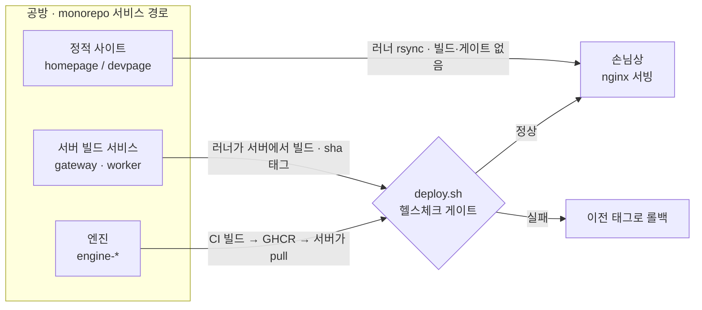

# SkinLens 배포 이야기 — 코드 한 줄이 손님상까지

> CD 파이프라인(monorepo 경로 필터 · 하이브리드 빌드 · 스테이징(WSL)/운영(VPS))을,
> 부품 이름 대신 "작은 식당 주방" 비유로 풀어 쓴 문서입니다.

> **v2 노트:** 창고 용어를 세 편에서 통일했습니다 — GHCR은 **이미지 창고**, Supabase는 **데이터 창고(납품처)**,
> 연습용 로컬 db는 **임시 냉장고**. 공용 비유 사전은 `./README.md`(허브)에 있습니다.

## 한 줄 요약

공방(서비스 경로)에 코드를 올리면 → 주방에 상주하는 집사(러너)가 알아서 집어 와서 → 가벼운 건 그 자리에서 만들고 무거운 건 이미지 창고에서 꺼내 오고 → 지배인(`deploy.sh`)이 시식(헬스체크)에 통과할 때만 손님상에 올리고, 아니면 되돌린다. 연습 주방에서 먼저 해보고, 점장 승인을 받아 영업점에 낸다.

## 등장인물 (부품 ↔ 비유)

| 비유 | 실제 부품 | 하는 일 |
|---|---|---|
| 공방 | monorepo의 서비스별 경로(`services/`·`apps/`) | 요리(서비스)마다 폴더를 나눠 두고, 워크플로가 경로 필터로 구분 |
| 집사 | self-hosted 러너 | 주방에 상주하며 GitHub 게시판을 힐끔힐끔 봄(아웃바운드 폴링) |
| 중앙 공장 | GitHub-hosted 러너 | 무거운 요리(엔진)를 대신 구움 |
| 이미지 창고 | GHCR(컨테이너 레지스트리) | 완제품 엔진 이미지를 보관 |
| 지배인 | `deploy.sh` | 시식(헬스체크) 통과 시에만 손님상에, 실패 시 롤백 |
| 시식 검사관 | 컨테이너 healthcheck | 새 접시가 정상인지 확인 |
| 주방 화이트보드 한 줄 | `.env.images` | "지금 어떤 버전을 쓰는지"를 한 줄로 기록 → 롤백이 즉시 |
| 안내데스크 | nginx(엣지) | 손님을 알맞은 방으로 안내 |
| 창문 없는 골방 | `enginenet`(internal) | 엔진 방 — 바깥으로 아무것도 못 내보냄(민감 재료 유출 차단) |
| 연습 주방 / 영업점 | 스테이징(WSL) / 운영(VPS) | 리허설용 / 실제 손님용 |

> 세 편 공용 비유(안내데스크·주방장·데이터 창고 등)의 **정본은 허브 비유 사전**(`./README.md`)입니다. 아래 표는 배포 편이 새로 쓰는 캐스트 위주입니다.

## 흐름 그림

> 색/상태로 읽으면 — 지나가는 단계는 중립, `deploy.sh`는 판정(게이트), 롤백은 실패, 손님상은 성공.
> 그리고 이 모든 걸 가능하게 하는 전제: **집사(러너)가 안에서 밖을 내다보므로, 집 서버(NAT 뒤)에 문(인바운드)을 뚫을 필요가 없다.**

## 세 가지 여정

### 1) 정적 — 홈페이지 문구를 고쳤을 때
홈페이지 공방에 올리면 집사가 새 종이(HTML)를 서빙대에 그냥 **갈아 끼웁니다**(rsync). 조리도, 안내데스크 재시작도 없습니다. nginx가 갈아 끼운 파일을 그 자리에서 바로 보여줍니다. 정적이라 "빌드"라는 과정 자체가 없는, 가장 가벼운 길입니다.

### 2) 서버 빌드 — gateway/worker 코드를 고쳤을 때
조리가 필요합니다. 주방 안 집사가 **그 자리에서 직접 요리**하고(서버에서 `docker build`), 갓 만든 접시에 커밋 번호 딱지를 붙입니다(sha 태그). 그다음 지배인(`deploy.sh`)이 손님상에 올리기 전에 **시식 검사관**을 부릅니다. "정상"이 나올 때까지 기다렸다가 통과하면 손님상으로, "이상"이면 **직전에 잘 나가던 접시로 되돌립니다**(롤백). 되돌리기가 즉각적인 이유는, 어떤 버전을 쓰는지가 화이트보드에 **딱 한 줄**(`.env.images`)로 적혀 있어 그 줄만 이전 값으로 바꾸면 되기 때문입니다.

### 3) 엔진 — 모델을 교체했을 때
엔진 요리는 무겁고 오래 걸립니다. 집 주방에서 구우면 온 주방이 매달려 다른 손님을 못 받습니다. 그래서 엔진만은 **중앙 공장**(GitHub-hosted 러너)이 대신 굽고, 완제품을 **이미지 창고**(GHCR)에 넣습니다. 주방 집사는 이미지 창고에서 **꺼내오기만** 하면 됩니다(pull). 이후는 2)와 똑같아요 — 지배인이 시식시키고, 통과하면 상에, 실패하면 롤백.

> 참고: 공장은 "굽기"가 아니라 "포장까지"만 하는 셈이라 GPU 없이도 이미지를 만들 수 있습니다. GPU가 실제로 필요한 건 나중에 그 요리를 손님 앞에서 **데울 때**(운영 서버에서 돌릴 때)입니다.

## 연습 주방에서 영업점으로 — 승격

- `develop`에 올리면 집사가 **집 연습 주방(WSL)에서 먼저 리허설**합니다. 손님이 없어 뭐가 깨져도 안전합니다.
- 만족스러우면 `main`에 올려 **영업점(VPS)으로** 냅니다. 단, 영업점은 문 앞에 **점장 승인**(GitHub Environment 승인 게이트)을 둬서, "오케이" 이후에만 실제 손님상 메뉴가 바뀝니다.
- 재료 납품처도 다릅니다 — 연습 주방은 **임시 냉장고**를 직접 하나 두고 쓰고(로컬 db, `staging` 프로파일에서만 켜짐), 영업점은 **데이터 창고=납품처(Supabase)** 에서 받습니다. 그래서 운영에서는 db 컨테이너를 아예 안 켜고 `.env`의 Supabase 주소로 연결합니다.

## 이 구조가 주는 편안함

- **움직인 공방만 움직인다** — 워크플로가 경로 필터(`on.push.paths`)로 나뉘어, 홈페이지 오타를 고쳤다고 엔진이 다시 구워지지 않습니다.
- **비밀 배합표는 금고에** — `.env`는 각 주방(서버)에만 있고 배포가 건드리지 않습니다. 러너/CI는 화이트보드(`.env.images`)의 버전 한 줄만 갱신합니다.
- **정적은 무중단·무빌드** — 갈아 끼우면 끝.
- **동시에 두 배포가 다투지 않음** — 배포 중에는 잠금(concurrency)이 걸립니다.
- **집 서버에 문을 뚫지 않아도 됨** — 집사가 안에서 밖을 보므로, NAT 뒤 WSL이라도 웹훅·공인 IP·포트 개방이 필요 없습니다. 덤으로 집사가 늘 깨어 있어 WSL이 심심해서 잠드는(idle 종료) 문제도 사라집니다.

## 한 줄로 다시

**"공방에 올리면 → 집사가 집어 와서 → 가벼운 건 그 자리서, 무거운 건 이미지 창고에서 → 지배인이 시식에 통과할 때만 손님상에, 아니면 되돌린다. 연습 주방에서 먼저, 점장 승인 받아 영업점에."**
