# SkinLens 서버 구축·이관·배포 통합 이야기

> SkinLens의 서버 환경을 **구축 → 하드닝/운영 → 백업 → 이관 → 배포**까지 하나의 흐름으로 정리한 통합 문서입니다.
>
> 원본 문서들의 "작은 식당 주방" 비유와 핵심 용어를 유지하면서, 서로 중복되는 허브/소개/마무리 부분은 하나로 통합했습니다.

---

## 목차

1. [전체 개요](#1-전체-개요)
2. [공용 비유 사전](#2-공용-비유-사전)
3. [전체 서버 아키텍처](#3-전체-서버-아키텍처)
4. [주문 처리 흐름](#4-주문-처리-흐름)
5. [막 1. 구축](#5-막-1-구축)
6. [막 2. 하드닝](#6-막-2-하드닝)
7. [막 3. 운영](#7-막-3-운영)
8. [막 4. 백업](#8-막-4-백업)
9. [막 5. 이관](#9-막-5-이관)
10. [막 6. 배포](#10-막-6-배포)
11. [전체 흐름 요약](#11-전체-흐름-요약)
12. [원본 문서와 세부 문서 위치](#12-원본-문서와-세부-문서-위치)


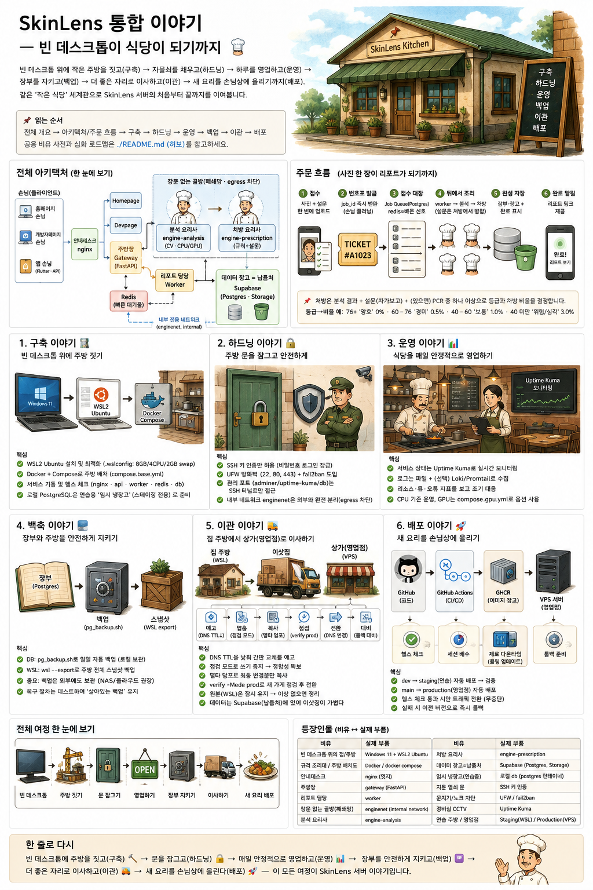

> **통합 삽화 안내:** SkinLens의 전체 서버 여정(구축 → 하드닝 → 운영 → 백업 → 이관 → 배포)을 한 장으로 보여주는 대표 삽화입니다.
>
> *(삽화 속 `redis(빠른 대기줄)`는 **Phase 3 예정** 항목입니다. 현재 구동 스택의 접수 대장(Job Queue)은 **Postgres 기반**이며 redis는 아직 배선돼 있지 않습니다.)*

---

# 1. 전체 개요

SkinLens 서버 세계는 **"작은 식당 주방"**에 비유할 수 있습니다.

빈 데스크톱에 주방을 짓고(구축) → 자물쇠를 채우고(하드닝) → 하루를 영업하고(운영) → 장부를 지키고(백업) → 더 좋은 자리로 이사하고(이관) → 새 요리를 손님상에 올립니다(배포).

전체 흐름은 다음과 같습니다.

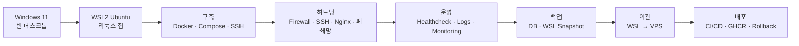

---

# 2. 공용 비유 사전

## 2.1 무대·집

| 비유 | 실제 부품 |
|---|---|
| 빈 데스크톱 / 빈 땅 | Windows 11 호스트 |
| 리눅스 집·주방 | WSL2 Ubuntu |
| 평수·화구 배정 | `.wslconfig` (메모리 8GB·CPU 4·swap 2GB) |
| 손님 없으면 불 끄는 타이머 | `vmIdleTimeout` |
| 규격 조리대 / 주방 배치도 | Docker / `deploy/compose/compose.base.yml` |

## 2.2 접객·주방

| 비유 | 실제 부품 |
|---|---|
| 안내데스크 | nginx(엣지) |
| 홈페이지 손님 / 개발자페이지 손님 / 앱 손님 | 공개 사이트 / 내부·데모 / Flutter(API) |
| 주방장 | gateway(FastAPI) — 주문 접수·번호표 발급 |
| 리포트 담당 | worker — 엔진 호출·리포트 생성 |
| 빠른 대기줄·호출 신호 | redis(캐시·큐, **Phase 3 예정**) |
| 접수 대장 | Job Queue(Postgres 기반) |

## 2.3 창문 없는 골방 — 엔진 폐쇄망

| 비유 | 실제 부품 |
|---|---|
| 창문 없는 골방 | `enginenet`(internal) — egress 차단 |
| 분석 요리사 | `engine-analysis` — 피부 분석·측정지표·점수 |
| 처방 요리사 | `engine-prescription` — 독립 진입점 |

처방 요리사는 분석 엔진의 하위 단계가 아니라 **독립 진입점**입니다. 분석 결과·설문·PCR 중 하나 이상이 있으면 동작합니다.

## 2.4 창고·냉장고

| 비유 | 실제 부품 | 역할 |
|---|---|---|
| 이미지 창고 | GHCR | 완제품 엔진 이미지 보관 |
| 데이터 창고(납품처) | Supabase(Postgres·Storage) | 실운영 장부·원본 |
| 임시 냉장고 | 로컬 PostgreSQL 컨테이너 | 스테이징 전용 |

셋을 혼동하지 않도록 **이미지는 이미지 창고(GHCR)**, **실데이터는 데이터 창고(Supabase)**, **스테이징 DB는 임시 냉장고**로 구분합니다.

## 2.5 보안·백업

| 비유 | 실제 부품 |
|---|---|
| 지문 열쇠 문 | SSH 키 인증 |
| 문지기 / 노크 차단 | UFW / fail2ban |
| 직원 전용 뒷문 | SSH 터널을 통한 adminer·uptime-kuma·DB |
| 경비실 CCTV | uptime-kuma |
| 데몬 관리 규칙 | `daemon.json` |
| 매일 장부 사본 / 주방 통째 스냅샷 | `pg_backup.sh` / `wsl --export` |
| 손님별 영수증 칸막이 | Supabase RLS(행 수준 보안, `user_id = auth.uid()`) · 게이트웨이 소유권 검사 |

## 2.6 배포

| 비유 | 실제 부품 |
|---|---|
| 공방 | monorepo 서비스별 경로(`services/`, `apps/`) |
| 집사 | self-hosted runner |
| 중앙 공장 | GitHub-hosted runner |
| 이미지 창고 | GHCR |
| 지배인 | `deploy.sh` |
| 시식 검사관 | container healthcheck |
| 주방 화이트보드 | `.env.images` |
| 연습 주방 | staging(WSL) |
| 영업점 | production(VPS) |

---

# 3. 전체 서버 아키텍처

SkinLens에는 홈페이지 손님, 개발자페이지 손님, Flutter 앱 손님이 있습니다. nginx가 이들을 적절한 서비스로 안내합니다.

주방 내부에서는 gateway가 주문을 접수하고 worker가 뒤에서 분석·처방 작업을 수행합니다.

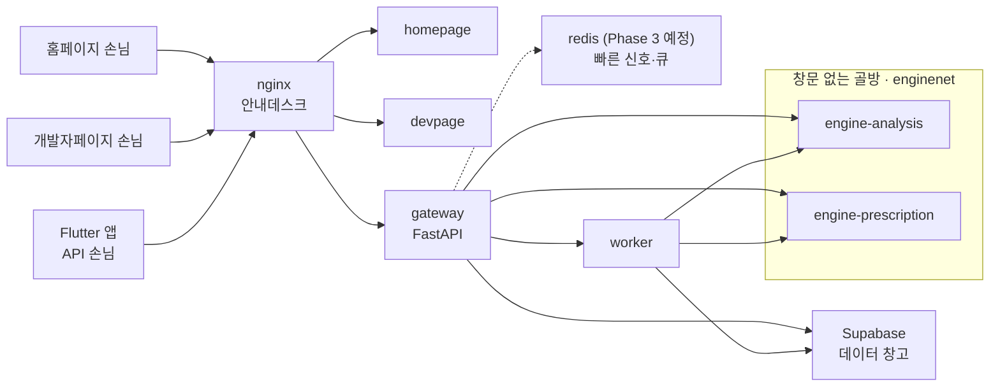

엔진 영역은 폐쇄망으로 구성하여 바깥으로의 egress를 차단합니다. 특히 피부 사진처럼 민감한 재료를 다루는 엔진이 데이터 창고에 직접 접근하지 않도록 구성합니다.

실운영 데이터는 Supabase에 두고, 로컬 PostgreSQL은 스테이징 전용으로 사용합니다.

접수 대장(Job Queue)은 현재 **Postgres 기반**이며, 다이어그램의 `redis`는 캐시·성능 단계(**Phase 3**)에서 도입 예정입니다. 또한 데이터 창고(Supabase)의 손님 데이터는 **행 수준 보안(RLS)**으로 칸막이가 쳐져 있어, 각 손님은 자기 `user_id` 소유의 행만 읽고 씁니다.

---

# 4. 주문 처리 흐름

SkinLens의 실제 UX는 **비동기 분석**입니다. 사용자가 분석이 끝날 때까지 HTTP 요청을 붙잡고 기다리는 방식이 아닙니다.

사진과 설문은 `multipart POST /analyze`로 gateway에 접수됩니다.

1. 사진은 Supabase Storage에 저장
2. 설문 JSON은 Job Queue의 `job.inputs`에 저장
3. `job_id`를 즉시 반환
4. worker가 Job Queue에서 작업을 가져감
5. engine-analysis가 사진을 분석
6. engine-prescription이 분석 결과와 설문/PCR을 이용해 처방
7. 결과를 DB와 Storage에 저장
8. 사용자가 `job_id`로 결과를 조회

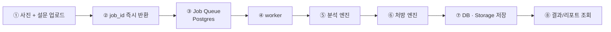

### 접수 대장의 상태 — 그리고 떨어뜨린 접시

주문(job)은 접수 대장에서 **`queued`(대기) → `processing`(조리 중) → `done`(완성)** 순으로 상태가 바뀌고, 문제가 생기면 `error`로 남습니다. 대장이 Postgres 한 곳이라 worker가 여러 명이어도 `FOR UPDATE SKIP LOCKED`로 **같은 주문을 두 번 집지 않습니다.**

- **떨어뜨린 접시(일시적 오류):** 엔진 호출이 잠깐 실패(연결·타임아웃·5xx)하면 그 주문을 버리지 않고 **다시 대기줄로(`requeued`)** 돌립니다. 정해진 횟수(`MAX_ATTEMPTS`)까지만 재시도하고 그 뒤엔 `error`로 접습니다. 반대로 잘못된 주문(입력 오류·4xx)은 재시도해도 소용없으니 곧바로 `error`.
- **자리 비운 요리사(크래시):** 조리 중(`processing`)인데 worker가 죽으면, 리퍼(reaper)가 오래 멈춘 주문을 감지해 다시 대기줄로 되돌립니다.
- **중복 방지:** 결과 기록은 한 번의 트랜잭션으로 처리하고 `ON CONFLICT DO NOTHING`을 써서 같은 결과가 두 번 적히지 않습니다.

> `redis`(빠른 신호)는 **Phase 3 예정**입니다. 지금은 이 대장(Postgres)만으로 접수·상태·재시도가 모두 돌아갑니다.

### 처방 규칙 — 점수에서 배합까지

처방 요리사는 **분석 결과 · 설문(자가보고) · PCR 검사** 중 하나 이상이 있으면 동작하며, 점수를 등급과 처방 비율로 옮깁니다.

| 점수 구간 | 등급 | 처방 비율 |
|---|---|---|
| 76~100 | 양호 | 0% |
| 60~76 | 경미 | 0.5% |
| 40~60 | 보통 | 1.0% |
| 40 미만 | 위험/심각 | 3.0% (집중 케어) |

지표별로 활성 믹스 **M01~M11**을 고르고, PCR 결과가 있으면 **PM01~PM03**을 더합니다(실제 배합값은 '꼬뜨리브 맞춤형' 배합표로 채웁니다).

---

# 5. 막 1. 구축

<!-- illustration:03-build.png -->

## 5.1 골조 — WSL2 Ubuntu

빈 Windows 11 데스크톱 안에 WSL2 Ubuntu라는 리눅스 집을 들입니다.

`.wslconfig`로 메모리 8GB, CPU 4개, swap 2GB를 배정하고 `vmIdleTimeout`을 설정합니다.

## 5.2 집들이 — 기본 환경

전용 사용자 계정을 만들고 시스템을 업데이트합니다.

필수 도구로 git, curl 등을 설치하고 프로젝트별 Python 가상환경(venv)을 사용합니다.

## 5.3 현관 열쇠 — SSH

SSH는 다음 순서를 지키는 것이 중요합니다.

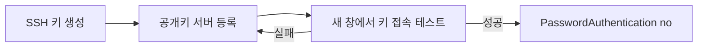

**새 키 접속을 확인한 뒤에만 비밀번호 로그인을 잠급니다.**

## 5.4 GitHub 다중 계정

`coteleafdev`와 `skygoldlee-cyber`처럼 여러 GitHub 계정을 사용하는 경우 계정별 SSH 키와 SSH config 호스트 별칭을 분리합니다.

개념은 다음과 같습니다.

```text
계정 A → SSH Key A → Host Alias A
계정 B → SSH Key B → Host Alias B
```

## 5.5 Docker와 Compose

Docker를 설치하고 `daemon.json`으로 데몬 재시작 정책과 로그 상한을 설정합니다.

Compose를 이용해 서비스 스택을 구성합니다.

초기에는 nginx + FastAPI + PostgreSQL의 뼈대로 검증하고, 실제 SkinLens 구조에서는 homepage, devpage, gateway, worker, engine-analysis, engine-prescription 및 Supabase 구조로 확장합니다.

## 5.6 네트워킹

WSL2 외부 접근은 미러 네트워킹과 NAT 방식으로 나눌 수 있습니다.

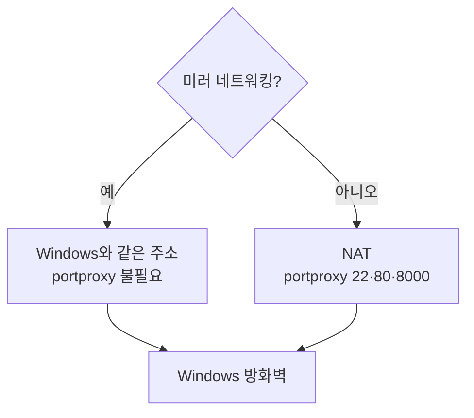

NAT에서는 WSL 내부 IP가 변경될 수 있으므로 portproxy 관리가 필요합니다.

## 5.7 준공 검사

세 가지 관점에서 검증합니다.

- 서버 자체: `verify_server.sh`
- 클라이언트: `verify_client.ps1`
- 통합 시나리오: `test_environment.py`

위험한 변경 전에는 `wsl --export`로 스냅샷을 만듭니다.

---

# 6. 막 2. 하드닝

<!-- illustration:04-hardening.png -->

## 6.1 네트워크 경계

외부 접근은 UFW와 fail2ban으로 보호합니다.

SSH는 키 인증을 사용하고 비밀번호 인증을 잠급니다.

## 6.2 관리 포트

adminer, uptime-kuma, DB 같은 관리 포트는 공개하지 않고 SSH 터널을 통해서만 접근합니다.

## 6.3 Nginx 표면 보호

nginx에서 서버 정보 노출을 줄이고 보안 헤더와 rate limit을 적용합니다.

## 6.4 컨테이너 권한

서비스 컨테이너는 가능한 한 비루트로 실행합니다.

추가로 다음과 같은 제한을 적용합니다.

```text
no-new-privileges
cap_drop
```

목적은 하나의 컨테이너가 침해되더라도 주방 전체로 권한이 확장되는 것을 막는 것입니다.

## 6.5 엔진 폐쇄망

`enginenet`은 internal 네트워크로 구성하여 엔진의 외부 egress를 차단합니다.

특히 엔진에 Supabase의 마스터키나 DB 접근권한을 직접 주지 않습니다.

> Docker가 publish한 포트는 UFW만으로 충분히 닫히지 않을 수 있으므로 포트 바인딩과 클라우드 보안그룹을 함께 확인해야 합니다.

## 6.6 손님별 칸막이 — 행 수준 보안(RLS)

네트워크와 컨테이너를 잠갔어도 **한 손님이 다른 손님의 영수증을 보는 것**은 또 다른 문제입니다. 데이터 창고(Supabase)의 손님 데이터 테이블에는 **행 수준 보안(RLS)**을 켜서 각 행에 `user_id = auth.uid()` 조건을 강제합니다 — 로그인한 손님은 자기 소유의 행만 읽고 씁니다.

게이트웨이도 같은 규칙을 한 번 더 지킵니다. 남의 `job_id`를 조회하면 "없음(404)"으로 응답해 **존재 여부조차 흘리지 않습니다.** 업로드 이미지도 `{user_id}/{job_id}/...` 경로 규약으로 저장돼, 창고 정책이 폴더 첫 조각(소유자)으로 접근을 가릅니다.

---

# 7. 막 3. 운영

<!-- illustration:05-operation.png -->

운영에서는 매일 반복되는 관리 작업을 자동화합니다.

- 부팅 시 서비스 자동 기동
- 절전 복귀 후 시계 확인 및 보정
- container healthcheck
- 로그 로테이션
- journald 상한
- 정기 업데이트
- 재부팅 정책
- uptime-kuma 모니터링

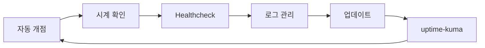

> 로그는 파일 로테이션에 더해 **구조적 로깅 + 이상 알림**이 `deploy/ops-jobs/observability/`로 배선돼 있습니다. 메트릭·트레이싱·대시보드까지는 **관측성(Phase 4)**의 남은 몫입니다.

---

# 8. 막 4. 백업

<!-- illustration:06-backup.png -->

백업에는 두 종류의 대상이 있습니다.

### 실운영 데이터

실운영 데이터는 **Supabase**가 데이터 창고입니다. 백업과 PITR은 관리형 DB 측 기능을 중심으로 관리합니다.

### 스테이징 데이터

스테이징의 로컬 PostgreSQL은 `pg_backup.sh` 등으로 백업합니다.

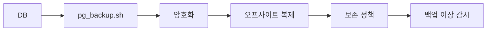

백업에는 다음 원칙을 적용합니다.

- 암호화
- 오프사이트 보관
- 최소 보존 개수
- 백업 성공 신호
- 실패 시 알림
- 위험한 WSL 변경 전 `wsl --export`

민감정보가 포함된 백업 파일은 안전하게 관리하고 사용 후 삭제해야 합니다.

---

# 9. 막 5. 이관

<!-- illustration:07-migration.png -->

## 9.1 왜 이관하는가

WSL은 개발과 리허설에는 적합하지만 실서비스 환경으로는 한계가 있습니다.

운영 환경은 VPS를 사용하여 다음을 확보합니다.

```text
고정 IP
도메인
TLS
상시 운영
```

데이터 자체는 처음부터 Supabase에 있으므로 실제 이관은 **가게(앱·설정·서비스)를 옮기는 작업**에 가깝습니다.

## 9.2 이관 전체 순서

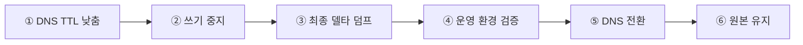

## 9.3 DNS TTL

이관 전에 DNS TTL을 낮춰 DNS 전환 후 캐시가 오래 남는 문제를 줄입니다.

## 9.4 쓰기 중지

컷오버 순간에는 옛 서버와 새 서버가 동시에 쓰기를 처리하지 않도록 점검 모드에서 쓰기를 중지합니다.

이렇게 해야 split-brain을 방지할 수 있습니다.

## 9.5 델타 덤프

대량 데이터는 미리 옮겨두고, 컷오버 직전에는 마지막 변경분만 델타 덤프로 옮겨 다운타임을 최소화합니다.

`migrate_export.sh`가 만드는 이관 번들에는 `.env`와 DB 덤프가 포함될 수 있으므로 보안에 특히 주의합니다.

## 9.6 운영 환경 검증

DNS를 전환하기 전에 새 VPS에서 운영 검증을 수행합니다.

```text
migrate_import.sh
        ↓
compose up (prod)
        ↓
verify_client.ps1 -Mode prod
        ↓
통과
```

## 9.7 DNS 전환

검증이 완료되면 DNS를 새 VPS IP로 변경합니다.

운영에서는 로컬 PostgreSQL 컨테이너를 기동하지 않고 Supabase를 사용합니다.

```text
DATABASE_URL
      ↓
Supabase
```

## 9.8 롤백 대비

DNS 전환 직후에는 기존 서버를 바로 삭제하지 않습니다.

새 서버에 문제가 발생하면 DNS를 다시 기존 서버로 돌릴 수 있도록 원본을 잠시 유지합니다.

---

# 10. 막 6. 배포

<!-- illustration:08-deployment.png -->

배포는 크게 세 가지 여정으로 나뉩니다.

## 10.1 정적 사이트

홈페이지나 개발자페이지의 정적 파일 변경은 rsync 방식으로 교체합니다.

별도 이미지 빌드가 필요하지 않은 가장 가벼운 배포입니다.

## 10.2 서버 코드

gateway/worker 변경은 서버에서 Docker build를 수행하고 커밋 SHA를 태그로 사용합니다.

그 후 `deploy.sh`가 healthcheck를 수행합니다.

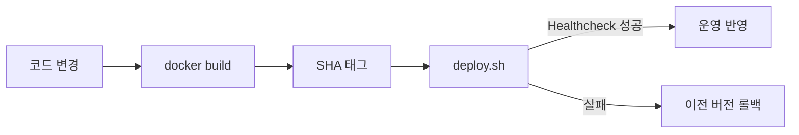

## 10.3 엔진

엔진은 무거운 빌드가 필요하므로 GitHub-hosted runner에서 빌드합니다.

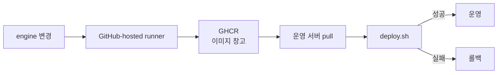

GPU가 필요한 것은 이미지를 빌드하는 과정이 아니라 실제 엔진을 운영 서버에서 실행하는 과정입니다.

## 10.4 스테이징 → 운영 승격

```text
develop
   ↓
스테이징(WSL)
   ↓
리허설 / 검증
   ↓
main
   ↓
GitHub Environment 승인
   ↓
운영(VPS)
```

스테이징은 임시 냉장고인 로컬 DB를 사용할 수 있지만, 운영은 데이터 창고인 Supabase를 사용합니다.

## 10.5 배포의 장점

- 변경된 서비스만 배포
- 정적 사이트는 무빌드
- 엔진은 GHCR 이미지 재사용
- `.env`는 서버에 유지
- `.env.images`로 현재 이미지 버전 기록
- concurrency로 동시 배포 충돌 방지
- healthcheck 실패 시 롤백
- self-hosted runner는 인바운드 포트가 필요 없음
- 배포 전 **CI에서 단위·계약 테스트** 수행(배포 자체의 게이트는 헬스체크)

---

# 11. 전체 흐름 요약

SkinLens 서버의 전체 생애주기는 다음과 같습니다.

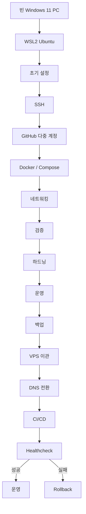

### 한 문장으로 정리

**빈 데스크톱에 리눅스 집을 들여 주방을 짓고(구축) → 문에 지문 열쇠를 달고 골방에 창을 없애고(하드닝) → 매일 자동으로 영업하며 상태를 점검하고(운영) → 장부를 보호하고(백업) → 실손님을 받을 상가로 이사한 뒤(이관) → 새 메뉴는 시식을 통과할 때만 손님상에 올린다(배포).**

---

# 12. 원본 문서와 세부 문서 위치

이번 통합본은 다음 다섯 개의 원본 문서를 하나의 흐름으로 재구성한 것입니다.

| 원본 | 통합본에서의 역할 |
|---|---|
| `docs/stories/README.md` | 전체 허브·비유 사전·로드맵 |
| `docs/stories/SkinLens_서버_이야기.md` | 전체 6막의 중심 이야기 |
| `docs/stories/SkinLens_구축_이야기.md` | 구축 세부 |
| `docs/stories/SkinLens_이관_이야기.md` | 이관 세부 |
| `docs/stories/SkinLens_배포_이야기.md` | 배포 세부 |

세부 명령과 실제 설정은 원본에서 참조하던 다음 문서/경로를 기준으로 합니다.

```text
docs/server-setup/
docs/architecture/
docs/operations/
docs/roadmap/
deploy/
services/
apps/
.github/workflows/
```

> 현재 이 여정이 **어느 Phase까지 실제로 반영됐는지**는 `docs/roadmap/00_PHASE_ROADMAP.md`의 상태표에 정리돼 있습니다 — 구축·하드닝·운영·백업·이관·배포와 엔진 분리(Phase 1)·비동기 Job Queue(Phase 2)는 완료, 캐시·성능(Phase 3)·수평 확장(Phase 5)은 예정입니다.
>
> 이 통합본은 업로드된 원본 문서의 내용을 바탕으로 구성했으며, 원본에서 실제 명령·설정의 근거가 별도 문서에 있다고 명시한 부분은 그 구조를 그대로 유지했습니다.
