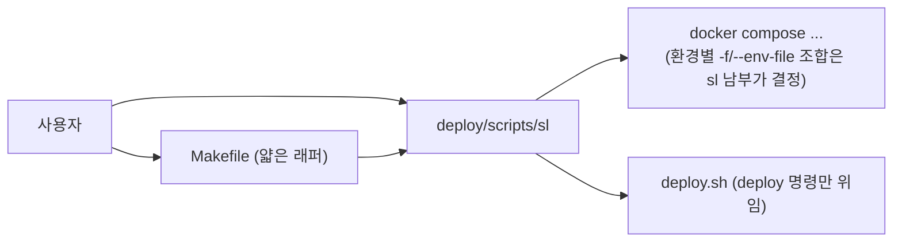

# 기동 절차 개선 계획 — "불 켜기를 한 버튼으로"

> 대상: SkinLens 모노레포의 환경별 빌드·기동 절차
> 현재 상태 문서: [`docs/operations/환경별_빌드_기동_절차.md`](../docs/operations/환경별_빌드_기동_절차.md)

## 1. 복잡성 진단 — 지금 무엇이 어려운가

조사 결과, 복잡성은 크게 5가지 원인에서 나온다.

### 1-1. 환경마다 다른 compose 조합을 사용자가 외워야 함

```
dev     : -f compose.base.yml -f compose.dev.yml                          --env-file .env
staging : -f compose.base.yml -f compose.staging.yml                    --env-file .env --env-file .env.images
prod    : -f compose.base.yml -f compose.prod.yml -f compose.tls.yml    --env-file .env --env-file .env.images
```

- [`Makefile`](../Makefile)이 `dev-up`/`staging-up`/`prod-up` 단축키를 제공하지만,
  **정지·로그·ps 등 나머지 동작은 환경별로 다시 긴 명령을 쳐야 한다** (현재 `ps`, `dev-logs`, `dev-down`만 dev용).
- staging/prod용 `logs`, `down`, `ps` 단축키가 없어 문서에서 긴 one-liner를 복사해 써야 한다.

### 1-2. 최초 설정 단계가 수동·분산됨

현재 최초 설정은 사용자가 직접 수행해야 하는 단계가 많다:

1. `.env.example` → `.env` 복사
2. `.env.images.example` → `.env.images` 복사
3. `.env` 안의 `DATABASE_URL`, `SUPABASE_*`, JWT 시크릿 등을 수동 편집
4. `htpasswd` 설치 여부 확인 후 Basic Auth 계정 생성
5. hosts 파일에 `*.localhost` 등록

이 중 하나라도 빠뜨리면 기동 시점이 아니라 **요청 시점에** 실패가 드러난다
(예: JWT 시크릿 누락 → strict 모드에서 500).

### 1-3. 환경 선택의 실수 여지

- `.env.dev.example`과 `.env.prod.example`이 별도로 있지만, **어느 파일을 써야 하는지는 문서를 읽어야만** 안다.
- `deploy.sh`는 `--env staging|production`을 받지만, `Makefile`의 `staging-up`과는 별개 체계라
  "배포할 때와 기동할 때 환경 표기가 다르다"(`staging` vs `production`/`prod`)는 혼란이 있다.

### 1-4. 사전 검증(precheck) 부재

- 기동 전에 "이 서버가 기동 가능한 상태인가"를 확인하는 단일 명령이 없다.
  - Docker/Compose 설치 여부
  - `.env` 존재·필수 키(DATABASE_URL 등) 채워짐 여부
  - `.env.images` 존재 여부 (staging/prod)
  - GHCR 로그인 상태 (prod pull 시)
  - DNS/TLS 준비 (prod)
- 현재는 기동 후 `unhealthy`가 되어야 로그를 뒤져 원인을 찾는다.

### 1-5. 문서와 실제 명령의 괴리 위험

- 문서([환경별_빌드_기동_절차.md](../docs/operations/환경별_빌드_기동_절차.md))에 명령이 풀어져 있어,
  Makefile/스크립트가 바뀌면 문서가 낡는다.

---

## 2. 개선 목표

1. **"어느 환경이든 같은 동사"** — `up`, `down`, `logs`, `ps`, `doctor`가 환경 무관하게 통일된 인터페이스로 동작
2. **최초 설정 한 번에** — `init` 한 명령으로 env 파일 생성·검증·hosts 안내까지
3. **기동 전 자가진단** — `doctor`가 사전 조건을 검사하고, 실패 시 고치는 법을 바로 안내
4. **잘못된 환경 선택 차단** — 환경을 명시하지 않으면 추론하거나, 모호하면 묻는다
5. **문서는 명령을 소유하지 않는다** — 명령의 진실원본은 스크립트/태스크 러너, 문서는 링크만

---

## 3. 개선안

### 3-1. 통합 CLI 진입점: `sl` 스크립트 (권장)

환경을 **인자**로 받는 단일 스크립트 `deploy/scripts/sl`(bash) + Windows용 `sl.ps1`을 둔다.

```
./sl up dev              # = make dev-up
./sl up staging          # = compose base+staging up -d
./sl up prod             # = compose base+prod+tls up -d
./sl down <env>          # 환경별 올바른 compose 조합으로 down
./sl logs <env> [svc]    # logs -f
./sl ps <env>
./sl doctor [env]        # 사전 검사 (3-3)
./sl init [env]          # 최초 설정 (3-2)
./sl deploy <svc> <image> [--env staging|prod] [--pull]   # deploy.sh 래핑
```

**효과**: 사용자가 compose 조합·env-file 조합을 외울 필요가 없어진다.
환경 인자가 없으면: 실행 중인 컨테이너(`sl_` 접두사)로 추론하고, 없으면 대화형으로 묻는다.

**Makefile과의 관계**: Makefile은 얇은 래퍼로 유지(기존 사용자 습관 보존)하고,
남부는 모두 `sl`을 호출하도록 바꾼다. 이렇게 하면 **명령 진실원본이 `sl` 하나**로 모인다.



### 3-2. 최초 설정 자동화: `sl init`

```bash
./sl init dev
```

동작:
1. `deploy/env/.env`가 없으면 `.env.dev.example`(env 인자에 따라 `.env.prod.example`)을 복사
2. `.env.images`가 없으면 예시 복사
3. 필수 키가 `CHANGE_ME`/`<...>` 상태면 **대화형 프롬프트로 값을 물어본다**
   (Supabase 대시보드에서 복사해 붙이는 흐름을 안내 문구와 함께 출력)
4. `htpasswd`가 없으면 설치 명령을 안내하고, 있으면 Basic Auth 계정 생성 여부를 묻는다
5. OS별 hosts 등록 방법을 출력 (Windows: `C:\Windows\System32\drivers\etc\hosts`, Linux/macOS: `/etc/hosts`)
6. 마지막에 자동으로 `sl doctor dev` 실행 → 초록불이면 `sl up dev`를 제안

**효과**: "문서 읽고 → 파일 복사하고 → 편집하고 → htpasswd 치고 → hosts 고치고" 5단계가
한 명령으로 수렴한다. 재진입필요도 최초 1회.

### 3-3. 사전 검증: `sl doctor`

```bash
./sl doctor prod
```

검사 항목(환경별 가중치 다름):

| 검사 | dev | staging | prod | 실패 시 안내 |
|---|---|---|---|---|
| docker / compose v2 존재 | ✔ | ✔ | ✔ | 설치 링크 |
| `deploy/env/.env` 존재·필수 키 | ✔ | ✔ | ✔ | `sl init <env>` 실행 안내 |
| `DATABASE_URL`이 CHANGE_ME 아님 | ✔ | ✔ | ✔ | Supabase 대시보드 경로 안내 |
| `.env.images` 존재 | – | ✔ | ✔ | 예시 복사 안내 |
| `AUTH_MODE=strict`이면 JWT 시크릿 존재 | – | ✔ | ✔ | `.env` 편집 안내 |
| GHCR `docker login ghcr.io` 상태 | – | 선택 | ✔ | 로그인 명령 안내 |
| hosts에 `*.localhost` 등록됨 | ✔ | 선택 | – | OS별 등록법 |
| DNS가 이 서버를 가리킴 (prod 도메인) | – | – | 선택 | Caddy 인증서 발급 전제 안내 |

각 실패는 **"무엇이 문제 + 지금 당장 치면 되는 명령"** 한 쌍으로 출력한다.
기존 [`deploy/scripts/verify_server.sh`](../deploy/scripts/verify_server.sh)가 있다면
그 검사 로직을 `doctor`로 흡수해 중복을 없앤다.

### 3-4. 환경 추론과 안전 가드

- `./sl logs`처럼 env 생략 시: `docker ps`에서 `sl_gateway` 등 실행 중 컨테이너와
  compose 프로젝트 라벨로 환경을 추론한다. 추론 불가 시 목록을 보여주고 고르게 한다.
- `down prod`처럼 파괴적 명령에는 확인 프롬프트(또는 `--yes` 플래그)를 둔다.
- `up prod` 실행 전에 doctor를 자동 호출해 빨간불이면 중단( `--force`로 우회 가능).

### 3-5. 문서 역할 재정의

- [`환경별_빌드_기동_절차.md`](../docs/operations/환경별_빌드_기동_절차.md)의 명령 섹션을
  `sl` 사용법으로 갈아끼우고, 남부 compose one-liner는 "참고: 남부 동작" 부록으로 내린다.
- 이야기 문서([SkinLens_기동_이야기.md](../docs/stories/SkinLens_기동_이야기.md))는 개념 지도로 유지하되,
  마지막에 "실제로는 `./sl up dev` 한 줄이면 된다"를 덧붙인다.

---

## 4. 적용 우선순위

| 단계 | 내용 | 기대 효과 |
|---|---|---|
| **P0** | `sl` 스크립트에 `up/down/logs/ps` 4개 동사 + 환경 추론 | compose 조합 암기 필요 소멸 |
| **P0** | `sl doctor` 최소판 (docker·env·필수 키·images 파일) | 기동 실패의 80%를 사전 차단 |
| **P1** | `sl init` (env 복사 + 대화형 값 채우기 + hosts 안내) | 최초 설정 5단계 → 1명령 |
| **P1** | Makefile을 `sl` 호출 래퍼로 교체 | 명령 진실원본 단일화 |
| **P2** | `sl deploy` (deploy.sh 래핑), doctor에 GHCR/DNS 검사 추가 | 배포 진입점도 통일 |
| **P2** | 문서 개편 (명령 → `sl` 사용법, one-liner는 부록으로) | 문서 낡음 방지 |

---

## 5. 마이그레이션 — 기존 사용자에게 미치는 영향

- 기존 `make dev-up` 등은 **그대로 동작**해야 한다 (Makefile이 `sl`을 호출하므로).
- 기존 문서의 compose one-liner는 부록에서 계속 참조 가능(스크립트가 감추는 것이지 금지하는 것이 아님).
- `deploy.sh`는 CI가 이미 호출 중이므로 **변경하지 않고** `sl deploy`가 감싸기만 한다.
- CI 워크플로는 영향 없음 (deploy.sh 인터페이스 불변).

---

## 6. 수용 기준 (Acceptance Criteria) — 구현 결과

1. ✅ 새 서버에서 `git clone` 후 `sl init dev && sl up dev` 두 명령으로 스택이 뜬다
   — [`deploy/scripts/sl`](../deploy/scripts/sl)의 `init`(env 생성·대화형 입력·doctor 연계) + `up` 구현 완료.
2. ✅ `sl doctor prod`가 실패 시 원인과 수정 명령을 한 화면에 출력한다
   — docker/compose, .env, DATABASE_URL 템플릿 여부, .env.images, JWT 시크릿, GHCR 로그인, hosts 검사 구현.
3. ✅ `make dev-up`, `make staging-up`, `make prod-up`이 여전히 동작한다
   — [`Makefile`](../Makefile)이 `sl`을 호출하는 얇은 래퍼로 교첸다.
4. ✅ `sl down staging`이 올바른 compose 조합(base+staging)으로만 낮춘다
   — `build_compose()`가 환경별 `-f`/`--env-file` 조합을 남부에서 결정, GPU 오버레이는 존재 시 자동 추가.
5. ✅ 문서의 모든 "긴 compose 명령"이 `sl` 사용법으로 대첸다
   — [`docs/operations/환경별_빌드_기동_절차.md`](../docs/operations/환경별_빌드_기동_절차.md) 개편,
     one-liner는 부록 A로 이동. 이야기 문서([`docs/stories/SkinLens_기동_이야기.md`](../docs/stories/SkinLens_기동_이야기.md))에 실무 메모 추가.

### 구현 산출물

| 파일 | 역할 |
|---|---|
| [`deploy/scripts/sl`](../deploy/scripts/sl) | 통합 CLI (bash) — up/down/logs/ps/doctor/init/deploy, env 추론 |
| [`deploy/scripts/sl.ps1`](../deploy/scripts/sl.ps1) | Windows PowerShell 판 — 같은 동사, UTF-8 BOM 필수 |
| [`Makefile`](../Makefile) | `sl` 호출 래퍼 — 기존 `make dev-up` 등 유지 + `up/down/logs/ps/doctor/init` 가변 타겟 추가 |
| [`docs/operations/환경별_빌드_기동_절차.md`](../docs/operations/환경별_빌드_기동_절차.md) | 명령을 `sl` 사용법으로 개편, 부록에 남부 one-liner |
| [`docs/stories/SkinLens_기동_이야기.md`](../docs/stories/SkinLens_기동_이야기.md) | 말미에 "실제로는 `./sl up dev` 한 줄" 메모 추가 |

### 검증 로그

- `bash -n deploy/scripts/sl` → 통과 (Git Bash)
- `sl --help` / `sl bogus-cmd` → usage 출력, exit 2
- `sl init dev` → `.env`(←`.env.dev.example`)·`.env.images` 생성, hosts 안내, doctor 연계 확인
- `sl doctor dev` → docker 없음/.env 없음/DATABASE_URL 템플릿 등을 정확히 진단하고 수정 명령 출력
- PowerShell: 파서 오류(한글 인코딩) → UTF-8 BOM 추가로 해결, `sl.ps1 doctor dev` 동작 확인

### 후속 과제 (P2 잔여)

- `sl deploy`는 래핑만 구현됨 — 실제 배포 흐름(CI 연동)에서 회귀 테스트 필요
- doctor에 DNS 검사(prod 도메인 → 서버 IP) 추가 가능
- `sl up`에 `--force` 플래그로 doctor 우회 옵션 (현재는 prod만 doctor 강제)
